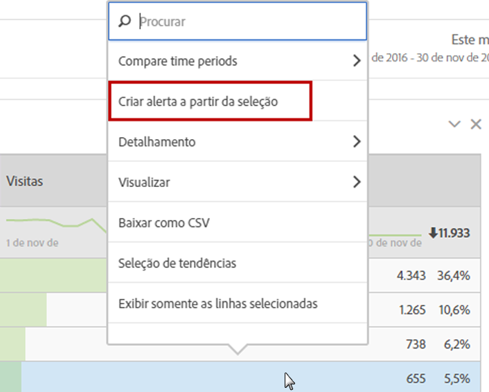
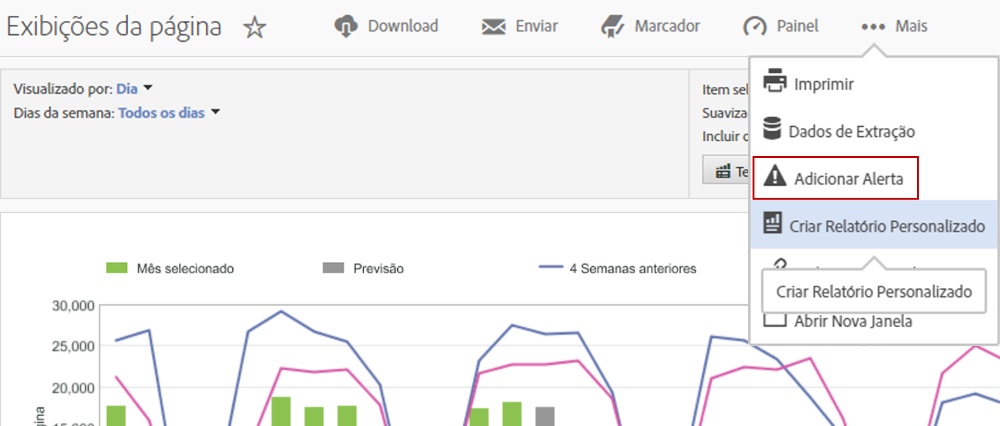

# Visão geral de alertas inteligentes

>[!Important]
>O uso de dados com carimbo de data e hora para criar alertas pode fazer com que alertas sejam disparados incorretamente. Portanto, recomendamos utilizar &gt; dados sem carimbo de data e hora para Alertas inteligentes.

O novo sistema de Alertas inteligentes permite um controle mais detalhado dos alertas e integra a detecção de anomalias ao sistema de alertas.

[Alertas inteligentes no youtube](https://www.youtube.com/watch?v=UVH9xr_2REA&list=PL2tCx83mn7GuNnQdYGOtlyCu0V5mEZ8sS&index=65) (5:34)

## Visão geral {#section_6AC8CA81DEA94E99B0F192B60D0FDF03}

O novo Criador de alertas e Gerenciador de alertas na Analysis Workspace substitui a funcionalidade de alertas existente nos Reports &amp; Analytics. Os Alertas inteligentes permitem

* Criar alertas com base em anomalias (limites de 90%, 95%, 99%, 99,75% e 99,9%; % de alteração; acima/abaixo).
* Visualizar a frequência de disparo de um alerta.
* Enviar alertas por email ou SMS com links para projetos da Analysis Workspace gerados automaticamente.
* Criar alertas “empilhados”, capazes de capturar várias métricas de uma só alerta.

Os componentes do novo sistema de alertas incluem: o Criador de alertas, o Gerenciador de alertas, a Visualização de alertas e um melhor acesso ao contexto para criar alertas. A interface do usuário do sistema de alerta anterior não estará mais disponível, mas os alertas serão migrados. Alguns recursos de alerta de legado [não estarão mais disponíveis](https://marketing.adobe.com/resources/help/en_US/sc/user/deprecated_alerts.html).

Há quatro maneiras de acesso o Criador de alertas:

* Usando o seguinte atalho na Analysis Workspace:

   `ctrl (or cmd) + shift + a`
* By going directly to the Alert Builder:  **[!UICONTROL Workspace]** &gt; **[!UICONTROL Components]** &gt; **[!UICONTROL New Alert]** .
* Selecionando um ou mais itens de linha da tabela de forma livre, clicando com o botão direito do mouse e selecionando **[!UICONTROL Criar alerta a partir da seleção]**. Isso abrirá o Criador de alertas e pré-preencherá o criador com as métricas e filtros apropriados aplicados a partir da tabela. Você pode editar o alerta, se necessário.

   

* From within a Reports &amp; Analytics report, by going to  **[!UICONTROL More]** &gt; **[!UICONTROL Add Alert]** . Isso abrirá o novo Criador de alertas e pré-preencherá o criador com as métricas e filtros apropriados aplicados a partir do relatório. Você pode editar o alerta, se necessário.

   

## FAQ: How alerts are calculated and triggered {#section_1F3B1DAF21784306953B49AAD4C3DCAB}

Os limites % são desvios padrão. Por exemplo, 95% = 2 desvios padrão e 99% = 3 desvios padrão. Dependendo da granularidade de tempo escolhida, [modelos diferentes](../../../analyze/analysis-workspace/virtual-analyst/c-anomaly-detection/statistics-anomaly-detection.md#concept_0705DC91F0F44951AC2226EC846E824C) são usados para calcular o quão distante (quantos desvios padrão) cada ponto de dados está da norma. Se você definir um limite mais baixo (como 90%), receberá mais anomalias se definir um limite mais alto (99%), Os limites 99,75% e 99,99% foram criados especificamente para a granularidade horária, de forma que não tantas anomalias não sejam acionadas.

<table id="table_B3AA85E1DE3543DCA34966A52E3CE4AB"> 
 <thead> 
  <tr> 
   <th colname="col1" class="entry"> Pergunta </th> 
   <th colname="col2" class="entry"> Resposta </th> 
  </tr> 
 </thead>
 <tbody> 
  <tr> 
   <td colname="col1"> 
<b>P: Até que ponto a detecção de anomalias dos alertas vai para determinar anomalias de dados?</b> 
 </td> 
   <td colname="col2"> 
O período de treinamento varia com base na granularidade selecionada. (Consulte <a href="../../../analyze/analysis-workspace/virtual-analyst/c-anomaly-detection/statistics-anomaly-detection.md#concept_0705DC91F0F44951AC2226EC846E824C" format="dita" scope="local"> Técnicas estatísticas usadas na Detecção de anomalias </a> para obter mais detalhes.) Aqui está um resumo: 
 
    <ul id="ul_4F8C2A41F06C498DBF5E7AE5DE803773"> 
     <li id="li_E246091A3F1E484C8444AF4052FCA784">Mensalmente = 15 meses + mesmo intervalo do ano passado </li> 
     <li id="li_CC014FB38AE1492B9647E990C29BFB3C">Semanalmente = 15 semanas + mesmo intervalo do ano passado </li> 
     <li id="li_2517EE2097534324BE9C1B54CD181A62">Diariamente = 35 dias + mesmo intervalo do ano passado </li> 
     <li id="li_710BC8B009354542AA4962A59A646099">De hora em hora = 336 horas </li> 
    </ul> </td> 
  </tr> 
  <tr> 
   <td colname="col1"> 
<b>P: Se eu desejar ser alertado sobre apenas uma baixa no comportamento ou apenas um aumento, posso usar o recurso de anomalia ou preciso usar o valor absoluto?</b> 
 </td> 
   <td colname="col2"> 
Usar o valor absoluto ainda acionaria alertas de baixas e de aumentos. Não é possível isolar alertas apenas para baixas ou aumentos. 
 </td> 
  </tr> 
  <tr> 
   <td colname="col1"> 
<b>P: Posso configurar os alertas para serem acionados apenas durante determinadas horas do dia (como horário comercial ou não comercial)? </b> 
 </td> 
   <td colname="col2"> 
Atualmente, não. 
 </td> 
  </tr> 
  <tr> 
   <td colname="col1"> 
<b>P: Posso obter uma tabela dos “valores esperados” que contém a linha pontilhada, ou algum tipo de saída do que são esses valores? </b> 
 </td> 
   <td colname="col2"> 
Não na Workspace, mas é possível no Report Builder (assista a este vídeo sobre a <a href="https://www.youtube.com/watch?v=-a-8W6GQZnU" format="https" scope="external">Detecção de anomalias no Report Builder </a>). 
 
Lembre-se de que o Report Builder usa métodos de detecção de anomalias menos sofisticados. Ele usa um período fixo de treinamento de 30 dias, intervalo fixo de 95% e é semelhante à <a href="https://marketing.adobe.com/resources/help/en_US/reference/anomaly.html" format="html" scope="external">Detecção de anomalias do Reports &amp; Analytics </a>. 
 </td> 
  </tr> 
 </tbody> 
</table>

