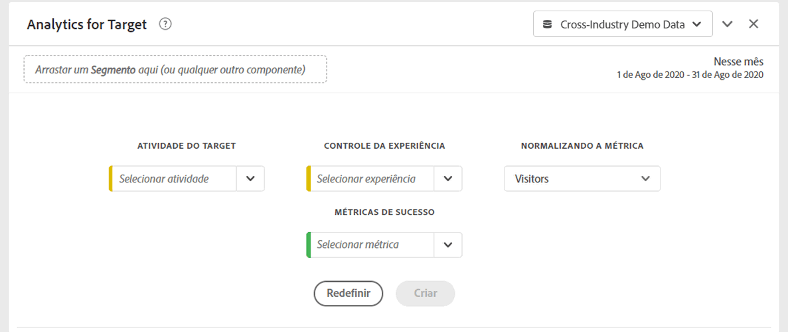

# Painel Analytics for Target (A4T)

O painel Analytics for Target (A4T) permite que você analise suas atividades e experiências do Adobe Target no Analysis Workspace. Ele também permite que você veja o incentivo e a confiança para até três métricas de sucesso. Para acessar o painel A4T, navegue até um conjunto de relatórios com os componentes A4T ativados. Em seguida, clique no ícone do painel na extremidade esquerda e arraste o painel Analytics for Target para o Projeto do Analysis Workspace.

## Entradas do painel {#Input}

Você pode configurar o painel A4T usando estas configurações de entrada:

| Configuração | Descrição |
|---|---|
| Atividade do Target | Selecione de uma lista de Atividades de Públicos alvos ou arraste e solte uma atividade do painel esquerdo. Observação: a lista é preenchida com os últimos 6 meses de atividades que tiveram pelo menos 1 ocorrência. Se não vir uma atividade na lista, ela pode ter mais de 6 meses. Ela também pode ser adicionada pelo painel esquerdo, que tem um período de retrospectiva de até 18 meses. |
| Experiência de controle | Selecione sua experiência de controle. Você pode alterá-la, se necessário, na lista suspensa. |
| Métrica de normalização | Escolha entre Visitantes únicos, Visitas ou Impressões de Atividade. Visitantes únicos são recomendados para a maioria dos casos de uso de análise. Essa métrica (também chamada de metodologia de contagem) torna-se o denominador do cálculo do incentivo. Além disso, afeta a maneira como os dados são agregados antes da aplicação do cálculo “confidence”. |
| Métricas de sucesso | Selecione até 3 eventos bem-sucedidos padrão (não calculados) nos menus suspensos ou arraste e solte métricas do painel esquerdo. Cada métrica terá uma tabela e uma visualização dedicadas no painel renderizado. |
| Intervalo de datas do calendário | É preenchido automaticamente com base no intervalo de datas da Atividade no Adobe Target. Você pode alterá-lo se necessário. |

## Saída do painel {#Output}

O painel Analytics for Target retorna um conjunto avançado de dados e visualizações para ajudar você a entender melhor como a atividade e as experiências do Adobe Target estão se saindo. Na parte superior do painel, uma linha de resumo é fornecida para lembrar das configurações do painel que você selecionou. A qualquer momento, você pode editar o painel clicando no lápis de edição na parte superior direita.

Para cada métrica de sucesso selecionada, uma tabela de forma livre e uma tendência de taxa de conversão serão mostradas:

Cada tabela de forma livre mostra as seguintes colunas de métrica:

| Métrica | Descrição |
|---|---|
| Normalização de métricas | Visitantes únicos, visitas ou Impressões de atividade. |
| Métrica de sucesso | A métrica selecionada no construtor |
| Índice de conversão | Métrica de sucesso/Métrica de normalização |
| Aumento | Compara o índice de conversão de cada experiência com a experiência de controle. Observação: o incentivo é uma “métrica bloqueada” para as experiências do Target; não pode ser desmembrada nem usada com outras dimensões. |
| Lift (inferior) | Representa o pior aumento que uma experiência variante poderia ter sobre o controle, em um intervalo de confiança de 95%. Cálculo: (x/y ± 1,96 std_err(x,y)) / (x_control/y_control ∓ 1,96 std_err(x_control,y_control)). Aqui std_err(x,y) é sqrt(xx/y - (x/y)^2), em que xx indica a soma dos quadrados. |
| Lift (médio) | Representa o aumento do ponto médio que uma experiência de variante poderia ter sobre o controle, em um intervalo de confiança de 95%. Este é o &quot;Lift&quot; em Reports &amp; Analytics. Cálculo: (x/y)/(x_control/y_control) - 1 |
| Lift (superior) | Representa o melhor aumento que uma experiência variante poderia ter sobre o controle, em um intervalo de confiança de 95%. Cálculo: consulte Aumento (Inferior). |
| Confiança | O teste t dos alunos calcula o nível de confiança, o que indica a probabilidade de os resultados serem duplicados se o teste fosse executado novamente. Um intervalo de formatação condicional fixo de 75%/85%/95% foi aplicado à métrica. Essa formatação pode ser personalizada, se necessário, em Configurações de coluna. Observação: a confiança é uma “métrica bloqueada” para as experiências do Target; ela não pode ser desmembrada nem usada com outras dimensões. Cálculo: aplique um teste t de 2 caudas com y+y_control-2 graus de liberdade para encontrar o valor p, seja x/y igual a x_control/y_control. Calcule a pontuação t, em que stderr é sqrt( (xx/y-(x/y)^2)/y + (xx_control/y_control-(x_control/y_control)^2)/y_control). Retorne 1-p como a confiança de que são diferentes. |

Assim como em qualquer painel no Analysis Workspace, você pode continuar sua análise adicionando tabelas e [visualizações](https://docs.adobe.com/content/help/pt-BR/analytics/analyze/analysis-workspace/visualizations/freeform-analysis-visualizations.html) adicionais que ajudarão a analisar suas atividades do Adobe Target. Também é possível aplicar um segmento no nível do painel ou na tabela de forma livre. Observe que, se o adicionar à tabela de forma livre, você deverá sobrepô-lo na tabela inteira para preservar os cálculos de aumento e confiança. Os segmentos de nível de coluna não são suportados no momento.

## Perguntas frequentes {#FAQ}

| Pergunta | Resposta |
|---|---|
| Que tipos de atividade são aceitas no A4T? | [Saiba mais](https://docs.adobe.com/content/help/pt-BR/target/using/integrate/a4t/a4t-faq/a4t-faq-activity-setup.html) sobre os tipos de atividades aceitos. |
| As métricas calculadas são aceitas nos cálculos de incentivo e confiança? | Não. [Saiba mais](https://docs.adobe.com/content/help/pt-BR/target/using/integrate/a4t/a4t-faq/a4t-faq-lift-and-confidence.html) sobre por que as métricas calculadas não são aceitas no incentivo e na confiança. No entanto, as métricas calculadas podem ser usadas no relatórios do A4T fora dessas métricas. |
| Por que os visitantes únicos variam entre o Target e o Analytics? | [Saiba mais](https://docs.adobe.com/content/help/pt-BR/target/using/integrate/a4t/a4t-faq/a4t-faq-viewing-reports.html) sobre as variações de visitantes únicos entre produtos. |
| Quando aplicar um segmento de ocorrência para uma atividade do Target específica em minha análise, por que vejo experiências não relacionadas retornadas? | A dimensão A4T é uma variável de lista, o que significa que pode conter muitas atividades (e experiências) ao mesmo tempo. [Saiba mais](https://docs.adobe.com/content/help/en/target/using/integrate/a4t/a4t-faq/a4t-faq-viewing-reports.html) |
| A métrica de confiança contabiliza pedidos extremos ou aplica uma correção Bonferroni para várias ofertas? | Não. [Saiba mais](https://docs.adobe.com/content/help/en/target/using/integrate/a4t/a4t-faq/a4t-faq-lift-and-confidence.html) sobre como o Analytics calcula a confiança. |
| As métricas de incentivo e confiança podem ser usadas com outras dimensões ou detalhamentos? | O incentivo e a confiança são “métricas bloqueadas” para a dimensão Experiências do Target, pois exigem um controle e uma variação para calcular. Sendo assim, não podem ser divididas nem utilizadas com outras dimensões. |
| Quando recalcular o incentivo e a confiança? | O aumento e a confiança serão calculados novamente sempre que o painel for executado (ou executado novamente), o intervalo de datas do painel mudar ou um segmento for aplicado ao painel ou à tabela. Ao ser aplicado um filtro de segmento à tabela de forma livre, ele deve ser aplicado em todas as colunas, caso contrário, o aumento e a confiança não serão atualizados corretamente. Os segmentos de nível de coluna não são suportados no momento. |

Para obter mais informações sobre os relatórios do Analytics for Target, acesse [relatórios do A4T](https://docs.adobe.com/content/help/pt-BR/target/using/integrate/a4t/reporting.html)
