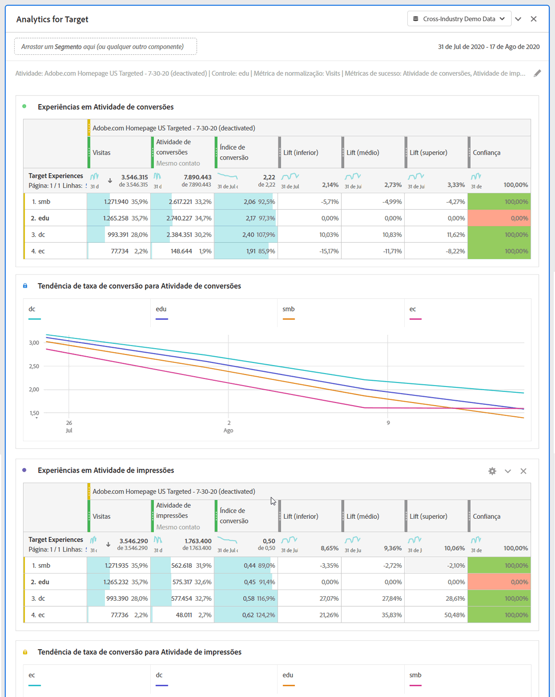

# Painel Analytics for Target (A4T)

>[!IMPORTANT]
>
>**[!UICONTROL O painel Analytics for Target (A4T)]** está atualmente em testes limitados. [Saiba mais](https://docs.adobe.com/content/help/pt-BR/analytics/landing/an-releases.html)

O painel Analytics for Target (A4T) permite que você analise suas atividades e experiências do Adobe Target no Analysis Workspace. Ele também permite que você veja incentivo e confiança para até três métricas de sucesso. Para acessar o painel A4T, navegue até um conjunto de relatórios com os componentes A4T ativados. Em seguida, clique no ícone do painel na extremidade esquerda e arraste o painel Analytics for Target para o Projeto do Analysis Workspace.

## Entradas do painel {#Input}

Você pode configurar o painel A4T usando estas configurações de entrada:

| Configuração | Descrição |
|---|---|
| Atividade do Target | Selecione de uma lista de Atividades de Públicos alvos ou arraste e solte uma atividade do painel esquerdo. **Observação:**A lista é preenchida com os últimos 6 meses de atividades que tiveram pelo menos 1 ocorrência. Se não vir uma atividade na lista, pode ter mais de 6 meses. Ainda pode ser adicionado do painel esquerdo, que tem um período de retrospectiva de até 18 meses. |
| Experiência de controle | Selecione sua experiência de controle. Você pode alterá-la, se necessário, na lista suspensa. |
| Métrica de normalização | Escolha entre Visitantes únicos, Visitas ou Impressões de Atividade. visitantes únicos são recomendados para a maioria dos casos de uso de análise. Essa métrica (também chamada de metodologia de contagem) torna-se o denominador do cálculo do incentivo. Além disso, afeta a maneira como os dados são agregados antes da aplicação do cálculo “confidence”. |
| Métricas de sucesso | Selecione até 3 eventos bem-sucedidos padrão (não calculados) nos menus suspensos ou arraste e solte métricas do painel esquerdo. Cada métrica terá uma tabela e uma visualização dedicadas no painel renderizado. |
| Intervalo de datas do calendário | Isso será preenchido automaticamente com base no intervalo de datas da Atividade. Você pode alterá-la se necessário. |

## Saída do painel {#Output}

O painel Analytics for Target retorna um conjunto avançado de dados e visualizações para ajudá-lo a entender melhor como a atividade e as experiências do Adobe Target estão se saindo. Na parte superior do painel, uma linha de resumo é fornecida para lembrá-lo das configurações do painel que você selecionou. A qualquer momento, você pode editar o painel clicando no lápis de edição na parte superior direita.

Para cada métrica de sucesso selecionada, uma tabela de forma livre e uma tendência de taxa de conversão serão mostradas:

Cada tabela de forma livre mostra as seguintes colunas de métrica:

| Métrica | Descrição |
|---|---|
| Normalização de métricas | Visitantes únicos, visitas ou impressões de Atividade. |
| Métrica de sucesso | A métrica selecionada no construtor |
| Índice de conversão | Métrica de sucesso/Métrica de normalização |
| Aumento | Compara o índice de conversão de cada experiência com a experiência de controle. **Observação:**O incentivo é uma &quot;métrica bloqueada&quot; para as experiências do Público alvo; não pode ser desmembrada nem usada com outras dimensões. |
| Lift (inferior) | Representa o pior aumento que uma experiência de variante poderia ter sobre o controle. |
| Lift (médio) | Representa o aumento do ponto médio que uma experiência de variante poderia ter sobre o controle, em um intervalo de confiança de 95%. Este é o &quot;Lift&quot; no Relatórios e Analytics. |
| Lift (superior) | Representa o melhor aumento que uma experiência de variante poderia ter sobre o controle. |
| Confiança | O teste t dos alunos calcula o nível de confiança, o que indica a probabilidade de que os resultados sejam duplicados se o teste for executado novamente. Um intervalo de formatação condicional fixo de 75%/85%/95% foi aplicado à métrica. Essa formatação pode ser personalizada, se necessário, em Configurações de coluna.  **Observação:**A confiança é uma &quot;métrica bloqueada&quot; para as experiências do Público alvo; não pode ser desmembrada nem usada com outras dimensões. |

Assim como em qualquer painel no Analysis Workspace, você pode continuar sua análise adicionando tabelas e [visualizações](https://docs.adobe.com/content/help/pt-BR/analytics/analyze/analysis-workspace/visualizations/freeform-analysis-visualizations.html) adicionais que ajudarão a analisar suas atividades do Adobe Target.

## Perguntas frequentes {#FAQ}

| Pergunta | Resposta |
|---|---|
| Que tipos de atividade são suportados no A4T? | [Saiba mais](https://docs.adobe.com/content/help/en/target/using/integrate/a4t/a4t-faq/a4t-faq-activity-setup.html) sobre os tipos de atividades suportados. |
| As métricas calculadas são suportadas nos cálculos de incentivo e confiança? | Não. [Saiba mais](https://docs.adobe.com/content/help/en/target/using/integrate/a4t/a4t-faq/a4t-faq-lift-and-confidence.html) sobre por que as métricas calculadas não são suportadas no incentivo e na confiança. No entanto, as métricas calculadas podem ser usadas no relatórios A4T fora dessas métricas. |
| Por que os visitantes únicos variam entre o Público alvo e o Analytics? | [Saiba mais](https://docs.adobe.com/content/help/en/target/using/integrate/a4t/a4t-faq/a4t-faq-viewing-reports.html) sobre as variações de visitantes únicos entre produtos. |
| Quando eu aplico um segmento de ocorrência para uma atividade de Público alvo específica em minha análise, por que vejo experiências não relacionadas retornadas? | A dimensão A4T é uma variável lista, o que significa que pode conter muitas atividades (e experiências) ao mesmo tempo. [Saiba mais](https://docs.adobe.com/content/help/en/target/using/integrate/a4t/a4t-faq/a4t-faq-viewing-reports.html) |
| A métrica de confiança contabiliza pedidos extremos ou aplica uma correção Bonferroni para várias ofertas? | Não. [Saiba mais](https://docs.adobe.com/content/help/en/target/using/integrate/a4t/a4t-faq/a4t-faq-lift-and-confidence.html) sobre como a Analytics calcula a confiança. |

Para obter mais informações sobre o relatórios Analytics para Públicos alvos, visite o relatórios [A4T](https://docs.adobe.com/content/help/en/target/using/integrate/a4t/reporting.html)
