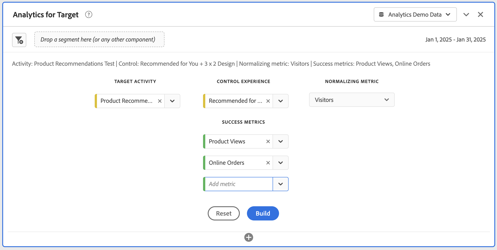

# Painel Analytics for Target {#analyze-for-target-panel}

<!-- markdownlint-disable MD034 -->

>[!CONTEXTUALHELP]
>id="workspace_a4t_button"
>title="Analytics for Target"
>abstract="Analisar atividades e experiências do Target no Analysis Workspace."

<!-- markdownlint-enable MD034 -->

<!-- markdownlint-disable MD034 -->

>[!CONTEXTUALHELP]
>id="workspace_a4t_panel"
>title="Painel Analytics for Target"
>abstract="Analisar atividades e experiências do Target no Analysis Workspace.  **Parâmetros ** **Atividade do Target**: a atividade do Target que é analisada. **Experiência de controle**: Experiência de controle para a atividade de Destino selecionada. **Métrica de normalização**: visitantes, visitas ou impressões. Essa métrica (também chamada de metodologia de contagem) torna-se o denominador do cálculo do incentivo. Além disso, afeta a maneira como os dados são agregados antes da aplicação do cálculo “confidence”. **Métricas de sucesso**: até 3 métricas de sucesso padrão (não calculadas) para analisar a atividade do Target."

<!-- markdownlint-enable MD034 -->

>[!BEGINSHADEBOX]

_Este artigo documenta o painel Analytics for Target no_  _**Adobe Analytics**._ _Consulte o [Painel de experimentação](https://experienceleague.adobe.com/en/docs/analytics/analyze/analysis-workspace/panels/a4t-panel) para obter informações sobre como comparar diferentes variações de experiências de usuário, marketing ou mensagens no_  _**Customer Journey Analytics**._

>[!ENDSHADEBOX]

O painel Analytics for Target permite analisar suas atividades e experiências do Adobe Target no Analysis Workspace. O painel também permite que você veja o incentivo e a confiança para até três métricas de sucesso. Para acessar o painel Analytics for Target, navegue até um conjunto de relatórios com os componentes do Analytics for Target ativados. Em seguida, selecione o ícone do painel na extremidade esquerda e arraste o painel Analytics for Target para o Projeto do Analysis Workspace.

+++Esta é uma breve visão geral em vídeo do painel Analytics for Target:

>[!VIDEO](https://video.tv.adobe.com/v/37247/?quality=12)

+++

## Usar

Para usar um painel do **[!UICONTROL Analytics for Target]**:

1. Crie um painel **[!UICONTROL Analytics for Target]**. Para obter informações sobre como criar um painel, consulte [Criar um painel](panels.md#create-a-panel).

1. Especifique a [entrada](#panel-input) do painel.

1. Observe a [saída](#panel-output) do painel.

### Entrada do painel {#panel-nput}

Você pode configurar o painel Analytics for Target usando estas configurações de entrada:

| Configuração | Descrição |
|---|---|
| **[!UICONTROL Atividade do Target]** | Selecione em uma lista de atividades do target. A lista é preenchida com os últimos 6 meses de atividades que tiveram pelo menos 1 ocorrência. Se não vir uma atividade na lista, ela pode ter mais de 6 meses. Ela também pode ser adicionada pelo painel esquerdo, que tem um período de retrospectiva de até 18 meses. |
| **[!UICONTROL Experiência de controle]** | Selecione a experiência de controle. |
| **[!UICONTROL Normalizando métrica]** | Selecione Visitantes, Visitas ou Impressões. [!UICONTROL Visitantes] é recomendado para a maioria dos casos de uso de análise. Essa métrica (também chamada de metodologia de contagem) torna-se o denominador do cálculo do incentivo. Além disso, afeta a maneira como os dados são agregados antes da aplicação do cálculo “confidence”. |
| **[!UICONTROL Métricas de sucesso]** | Selecione até 3 eventos bem-sucedidos padrão (não calculados) no menu suspenso ou arraste e solte métricas de Métricas no painel Componentes. Cada métrica tem uma tabela e uma visualização dedicadas no painel renderizado. |

Selecione **[!UICONTROL Criar]** para criar o painel.

### Saída do painel {#panel-output}

O painel Analytics for Target retorna um conjunto avançado de dados e visualizações para ajudar você a entender melhor como a atividade e as experiências do Adobe Target estão se saindo. Na parte superior do painel, uma linha de resumo é fornecida para lembrar das configurações do painel que você selecionou. Para cada métrica de sucesso selecionada, uma visualização de [Tabela de forma livre](/help/analyze/analysis-workspace/visualizations/freeform-table/freeform-table.md) e uma [Linha](/help/analyze/analysis-workspace/visualizations/line.md) que mostra a tendência da taxa de conversão é mostrada:

Cada tabela de forma livre mostra as seguintes colunas de métrica:

| Métrica | Descrição |
|---|---|
| **[!UICONTROL Normalizando métricas]** | A métrica de normalização selecionada no painel de entrada: Visitantes únicos, Visitas ou Impressões de atividade. |
| **[!UICONTROL Métrica de sucesso]** | A métrica de sucesso selecionada no painel de entrada. |
| **[!UICONTROL Taxa de conversão]** | A métrica Sucesso / métrica Normalização. |
| **[!UICONTROL Aumento]** | Compara o índice de conversão de cada experiência com a experiência de controle. Observação: o incentivo é uma *métrica bloqueada* para as experiências do Target; não pode ser desmembrada nem usada com outras dimensões. |
| **[!UICONTROL Aumento (Inferior)]** | Esse valor representa o pior aumento que uma experiência de variante poderia ter sobre o controle, em um intervalo de confiança de 95%. Consulte o arquivo do Excel [Cálculos estatísticos](https://experienceleague.adobe.com/en/docs/target/using/reports/statistical-methodology/statistical-calculations) e [Calculadora de Confiança Completa](https://experienceleague.adobe.com/docs/target/assets/complete_confidence_calculator.xlsx) para obter mais informações. |
| **[!UICONTROL Lift (Médio)]** | Esse valor representa o aumento do ponto médio que uma experiência de variante poderia ter sobre o controle, em um intervalo de confiança de 95%.  Consulte o arquivo do Excel [Cálculos estatísticos](https://experienceleague.adobe.com/en/docs/target/using/reports/statistical-methodology/statistical-calculations) e [Calculadora de Confiança Completa](https://experienceleague.adobe.com/docs/target/assets/complete_confidence_calculator.xlsx) para obter mais informações. |
| **[!UICONTROL Aumento (Superior)]** | Esse valor representa o melhor aumento que uma experiência de variante poderia ter sobre o controle, em um intervalo de confiança de 95%. Consulte o arquivo do Excel [Cálculos estatísticos](https://experienceleague.adobe.com/en/docs/target/using/reports/statistical-methodology/statistical-calculations) e [Calculadora de Confiança Completa](https://experienceleague.adobe.com/docs/target/assets/complete_confidence_calculator.xlsx) para obter mais informações. |
| **[!UICONTROL Confiança]** | O teste t dos alunos calcula o nível de confiança, o que indica a probabilidade de os resultados serem duplicados se o teste fosse executado novamente. Um intervalo de formatação condicional fixo de 75%/85%/95% foi aplicado à métrica. Essa formatação pode ser personalizada, se necessário, em Configurações de coluna. Observação: a confiança é uma “métrica bloqueada” para as experiências do Target; ela não pode ser desmembrada nem usada com outras dimensões. Consulte o arquivo do Excel [Cálculos estatísticos](https://experienceleague.adobe.com/en/docs/target/using/reports/statistical-methodology/statistical-calculations) e [Calculadora de Confiança Completa](https://experienceleague.adobe.com/docs/target/assets/complete_confidence_calculator.xlsx) para obter mais informações. |

Assim como em qualquer painel no Analysis Workspace, você pode continuar sua análise adicionando tabelas e [visualizações](https://experienceleague.adobe.com/en/docs/analytics/analyze/analysis-workspace/visualizations/freeform-analysis-visualizations) adicionais que ajudam a analisar suas atividades do Adobe Target. Também é possível aplicar um segmento no nível do painel ou na tabela de forma livre. Observe que, se o adicionar à tabela de forma livre, você deverá sobrepô-lo na tabela inteira para preservar os cálculos de aumento e confiança. Os segmentos de nível de coluna não são suportados no momento.

Use  para reconfigurar e recriar o painel.

## Perguntas frequentes {#FAQ}

| Pergunta | Resposta |
|---|---|
| Quais tipos de atividade são compatíveis com o Analytics for Target? | [Saiba mais](https://experienceleague.adobe.com/en/docs/target/using/integrate/a4t/a4t-faq/a4t-faq-activity-setup) sobre os tipos de atividades aceitos. |
| As métricas calculadas são aceitas nos cálculos de incentivo e confiança? | Não. [Saiba mais](https://experienceleague.adobe.com/en/docs/target/using/integrate/a4t/a4t-faq/a4t-faq-lift-and-confidence) sobre por que as métricas calculadas não são aceitas no incentivo e na confiança. No entanto, as métricas calculadas podem ser usadas nos relatórios do Analytics for Target fora dessas métricas. |
| Por que os visitantes únicos variam entre o Target e o Analytics? | [Saiba mais](https://experienceleague.adobe.com/en/docs/target/using/integrate/a4t/a4t-faq/a4t-faq-viewing-reports) sobre as variações de visitantes únicos entre produtos. |
| Quando aplicar um segmento de ocorrência para uma atividade do Target específica em minha análise, por que vejo experiências não relacionadas retornadas? | A dimensão Analytics for Target é uma variável de lista, o que significa que pode conter muitas atividades (e experiências) ao mesmo tempo. [Saiba mais](https://experienceleague.adobe.com/en/docs/target/using/integrate/a4t/a4t-faq/a4t-faq-viewing-reports) |
| A métrica de confiança contabiliza pedidos extremos ou aplica uma correção Bonferroni para várias ofertas? | Não. [Saiba mais](https://experienceleague.adobe.com/en/docs/target/using/integrate/a4t/a4t-faq/a4t-faq-lift-and-confidence) sobre como o Analytics calcula a confiança. |
| As métricas de incentivo e confiança podem ser usadas com outras dimensões ou detalhamentos? | O incentivo e a confiança são “métricas bloqueadas” para a dimensão Experiências do Target, pois exigem um controle e uma variação para calcular. Sendo assim, não podem ser divididas nem utilizadas com outras dimensões. |
| Quando recalcular o incentivo e a confiança? | O aumento e a confiança serão calculados novamente sempre que o painel for criado, o intervalo de datas do painel mudar ou um segmento for aplicado ao painel ou tabela. Ao aplicar um filtro de segmento à tabela de forma livre, o segmento deve ser aplicado em todas as colunas ou o aumento e a confiança não são atualizados corretamente. Segmentos de nível de coluna não são suportados. |

Para obter mais informações sobre os relatórios do Analytics for Target, visite [relatórios do Analytics for Target](https://experienceleague.adobe.com/en/docs/target/using/integrate/a4t/reporting)
