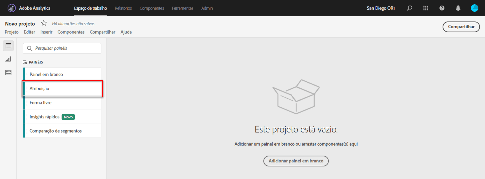
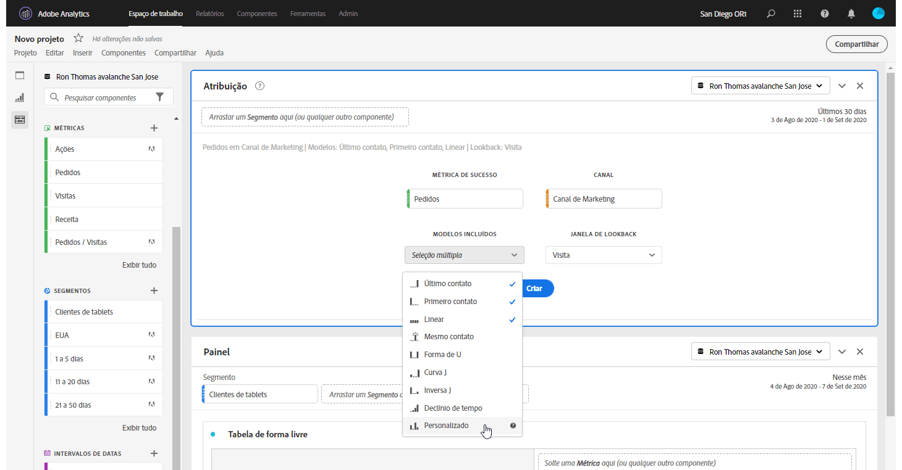
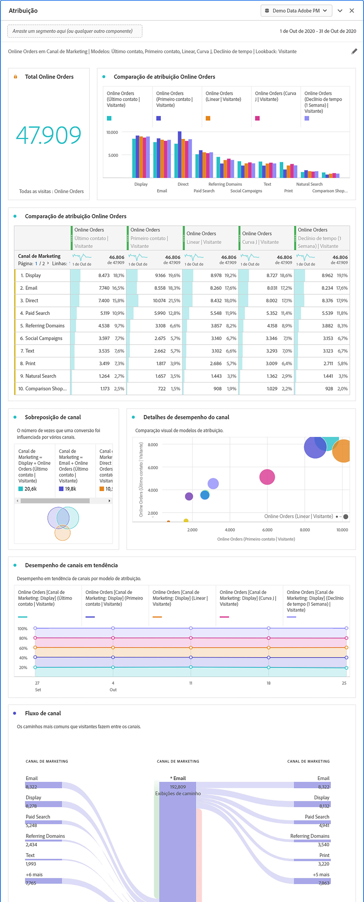

# Painel de atribuição

O painel de atribuição é uma maneira fácil para criar uma análise comparando vários modelos de atribuição. É um recurso no QI [de](../attribution/overview.md) atribuição que oferece um espaço de trabalho dedicado para usar e comparar modelos de atribuição.

## Criar um painel de atribuição

1. Clique no ícone do painel à esquerda.
1. Arraste o Painel de atribuição para seu projeto do Analysis Workspace.

   

1. Adicione uma métrica que você deseja atribuir e adicione qualquer dimensão ao atributo. Os exemplos incluem Canais de marketing ou dimensões personalizadas, como promoções internas.

   

1. Selecione os modelos de [atribuição e a janela](../attribution/models.md) de pesquisa que deseja comparar.

1. O painel Atribuição retorna um conjunto avançado de dados e visualizações que comparam a atribuição da dimensão e da métrica selecionadas.

   

## Visualizações de atribuição

* **Métrica** total: O número total de conversões que ocorreram na janela de tempo do relatórios. Essas são as conversões atribuídas pela dimensão selecionada.
* **Gráfico** de barras de comparação de atribuição de métrica: Compara visualmente as conversões atribuídas em cada um dos itens de dimensão da dimensão selecionada. Cada cor da barra representa um modelo de atribuição distinto.
* **Tabela** de forma livre de atribuição de métrica: Mostra os mesmos dados que o gráfico de barras, representado como uma tabela. Selecionar diferentes colunas ou linhas nesta tabela filtros o gráfico de barras, bem como várias outras visualizações no painel. Esta tabela atua de forma semelhante a qualquer outra Tabela de forma livre no Workspace - permitindo que você adicione componentes como métricas, segmentos ou detalhamentos.
* **Gráfico** de sobreposição de dimensão: Um diagrama Venn mostrando os três principais itens de dimensão e a frequência com que eles participam em conjunto em uma conversão. Por exemplo, o tamanho da sobreposição de bolha indica a frequência com que as conversões ocorreram quando um visitante foi exposto a ambos os itens de dimensão. Selecionar outras linhas na tabela de forma livre adjacente atualiza a visualização para refletir sua seleção.
* **Pontos de contato de marketing por jornada**: Um histograma que indica o número de pontos de contato que um visitante teve na janela de pesquisa. Isso é útil para descobrir o impacto da atribuição de multi toque em seu conjunto de dados. Se quase todos os visitantes tiverem apenas um único ponto de contato, modelos de atribuição diferentes provavelmente mostrarão dados semelhantes.
* **Detalhes** de desempenho do Canal de marketing: Permite comparar até três modelos de atribuição visualmente usando um gráfico de dispersão.
* **Fluxo** do Canal de marketing: Permite que você veja com quais canais interagem mais comumente, e em que ordem, ao longo de uma jornada de visitantes.
