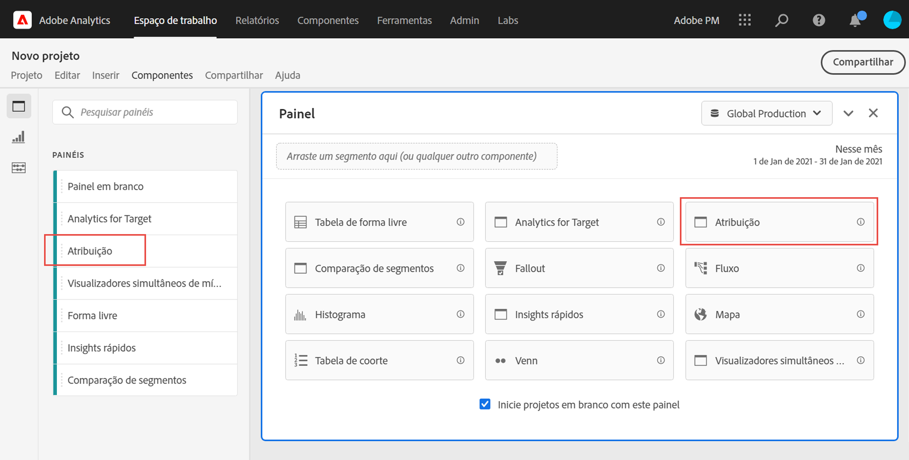

# Painel de atribuição {#attribution-panel}

<!-- markdownlint-disable MD034 -->

>[!CONTEXTUALHELP]
>id="workspace_attribution_button"
>title="Atribuição"
>abstract="Compare e visualize rapidamente quantos modelos de atribuição quiser usando qualquer dimensão e métrica de conversão"
>additional-url="https://www.youtube.com/watch?v=Yu0hy2klzA0" text="Painel do Attribution IQ"

>[!CONTEXTUALHELP]
>id="workspace_attribution_panel"
>title="Painel de atribuição"
>abstract="Compare e visualize modelos de atribuição rapidamente usando qualquer dimensão e métrica de conversão.  **Parâmetros ** **Canal**  A dimensão à qual atribuir. Essa dimensão pode ser canais de marketing, campanhas ou qualquer outra dimensão. **Modelos**  O modelo determina como o crédito é atribuído aos pontos de contato. **Janela de pesquisa**  Essa configuração determina a janela de atribuição de dados que será aplicada a cada conversão."
>additional-url="https://www.youtube.com/watch?v=Yu0hy2klzA0" text="Painel do Attribution IQ"

<!-- markdownlint-enable MD034 -->

>[!BEGINSHADEBOX]

*Este artigo documenta o painel Atribuição no **Adobe Analytics**. Consulte [Painel de atribuição](https://experienceleague.adobe.com/en/docs/analytics-platform/using/cja-workspace/panels/attribution) para a versão **Customer Journey Analytics**deste artigo.*

>[!ENDSHADEBOX]

O painel **[!UICONTROL Atribuição]** é uma maneira fácil de criar uma análise comparando vários modelos de atribuição. O painel fornece um espaço de trabalho dedicado para usar e comparar modelos de atribuição.

O Adobe Analytics aprimora a atribuição ao permitir:

* Definir atribuição além da mídia paga: qualquer dimensão, métrica, canal ou evento pode ser aplicado a modelos (por exemplo, pesquisa interna), não apenas campanhas de marketing.
* Usar comparação de modelo de atribuição ilimitada: compare dinamicamente quantos modelos desejar.
* Evite alterações na implementação: com o processamento em tempo de relatório e sessões sensíveis ao contexto, o contexto de jornada do cliente pode ser incorporado e aplicado no tempo de execução.
* Construir a sessão que melhor corresponde ao seu cenário de atribuição.
* Detalhar atribuições por segmentos: compare facilmente o desempenho de seus canais de marketing entre segmentos importantes (por exemplo, clientes novos vs. repetidos, Produto X vs. Produto Y, Nível de fidelidade ou CLV).
* Inspecionar canais cruzados e análises de multitoque: usando diagramas e histogramas de Venn e resultados de atribuição de tendência.
* Analisar visualmente as principais sequências de marketing: explore visualmente caminhos que levaram à conversão usando as visualizações de fluxo de múltiplos nós e de fallout.
* Criar métricas calculadas: use a quantidade de métodos de alocação de atribuição que desejar.

## Usar

Para usar um painel **[!UICONTROL Atribuição]**:

1. Crie um painel **[!UICONTROL Atribuição]**. Para obter informações sobre como criar um painel, consulte [Criar um painel](panels.md#create-a-panel).

1. Especifique a [entrada](#panel-input) do painel.

1. Observe a [saída](#panel-output) do painel.

### Entrada do painel

Você pode configurar o painel Atribuição usando estas configurações de entrada:

1. Adicione uma **[!UICONTROL Métrica de sucesso]** e uma dimensão do **[!UICONTROL Canal]** para a qual você deseja atribuir. Os exemplos incluem Canais de marketing ou dimensões personalizadas, como promoções internas.

   

1. Selecione um ou mais [modelos de atribuição](#attribution-models) de **[!UICONTROL modelos incluídos]** e uma [janela de pesquisa](#lookback-window) da **[!UICONTROL janela de pesquisa]** que você deseja usar para comparação.

1. Selecione **[!UICONTROL Criar]** para criar as visualizações no painel.

### Saída do painel

O painel **[!UICONTROL Atribuição]** retorna um conjunto avançado de dados e visualizações que comparam a atribuição da dimensão e da métrica selecionadas.

### Visualizações de atribuição

As visualizações a seguir fazem parte do resultado do painel.

* **Métrica total**: o número total de conversões que ocorreram ao longo da janela de tempo do relatório e são atribuídas à dimensão selecionada.
* **Barra de comparação de atribuição**: compara visualmente as conversões atribuídas em cada um dos itens da dimensão selecionada. Cada cor da barra representa um modelo de atribuição distinto.
* **Tabela de comparação de atribuição**: mostra os mesmos dados que o gráfico de barras, mas representados como uma tabela. Selecionar diferentes colunas ou linhas nesta tabela filtra o gráfico de barras, bem como várias outras visualizações no painel. Esta tabela atua de forma semelhante a qualquer outra tabela de forma livre no Workspace, permitindo adicionar componentes como métricas, segmentos ou detalhamentos.
* **Diagrama de sobreposição**: uma visualização Venn mostrando os três principais itens de dimensão e a frequência com que eles participam em conjunto em uma conversão. Por exemplo, o tamanho da sobreposição entre as bolhas indica com que frequência as conversões ocorreram quando uma pessoa foi exposta a ambos os itens de dimensão. Selecionar outras linhas na tabela de Forma livre adjacente atualizará a visualização para refletir a seleção.
* **Detalhe de Desempenho**: uma visualização de dispersão para comparar visualmente até três modelos de atribuição.
* **Desempenho com tendência**: mostra a tendência das conversões atribuídas para o item de dimensão principal. Selecionar outras linhas na tabela de Forma livre adjacente atualizará a visualização para refletir a seleção.
* **Fluxo**: permite ver em quais canais há mais interação e em que ordem isso ocorre na jornada de uma pessoa.

## Modelos de atribuição

{{attribution-models-details}}

## Janela de lookback

{{attribution-lookback-window}}

>[!MORELIKETHIS]
>
> [Criar um painel](/help/analyze/analysis-workspace/c-panels/panels.md#create-a-panel)
>

<!--
# Attribution panel

The [!UICONTROL Attribution] panel is an easy way to build an analysis comparing various attribution models. It is a feature in [Attribution](/help/analyze/analysis-workspace/attribution/overview.md) that gives you a dedicated workspace to use and compare attribution models.

>[!VIDEO](https://video.tv.adobe.com/v/23139/?quality=12)

## Create an attribution panel

1. Click the panel icon on the left.
1. Drag the [!UICONTROL Attribution] panel into your Analysis Workspace Project.

   

1. Add a metric that you want to attribute and add any dimension to attribute against. Examples include Marketing Channels or custom dimensions, such as internal promotions.

   

1. Select the [attribution models and lookback window](../attribution/models.md) you want to compare.

1. The Attribution panel returns a rich set of data and visualizations that compare attribution for the selected dimension and metric.

   

## Attribution visualizations

* **Total metric**: The total number of conversions that occurred over the reporting time window. These are the conversions that are attributed across the dimension that you selected.
* **Attribution Comparison Bar**: Visually compares the attributed conversions across each of the dimension items from your selected dimension. Each bar color represents a distinct attribution model.
* **Attribution Comparison Table**: Shows the same data as the bar chart, represented as a table. Selecting different columns or rows in this table filters the bar chart as well as several of the other visualizations in the panel. This table acts similar to any other Freeform Table in Workspace - allowing you to add components such as metrics, segments, or breakdowns.
* **Overlap Diagram**: A Venn Diagram showing the top three dimension items and how often they participate jointly in a conversion. For example, the size of the bubble overlap indicates how often conversions occurred when a visitor was exposed to both dimension items. Selecting other rows in the adjacent Freeform table updates the visualization to reflect your selection.
* **Performance Detail**: Lets you to compare up to three attribution models visually using a scatter plot.
* **Trended Performance**: By default, shows the conversion performance trend by attribution model for the first dimension listed in the adjacent Freeform table. You can select different dimension rows in the Freeform table to show the trend for the selected dimensions (such as Total Revenue for each attribution model for Social Campaigns and Paid Search). Alternately, you can select cells in the columns for any metric and attribution type combinations in the Freeform table to see the trended performance by dimension value for the specified attribution models (such as Total Revenue by Marketing Channel using Last Touch and First Touch attribution).
* **Flow**: Lets you see which channels are interacted with most commonly, and in what order across a visitor's journey.

-->