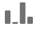
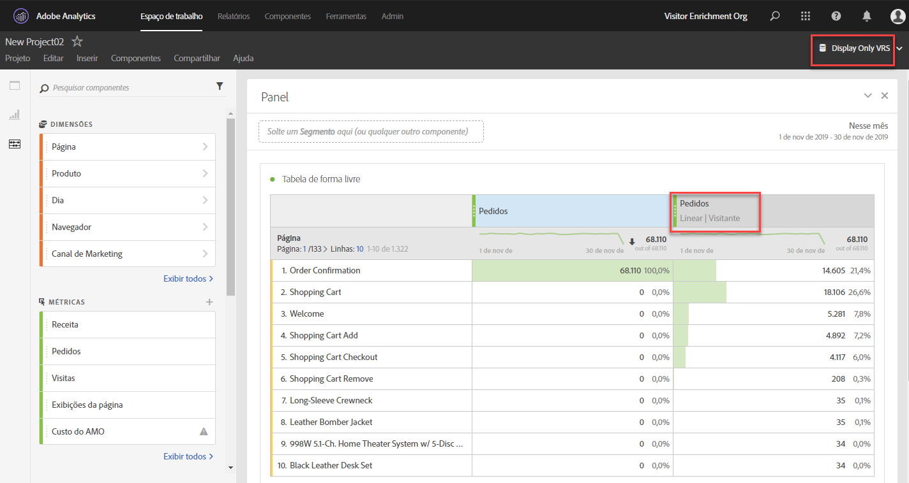

# Visão geral do painel Atribuição

>[!IMPORTANT] O Painel de atribuição está disponível para todos os clientes nos SKUs do Adobe Analytics Ultimate, Prime, Select e Foundation.

O painel de atribuição é um recurso do [Attribution IQ](../../attribution-iq.md) que permite adicionar vários tipos novos de modelo de atribuição às tabelas de forma livre, visualizações e métricas calculadas. Todos os modelos de atribuição têm dois componentes:

* **Modelo de atribuição:** o modelo descreve a distribuição de conversões nas ocorrências de um grupo. Por exemplo, primeiro ou último contato.
* **Janela de retrospectiva de atribuição:** descreve quais agrupamentos de ocorrências são considerados para cada modelo. Por exemplo, visita ou visitante.

## Modelos de atribuição

| Ícone da interface do usuário | Modelos de atribuição | Definição | Quando usar |
| --- | --- | --- | --- |
|  | Último contato | Dá 100% de crédito ao ponto de contato mais recente antes da conversão. | É o modelo de atribuição mais básico e comum. É utilizado com frequência para conversões com um ciclo de curto consideração. O modelo Último contato é usado por equipes responsáveis por gerenciar marketing de pesquisa ou analisar palavras-chave de pesquisa interna. |
|  | Primeiro contato | Dá 100% de crédito ao primeiro ponto de contato visto na janela de retrospectiva de atribuição. | Também é um modelo de atribuição comum e útil para analisar canais de marketing com o fim de impulsionar a percepção da marca ou a conquista de clientes. O modelo Primeiro contato é usado com frequência por equipes de marketing de exibição ou de marketing social, mas também é útil para avaliar a eficiência das recomendações locais de produtos. |
|  | Mesmo contato | Dá 100% de crédito à ocorrência em que ocorreu a conversão. Se o ponto de contato e a conversão não estiverem relacionados com a mesma ocorrência, o ponto de contato será agrupado em “Nenhum”. | Este modelo é útil para avaliar o conteúdo ou a experiência do usuário apresentados no momento da conversão. Equipes de produto ou de design geralmente usam esse modelo para avaliar a eficácia de uma página na qual ocorre a conversão. |
|  | Linear | Dá crédito igual a todos os pontos de contato que resultem em uma conversão. | Este modelo é útil para conversões com ciclos de consideração mais longos ou experiências do usuário que requerem um engajamento do cliente mais frequente. A atribuição linear é usada com frequência por equipes de produtos com base em assinatura ou responsáveis por medir a eficácia de notificações de aplicativos móveis. |
|  | Forma de U | Dá crédito de 40% à primeira interação, de 40% à última interação, e divide os 20% restantes para os pontos de contato entre as duas. Para conversões com um só ponto de contato, o crédito é de 100%. Para conversões com dois pontos de contato, o crédito é de 50% para ambos. | É um ótimo modelo para quem valoriza as interações que introduziram ou concluíram uma conversão, mas ainda quer reconhecer as interações de assistência. O modelo em Forma de U é usado com frequência por equipes que têm uma abordagem mais equilibrada, mas desejam atribuir mais crédito a canais que introduziram ou concluíram uma conversão. |
|  | Forma de J | Dá crédito de 60% à última interação, de 20% à primeira interação, e divide os 20% restantes para os pontos de contato entre as duas. Para conversões com um só ponto de contato, o crédito é de 100%. Para conversões com dois pontos de contato, o crédito é de 75% para a última interação e de 25% para a primeira. | Esse modelo é excelente para quem prioriza a descoberta e a conclusão de conversões, mas quer se concentrar em interações de conclusão. A atribuição em Forma de J é frequentemente usada por equipes com uma abordagem mais equilibrada, que desejam atribuir mais crédito a canais que concluíram uma conversão. |
|  | J invertido | Dá 60% de crédito ao primeiro ponto de contato, 20% de crédito ao último ponto de contato e divide os 20% restantes para os pontos de contato entre os dois. Para conversões com um só ponto de contato, o crédito é de 100%. Para conversões com dois pontos de contato, o crédito é de 75% para a primeira interação e de 25% para a última. | Esse modelo é ideal para quem prioriza a descoberta e a conclusão de conversões, mas quer focalizar a descoberta de interações. A atribuição em forma de J invertido é frequentemente usada por equipes com uma abordagem mais equilibrada, que desejam atribuir mais crédito a canais que iniciaram uma conversão. |
|  | Personalizado | Permite que você especifique os pesos que deseja atribuir ao primeiro, ao último e ao resto de pontos de contato. Os valores especificados são regularizados para 100% mesmo se os números inseridos, quando somados, não resultarem em 100. Para conversões com um só ponto de contato, o crédito é de 100%. Para interações com dois pontos de contato, o parâmetro intermediário é ignorado. O primeiro e o último ponto de contato são normalizados para 100% e o crédito é atribuído em conformidade. | Esse modelo é perfeito para quem quer controle total sobre seu modelo de atribuição e tem necessidades específicas que outros modelos de atribuição não atendem. |
|  | Declínio de tempo | Segue um declínio exponencial com um parâmetro personalizado de meia-vida e padrão de 7 dias. O peso de cada canal depende da quantidade de tempo decorrido entre a iniciação do ponto de contato e a conversão final. A fórmula usada para determinar o crédito é `2``(-t/halflife)`, em que `t` é o tempo entre um ponto de contato e uma conversão. Todos os pontos de contato são normalizados para 100%. | Ideal para equipes que fazem publicidade em vídeos ou marketing para eventos com data predeterminada. Quanto mais tarde ocorrer uma conversão após um evento de marketing, menos crédito será dado. |
|  | Participação | Dá 100% de crédito a todos os pontos de contato exclusivos. O número total de conversões aumenta em comparação com outros modelos de atribuição. A participação remove a duplicação de canais que são vistos várias vezes. | Excelente para identificar a quem os clientes são expostos com frequência em uma determinada interação. As organizações de mídia usam esse modelo frequentemente para calcular a velocidade do conteúdo. As varejistas geralmente usam esse modelo para identificar as partes do site que são essenciais para a conversão. |
|  | [Algorítmico](https://docs.adobe.com/content/help/en/analytics/analyze/analysis-workspace/panels/attribution/algorithmic.md) | Usa técnicas estatísticas para determinar dinamicamente a alocação ideal de crédito para a métrica selecionada. | Útil para ajudar a evitar adivinhações ou heurística ao escolher o modelo de atribuição correto para sua empresa. |

## Janelas de retrospectiva

As janelas de retrospectiva representam quanto tempo uma conversão deve retroceder para incluir pontos de contato. Os modelos de atribuição que dão mais crédito às primeiras interações veem diferenças maiores ao exibir diferentes janelas de retrospectiva.

* **Janela de retrospectiva de visita:** retroage até o início de uma visita em que ocorreu uma conversão. As janelas de retrospectiva de visita são pequenas, pois não consideram nada além da visita. As janelas de retrospectiva de visita respeitam a definição de visita modificada em conjuntos de relatórios virtuais.

* **Janela de retrospectiva do visitante:** verifica todas as visitas até o primeiro dia do mês do intervalo de datas atual. As janelas de retrospectiva do visitante são amplas, pois podem abranger muitas visitas. Por exemplo, se o intervalo de datas de um relatório for de 15 a 30 de setembro, o intervalo de datas da retrospectiva do visitante será de 1º a 30 de setembro.

* **** Janela de pesquisa personalizada: Permite expandir a janela de atribuição além do intervalo de datas do relatório até um máximo de 90 dias. As janelas de pesquisa personalizadas são avaliadas em cada conversão no período de relatório. Por exemplo, para uma conversão que ocorre em 20 de fevereiro, uma janela de pesquisa de 10 dias avaliaria todos os pontos de contato de dimensão de 10 a 20 de fevereiro no modelo de atribuição.

## Exemplo

Considere o exemplo a seguir:

1. Em 15 de setembro, um visitante chega ao seu site através de um anúncio de pesquisa pago e depois sai.
2. Em 18 de setembro, o visitante chega ao seu site novamente através de um link de redes sociais que recebeu de um amigo. Eles adicionam vários itens ao carrinho, mas não compram nada.
3. Em 24 de setembro, sua equipe de marketing envia um email com um cupom para alguns dos itens em seu carrinho. Eles aplicam o cupom, mas visitam vários outros sites para ver se existem outros cupons disponíveis. Eles encontram outro cupom por meio de um anúncio de exibição e, em seguida, fazem uma compra de US$ 50.

Dependendo da janela de retrospectiva e do modelo de atribuição, os canais recebem crédito diferente. Veja a seguir alguns exemplos:

* Usando o modelo **primeiro contato** e uma **janela de retrospectiva de visita**, a atribuição considera somente a terceira visita. Entre email e exibição, o email foi o primeiro, então o email recebe 100% de crédito pela compra de US$ 50.
* Usando o modelo **primeiro contato** e uma **janela de retrospectiva de visitante**, a atribuição considera todas as três visitas. A pesquisa paga foi a primeira, então ela recebe 100% de crédito pela compra de US$ 50.
* Usando o **primeiro toque** e uma janela **de pesquisa** personalizada, de sete dias, a atribuição analisa apenas as duas visitas mais recentes. Nesta janela de relatórios, o link de mídia social foi o primeiro, então ele recebe 100% de crédito pela compra de $50.
* Usando o modelo **linear** e uma **janela de retrospectiva de visita**, o crédito é dividido entre email e exibição. Ambos os canais recebem um crédito de US$ 25 dólares.
* Usando o modelo **linear** e uma **janela de retrospectiva de visitante**, o crédito é dividido entre pesquisa paga, redes sociais, email e exibição. Cada canal recebe um crédito de US$ 12,50 por esta compra.
* Usando uma janela **de pesquisa** linear **e** personalizada de sete dias, o crédito é dividido entre social, email e exibição. Cada um desses canais recebe um crédito de US$ 12,50 por esta compra. A pesquisa paga é excluída porque não ocorre na janela de pesquisa especificada.
* Usando o modelo em **Forma de J** e uma **janela de retrospectiva de visitante**, o crédito é dividido entre pesquisa paga, redes sociais, email e exibição.
   * O crédito será de 60% para a exibição (US$ 30).
   * De 20% para a pesquisa paga (US$ 10).
   * Os 20% restantes são divididos entre redes sociais e email (US$ 5 para cada).
* Usando o modelo **Declínio de tempo** e uma **janela de pesquisa de visitante**, o crédito é dividido entre pesquisa paga, redes sociais, email e exibição. Usando a meia-vida padrão de 7 dias:
   * Intervalo de 0 dias entre o ponto de contato de exibição e a conversão. `2``(-0/7)` `= 1`
   * Intervalo de 0 dias entre o ponto de contato do email e a conversão. `2``(-0/7)` `= 1`
   * Intervalo de 6 dias entre o ponto de contato social e a conversão. `2``(-6/7)` `= 0.552`
   * Intervalo de 9 dias entre o ponto de contato de pesquisa paga e a conversão. `2``(-9/7)` `= 0.41`
   * A normalização desses valores resulta no seguinte:
      * Exibição: 33,8%, crédito de US$ 16,88
      * Email: 33,8%, crédito de US$ 16,88
      * Redes sociais: 18,6%, crédito de US$ 9,32
      * Pesquisa paga: 13,8%, crédito de US$ 6,92

> [!TIP] Outros eventos de conversão, como pedidos ou eventos personalizados, também são divididos se o crédito pertencer a mais de um canal. Por exemplo, se dois canais contribuem para um evento personalizado usando um modelo de atribuição Linear, ambos os canais obtêm 0,5 do evento personalizado. Essas frações de evento são somadas em todas as visitas e em seguida arredondadas para o número inteiro mais próximo para o relatório.

## Uso da atribuição com canais de marketing

Quando os canais de marketing foram introduzidos pela primeira vez, eles só contavam com as dimensões de primeiro e último contato. Com os novos modelos de atribuição, as dimensões explícitas de primeiro/último contato não são mais necessárias. A Adobe fornece dimensões genéricas **Canal de marketing** para que possam ser usadas com o modelo de atribuição escolhido. Essas dimensões genéricas dos Canais de marketing se comportam de forma idêntica às dimensões do Canal de último contato, mas são rotuladas de forma diferente para evitar confusão em caso de uso de canais de marketing com um modelo de atribuição diferente.

Como as dimensões do canal de marketing dependem de uma definição de visita tradicional (conforme definido por suas regras de processamento), a definição de visita não pode ser alterada usando conjuntos de relatórios virtuais.

## Uso da atribuição com variáveis de vários valores

Algumas dimensões do Analytics podem conter vários valores em uma só ocorrência. Exemplos comuns incluem list vars e a variável products.

Quando a atribuição é aplicada a ocorrências de vários valores, todos os valores na mesma ocorrência recebem o mesmo crédito. Como muitos valores podem receber esse crédito, o total do relatório pode ser diferente se você somar cada item de linha individual. O total do relatório é desduplicado, enquanto cada valor de dimensão individual recebe o crédito adequado.

## Uso da atribuição com segmentação

A atribuição sempre é executada antes da segmentação e a segmentação é executada antes da aplicação dos filtros do relatório. Esse conceito também se aplica a conjuntos de relatórios virtuais (VRS) que usam segmentos.

Por exemplo, se você criar um VRS com um segmento “Exibir ocorrências” aplicado, poderá ver outros canais em uma tabela usando alguns modelos de atribuição.

