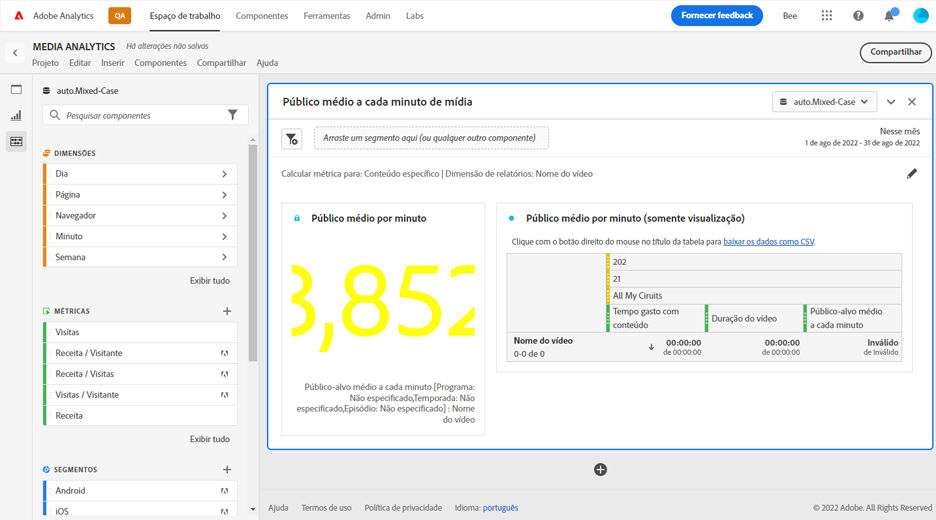
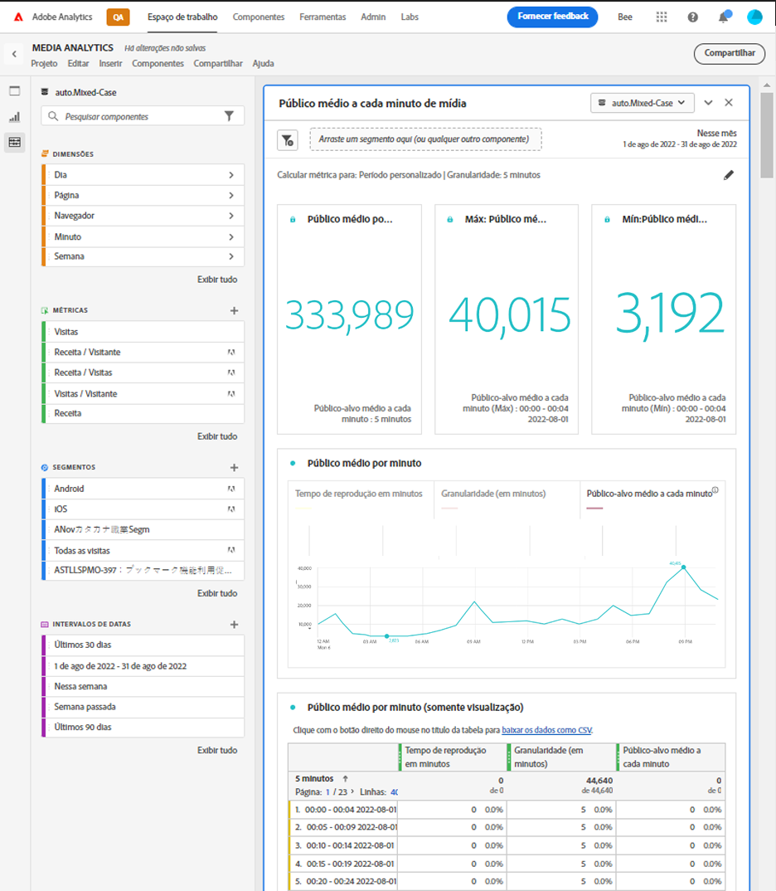

# Painel de audiência média por minuto de mídia {#media-average-minute-audience-panel}

<!-- markdownlint-disable MD034 -->

>[!CONTEXTUALHELP]
>id="workspace_mediaminuteaverageaudience_button"
>title="Público médio a cada minuto de mídia"
>abstract="Crie um painel para analisar a audiência média por minuto de um conteúdo específico ou ao longo de um período específico."

<!-- markdownlint-enable MD034 -->

<!-- markdownlint-disable MD034 -->

>[!CONTEXTUALHELP]
>id="workspace_mediaaverageminuteaudience_panel"
>title="Público médio a cada minuto de mídia"
>abstract="Mostra o desempenho de conteúdo de mídia específico ou ao longo de um período personalizado.  **Parâmetros gerais ** **Calcular métrica para**: selecione a métrica a ser usada para o painel. Selecione **Conteúdo específico** para analisar a audiência média por minuto de um conteúdo ou evento específico com base na duração do conteúdo. **Selecione um período personalizado** para analisar como a audiência média por minuto muda ao longo de um período personalizado selecionado. **Dimensão do relatório**: selecione para relatar por **Nome do vídeo** da dimensão da **ID do conteúdo**. Disponível somente quando você seleciona Conteúdo específico como a métrica. **Granularidade**: selecione a granularidade para os relatórios. Disponível somente quando você seleciona Período personalizado como a métrica. **Filtrar conteúdo por (opcional)**: selecione um programa, temporada, episódio ou selecione uma dimensão personalizada para filtrar o conteúdo.  **Configurações avançadas ** **Configurações de tabela**: selecione se deseja mostrar valores de cálculo na tabela. **Métrica de tempo gasto**: selecione a métrica de tempo gasto que deseja usar para o cálculo de conteúdo específico. Disponível somente quando você seleciona Conteúdo específico como a métrica."

<!-- markdownlint-enable MD034 -->

>[!BEGINSHADEBOX]

*Este artigo documenta o painel Audiência média por minuto da mídia em **Customer Journey Analytics**. Consulte o [painel Audiência média por minuto da mídia](https://experienceleague.adobe.com/en/docs/analytics/analyze/analysis-workspace/panels/average-minute-audience-panel) para a versão **Adobe Analytics**deste artigo.*

>[!ENDSHADEBOX]

>[!NOTE]
>
>O painel **[!UICONTROL Público-alvo médio por minuto da mídia]** está disponível somente para clientes que compraram a Coleção de mídia de streaming para o Adobe Analytics.
>
>Entre em contato com o representante de vendas da Adobe ou com a equipe de conta da Adobe para obter mais informações.
>

No Analysis Workspace, o público-alvo médio por minuto pode fornecer informações sobre

* o tempo gasto visualizando um fluxo de mídia específico dividido pela duração do conteúdo, ou
* o tempo gasto visualizando durante um período personalizado com granularidade selecionada.

O painel Audiência média por minuto da mídia permite compreender o consumo médio do conteúdo comparando programas de qualquer comprimento ou gênero. Por exemplo, você pode entender o consumo médio ao comparar um sitcom de 30 minutos com um evento esportivo de 3 horas.

Além disso, você pode usar o painel Audiência média por minuto da mídia para comparar ou anexar essa Audiência média por minuto digital às métricas de média por minuto lineares da TV.

O painel Público-alvo médio por minuto da mídia oferece os seguintes benefícios em relação à métrica Público-alvo médio por minuto:

* Oferece suporte a períodos personalizados

* Permite atualizar a classificação de duração após o processamento das exibições (se a classificação de duração não estava presente ou precisa ser corrigida)

  Se você fizer essa atualização ao usar a métrica, a classificação de duração não existirá (se a classificação não estiver presente). Ou a classificação de duração está desatualizada (se a classificação estava presente, mas incorreta).

## Usar

Para usar um painel **[!UICONTROL Audiência média por minuto da mídia]**:

1. Crie um painel **[!UICONTROL Audiência média por minuto da mídia]**. Para obter informações sobre como criar um painel, consulte [Criar um painel](panels.md#create-a-panel).

1. Selecione uma visualização de dados para o painel que tem componentes configurados na coleção de mídia de transmissão.

1. Especifique a [entrada](#panel-input) do painel.

1. Observe a [saída](#panel-output) do painel.

### Entrada do painel

Use as configurações de entrada descritas nesta seção para configurar o painel Público-alvo médio por minuto de mídia.

1. Defina as seguintes configurações de entrada:

   | Configuração | Descrição |
   |---------|------------|
   | **Intervalo de datas do painel** | O padrão do intervalo de datas do painel é [!UICONTROL **Este mês**]. É possível editá-lo para exibir um único dia ou muitos meses de cada vez.    Essa visualização é limitada a 1440 linhas de dados (por exemplo, 24 horas na granularidade no nível de minuto). Se uma combinação de intervalo de datas e granularidade resultar em mais de 1440 linhas, a granularidade será atualizada automaticamente para ajustar o intervalo de datas completo. |
   | [!UICONTROL **Solte um segmento aqui (ou qualquer outro componente)**] | Como outros painéis, essa configuração filtra as seleções com base nos segmentos criados. Essa configuração é uma ótima maneira de observar plataformas específicas, fluxos ao vivo ou outros segmentos de mídia comuns. |
   | [!UICONTROL **Calcular métrica para**] | Escolha se você deseja ver o público-alvo médio por minuto para [**[!UICONTROL Conteúdo específico]**](#specific-content). Ou se você quiser ver a audiência média por minuto de um [**[!UICONTROL Período personalizado]**](#custom-time-period).  Selecionar [!UICONTROL **Período personalizado**]: <ul><li>Se a duração não estiver disponível ou </li><li>se você quiser visualizar o público-alvo médio por minuto de uma série de tempo com vários conteúdos, ou</li><li>para conteúdo sem uma duração específica atribuída (como durante um fluxo ao vivo ou evento)</li></ul></li></li></ul> 
Essa configuração altera o fluxo de trabalho e a saída do relatório.
 |

1. Continue com [Conteúdo específico](#specific-content) ou [Período personalizado](#custom-time-period), dependendo da opção escolhida na lista suspensa [!UICONTROL **Calcular métrica para**].

#### Conteúdo específico

1. Se você selecionou [!UICONTROL **Conteúdo específico**] no menu suspenso [!UICONTROL **Calcular métrica para**] ao [configurar entradas do painel](#panel-inputs), especifique as seguintes opções de configuração:

   | Configuração | Descrição |
   |---------|------------|
   | [!UICONTROL **Dimensão de relatório**] | Ao selecionar um conteúdo específico, é possível selecionar a saída do relatório para usar os campos nome do vídeo ou ID do conteúdo para mostrar o conteúdo e o público-alvo médio por minuto associado. |
   | [!UICONTROL **Filtrar conteúdo por (opcional)**] | Escolha como filtrar o conteúdo específico, dependendo da exibição desejada ou da maneira como seus dados são estruturados. <ul>[!UICONTROL **Programa, temporada, episódio**]: exibe seus programas disponíveis na lista suspensa, que podem ser filtrados por meio de uma pesquisa (ou arrastando e soltando o nome do programa na coluna esquerda). Você pode terminar a seleção ali para ver todas as estações do programa, ou você pode filtrar por estações individuais e por episódios individuais. Esta configuração mostra os dados para esses programas, temporadas ou episódios do período selecionado.</li><li>[!UICONTROL **Dimensão personalizada**]: se o seu nome de exibição estiver em uma dimensão personalizada, você poderá encontrá-lo pesquisando na lista suspensa da dimensão (opcional) ou usando a pesquisa de coluna à esquerda. O item de dimensão é preenchido automaticamente com base nessa seleção e é tratado como um episódio.</li><li>[!UICONTROL **Nenhum**]: mostra todos os nomes de vídeo que têm dados de público-alvo médio por minuto para a seleção que você escolheu. (Essa opção é selecionada por padrão.)</li></ul> |

1. Continue com [Configurações avançadas de conteúdo específico](#specific-content-advanced-settings) para definir as configurações avançadas.

#### Configurações avançadas de conteúdo específico

1. Com [!UICONTROL **Conteúdo específico**] selecionado no menu suspenso [!UICONTROL **Calcular métrica para**], selecione [!UICONTROL **Mostrar configurações avançadas**] e especifique as seguintes opções de configuração:

   | Opções | Descrição |
   |---------|------------|
   | **[!UICONTROL Configurações de tabela]** | A opção padrão **[!UICONTROL Mostrar valores de cálculo na tabela]** mostra o numerador e o denominador do público-alvo médio por minuto como as colunas anteriores na tabela. Desmarcar essa opção remove essas duas colunas. A coluna de público-alvo médio por minuto permanece na tabela ao lado do nome do vídeo ou da ID do conteúdo. |
   | **[!UICONTROL Métrica de tempo gasto]** | Você pode escolher a opção padrão **[!UICONTROL Tempo gasto com conteúdo]**, que inclui apenas o tempo de conteúdo. Ou você pode optar por usar **[!UICONTROL Tempo gasto com a mídia]**, que inclui o conteúdo e o tempo do anúncio juntos como cálculo do numerador para o público-alvo médio por minuto. |

1. Selecione [!UICONTROL **Build**] para concluir a criação do painel Audiência média por minuto da mídia.

1. Continue com [Saída do painel](#panel-output) para obter informações sobre como usar o painel Audiência média por minuto de mídia.

#### Período personalizado

1. Se você selecionou [!UICONTROL **Período personalizado**] no menu suspenso [!UICONTROL **Calcular métrica para**] ao [configurar entradas do painel](#panel-inputs), especifique as seguintes opções de configuração:

   | Opções | Descrição |
   |---------|------------|
   | **[!UICONTROL Granularidade]** | A granularidade padrão é de [!UICONTROL **5-Minute**], mas você pode escolher qualquer uma das granularidades usadas como denominador para a série de tempo dentro do período selecionado. Por exemplo, selecionar 12h às 12h30 com granularidade de 5 minutos retorna o público-alvo médio por minuto durante a meia hora completa, bem como seis linhas com o público-alvo médio por minuto para cada período de 5 minutos. Essas linhas são usadas como pontos de dados para o gráfico de série de tempo. |
   | [!UICONTROL **Filtrar conteúdo por (opcional)**] | Escolha como filtrar o conteúdo específico, dependendo da exibição desejada ou da maneira como seus dados são estruturados. <ul>[!UICONTROL **Programa, temporada, episódio**]: exibe seus programas disponíveis na lista suspensa, que podem ser filtrados por meio de uma pesquisa (ou arrastando e soltando o nome do programa na coluna esquerda). Você pode terminar a seleção ali para ver todas as estações do programa, ou você pode filtrar por estações individuais e por episódios individuais. Esta configuração mostra os dados para esses programas, temporadas ou episódios do período selecionado.</li><li>[!UICONTROL **Dimensão personalizada**]: se o seu nome de exibição estiver em uma dimensão personalizada, você poderá encontrá-lo pesquisando na lista suspensa da dimensão (opcional) ou usando a pesquisa de coluna à esquerda. O item de dimensão é preenchido automaticamente com base nessa seleção e é tratado como um episódio.</li><li>[!UICONTROL **Nenhum**]: mostra todos os nomes de vídeo que têm dados de público-alvo médio por minuto para a seleção que você escolheu. (Essa opção é selecionada por padrão.)</li></ul> |

1. Continue com as [configurações avançadas do período personalizado](#custom-time-period-advanced-settings) para definir as configurações avançadas.

#### Configurações avançadas do período personalizado

1. Com o [!UICONTROL **Período personalizado**] selecionado no menu suspenso [!UICONTROL **Calcular métrica para**], selecione [!UICONTROL **Mostrar configurações avançadas**] e especifique a seguinte opção de configuração:

   | Opção | Descrição |
   |---------|------------|
   | **[!UICONTROL Configurações de tabela]** | A configuração padrão mostra os valores de cálculo na tabela, que mostra o numerador e o denominador do público-alvo médio por minuto como as colunas anteriores na tabela. Desmarcar essa opção remove essas duas colunas, deixando somente o público-alvo médio por minuto ao lado do período. |

1. Selecione [!UICONTROL **Build**] para concluir a criação do painel Audiência média por minuto da mídia.

1. Continue com [Saída do painel](#panel-output) para obter informações sobre como usar o painel Audiência média por minuto de mídia.

### Saída do painel

A saída do painel será diferente se você escolher [!UICONTROL **Conteúdo específico**] ou [!UICONTROL **Período personalizado**] no menu suspenso [!UICONTROL **Calcular métrica para**] ao [configurar entradas do painel](#panel-inputs).

#### Conteúdo específico

O painel Audiência média por minuto da mídia retorna o seguinte:

* Público-alvo médio por minuto para toda a seleção
* Filtros e público-alvo médio por minuto para vídeos individuais, exibidos em uma tabela
* Tempo gasto no conteúdo e duração do vídeo (duração) se essa configuração avançada tiver sido selecionada

Para editar e recriar o painel a qualquer momento, selecione  no canto superior direito.

#### Fonte de dados de conteúdo específico

O painel Público-alvo médio por minuto da mídia usa somente a métrica de público-alvo médio por minuto para coletar dados. Detalhamentos ou outras métricas não podem ser usadas no painel.

| Métrica | Descrição |
|--------|-------------|
| **[!UICONTROL Público-alvo médio por minuto]** | O tempo gasto com a visualização do fluxo de mídia dividido pela duração do vídeo fornecido por Classificações. |

#### Período personalizado {#custom-time-period-output}

O painel Audiência média por minuto da mídia retorna o seguinte:

* O público-alvo médio por minuto para toda a seleção

* O público-alvo médio por minuto máximo e mínimo

* O gráfico de série de linhas que mostra o público-alvo médio por minuto em toda a seleção.

* Uma tabela que mostra os filtros e o público-alvo médio por minuto para as granularidades, bem como o tempo gasto no conteúdo e a granularidade para cada período

  Esta tabela é exibida somente se a opção em configurações avançadas chamada [!UICONTROL **Mostrar valores de cálculo na tabela**] for selecionada.

Para editar e recriar o painel a qualquer momento, selecione  no canto superior direito.

#### Fonte de dados de período personalizado

O painel Público-alvo médio por minuto da mídia usa somente a métrica de público-alvo médio por minuto para coletar dados. Detalhamentos ou outras métricas não podem ser usadas no painel.

| Métrica | Descrição |
|---|---|
| **[!UICONTROL Audiência média por minuto]** | O tempo gasto visualizando o fluxo de mídia dividido pela seleção total ou granularidade selecionada em minutos. |

>[!MORELIKETHIS]
>
> [Criar um painel](/help/analyze/analysis-workspace/c-panels/panels.md#create-a-panel)
> [Painel de visualizadores simultâneos de mídia](media-concurrent-viewers.md)
> [Painel Tempo gasto com a reprodução da mídia](media-playback-time-spent.md)
>

<!--

# Media average minute audience panel

>[!NOTE]
>
>The Media average minute audience panel is available only to customers who have purchased the Streaming Media Collection Add-on. 
>
>Contact your Adobe Sales Representative or Adobe Account Team to purchase the Streaming Media Collection Add-on. 

In Analysis Workspace, average minute audience is the time spent viewing your media stream divided by the duration of the content or the total selection of the period and selected granularity.

The Media average minute audience panel enables you to better understand average consumption of your content by comparing programs of any length or genre. For example, you can understand average consumption when comparing a 30-minute sitcom with a 3-hour sporting event.

In addition, you can use the Media average minute audience panel to compare or append this digital average minute audience to linear TV average minute metrics. 

The Media average minute audience panel provides the following benefits over the Average Minute Audience metric:

* Supports custom time periods

* Allows for updating the duration classification after views are processed (if it was not present or if it needs to be corrected)

  If you did this when using the metric, it either won't exist (if the classification wasn't present) or it will be out of date (if the classification was present but incorrect).

## Access the Media average minute audience panel

1. In Analysis Workspace, go to a report suite that has streaming media components enabled. 

1. In the left nav, select the **Panels** icon.

   

1. Drag the [!UICONTROL **Media average minute audience**] panel onto the canvas in Analysis Workspace.

1. To configure the panel, continue with [Panel inputs](#panel-inputs).

## Panel inputs {#Input}

Use the input settings described in this section to configure the Media average minute audience panel.

1. Begin creating a Media average minute audience panel, as described in [Access the Media average minute audience panel](#access-the-media-average-minute-audience-panel).

1. Configure the following input settings:

   | Setting | Description |
   |---------|------------|
   | **Panel date range** | The panel date range default is [!UICONTROL **This month**]. You can edit it to view a single day or many months at a time.    This visualization is limited to 1440 rows of data (for example, 24-hours at minute-level granularity). If a date range and granularity combination results in more than 1440 rows, the granularity is automatically updated to accommodate the full date range. |
   | [!UICONTROL **Drop a segment here (or any other component)**] | Like other panels, this setting filters your selections based on segments you've created. This is a great way to look at specific platforms, live streams, or other common media segments. |
   | [!UICONTROL **Calculate metric for**] | Choose whether you want to see the average minute audience for a specific piece of content, or if you want to see the average minute audience for a custom period of time:<ul><li>**Specific content:** This is available only if the duration has been updated using Classifications. If the duration is unavailable, or if you want to view the average minute audience for a time series with multiple pieces of content or content without a specific assigned duration (like during a live stream or event), then you should select [!UICONTROL **Custom time period**]. (Durations can be set using Classifications either before or after processing time.)</li><li>**Custom time period:** This is available regardless of whether the durations is made available using Classifications.</li></ul> 
This setting changes the workflow and report output.
  |

1. Continue with [Specific content](#specific-content) or [Custom time period](#custom-time-period), depending on the option you chose in the [!UICONTROL **Calculate metric for**] drop-down menu.

### Specific content

1. If you selected [!UICONTROL **Specific content**] in the [!UICONTROL **Calculate metric for**] drop-down menu when [configuring panel inputs](#panel-inputs), specify the following configuration options:

   | Setting | Description |
   |---------|------------|
   | [!UICONTROL **Reporting dimension**] | When you choose specific content, you can select the report output to use either the video name or content ID fields to show the content and its associated average minute audience for the time period selected. |
   | [!UICONTROL **Filter content by (optional)**] | Choose how to filter the specific content, depending on the view you want or the way your data is structured. <ul>[!UICONTROL **Show, season, episode**]: Displays your available shows in the drop-down, which you can filter using a search (or by dragging and dropping the show name from the left column). You can end your selection there to see all the seasons of your show, or you can filter by individual seasons and then by individual episodes. This setting shows the data for those shows, seasons, or episodes for the selected time period.</li><li>[!UICONTROL **Custom dimension**]: If your show name is under a custom dimension, you can find it either by searching in the dimension (optional) drop down or by using the left column search. The dimension item automatically populates based on that selection and is treated as an episode.</li><li>[!UICONTROL **None**]: Shows all the video names that have average minute audience data for the selection you've chosen. (This options is selected by default.)</li></ul>  |

1. Continue with [Specific content advanced settings](#specific-content-advanced-settings) to configure advanced settings. 

### Specific content advanced settings

1. With [!UICONTROL **Specific content**] selected in the [!UICONTROL **Calculate metric for**] drop-down menu, select [!UICONTROL **Show advanced settings**], then specify the following configuration options:

   | Setting | Description |
   |---------|------------|
   | Table settings | The default setting shows the calculation values in the table, which shows the numerator and denominator of the average minute audience as the preceding columns in the table. Deselecting this option removes those two columns, leaving only the average minute audience next to the video name or content ID. |
   | Time spent metric | You can choose the default content time spent, which includes only content time, or you can choose to use the media time spent, which includes content and ad time together as the numerator calculation for the average minute audience. |

1. Select [!UICONTROL **Build**] to finish creating the Media average minute audience panel.

1. Continue with [Panel output](#panel-output) for information about how to use the Media average minute audience panel.

### Custom time period

1. If you selected [!UICONTROL **Custom time period**] in the [!UICONTROL **Calculate metric for**] drop-down menu when [configuring panel inputs](#panel-inputs), specify the following configuration options:

   | Setting | Description |
   |---------|------------|
   | Granularity | The default granularity is [!UICONTROL **5-Minute**], but you can choose any of the granularities that are used as the denominator for the time series within your overall time period selection made in the calendar selection. For example, selecting 12:00 pm to 12:30 pm with a 5-minute granularity returns the average minute audience over the full half hour as well as six rows with the average minute audience for each 5-minute period. These rows are used as the datapoints for the time series chart. |
   | [!UICONTROL **Filter content by (optional)**] | Choose how to filter the specific content, depending on the view you want or the way your data is structured. <ul>[!UICONTROL **Show, season, episode**]: Displays your available shows in the drop-down, which you can filter using a search (or by dragging and dropping the show name from the left column). You can end your selection there to see all the seasons of your show, or you can filter by individual seasons and then by individual episodes. This setting shows the data for those shows, seasons, or episodes for the selected time period.</li><li>[!UICONTROL **Custom dimension**]: If your show name is under a custom dimension, you can find it either by searching in the dimension (optional) drop down or by using the left column search. The dimension item automatically populates based on that selection and is treated as an episode.</li><li>[!UICONTROL **None**]: Shows all the video names that have average minute audience data for the selection you've chosen. (This options is selected by default.)</li></ul>  |

1. Continue with [Custom time period advanced settings](#custom-time-period-advanced-settings) to configure advanced settings. 

### Custom time period advanced settings

1. With [!UICONTROL **Custom time period**] selected in the [!UICONTROL **Calculate metric for**] drop-down menu, select [!UICONTROL **Show advanced settings**], then specify the following configuration option:

   | Setting | Description |
   |---------|------------|
   | Table settings | The default setting displays the calculation values in the table, which displays the numerator and denominator of the average minute audience as the preceding columns in the table. Deselecting this option removes those two columns leaving only the average minute audience next to the time period. |

1. Select [!UICONTROL **Build**] to finish creating the Media average minute audience panel.

1. Continue with [Panel output](#panel-output) for information about how to use the Media average minute audience panel.

## Panel output

The panel output differs depending on whether you chose [!UICONTROL **Specific content**] or [!UICONTROL **Custom time period**] in the [!UICONTROL **Calculate metric for**] drop-down menu when [configuring panel inputs](#panel-inputs).

### Specific content

The Media average minute audience panel returns the following:

* Total average minute audience for your entire selection
* Filters and average minute audience for the individual videos displayed in a table 
* Content time spent and video length (duration) if that advanced setting was selected

To edit and rebuild the panel at any time, select the Edit (pencil) icon in the top right.

### Specific content data source

The Media average minute audience panel uses only the Average Minute Audience metric to gather data. Breakdowns or other metrics cannot be used in the panel.

| Metric | Description |
|--------|-------------|
| Average Minute Audience | The time spent viewing your media stream divided by the video length (duration) supplied via Classifications. |

### Custom time period {#custom-time-period-output}

The Media average minute audience panel returns the following:

* The total average minute audience for your entire selection

* The maximum and minimum average minute audience

* The line series graph showing the average minute audience over the entire selection.

* A table that shows the filters and average minute audience for the granularities, as well as the content time spent and granularity for each time period 

  This table displays only if the option under advanced settings called [!UICONTROL **Show calculation values in table**] is selected.

To edit and rebuild the panel at any time, select the Edit (pencil) icon in the top right.

### Custom time period data source

The Media average minute audience panel uses only the Average Minute Audience metric to gather data. Breakdowns or other metrics cannot be used in the panel.

|Metric|Description|
|---|---|
|Average Minute Audience| The time spent viewing your media stream divided by the total selection or selected granularity in minutes.|

-->