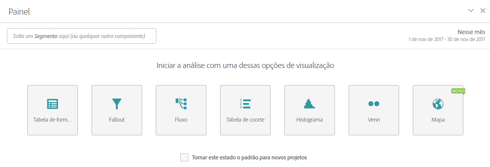

# Painel em branco

Um painel em branco destaca todas as visualizações que podem ser criadas dentro de um painel, incluindo Forma livre, Mapa, Fallout, Fluxo, Histograma, Coorte e Venn. Também é possível escolher tornar o Painel em branco o estado inicial padrão do projeto, em vez de um painel de forma livre.

