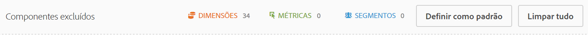

# Comparar segmentos

Explica como comparar segmentos na Analysis Workspace.

>[!NOTE]
>
>You can also compare segments within a [fallout analysis](../../../../analyze/analysis-workspace/visualizations/fallout/compare-segments-fallout.md#section_E0B761A69B1545908B52E05379277B56).

## Compare segments {#section_8F2BFC45131C49B4A2E08A063CD7A91F}

1. Navigate to **[!UICONTROL Analytics]** &gt; **[!UICONTROL Workspace]** and open a project.

1. Em **[!UICONTROL Painéis]** na margem esquerda, selecione **Comparação de segmentos]e arraste para um projeto novo ou existente.[!UICONTROL **

   

1. Certifique-se de que o intervalo de datas de comparação está configurado adequadamente.
1. Selecione segmentos para deseja comparar e arraste-os para o painel. Por exemplo, digamos que você tenha um segmento “Super Shoppers”.

   

   Após arrastar o segmento para o painel, o Analytics cria automaticamente um segmento **[!UICONTROL Todos os outros]que inclui todos que NÃO estão no segmento que você escolher, nesse caso, todos os “Non Super Shoppers”.** Isto faz com que não seja necessário criar este segmento. Todos os outros é automaticamente adicionado ao painel no campo **[!UICONTROL Comparar].** Sinta-se à vontade para excluí-lo e comparar o Super Shopper com qualquer outro segmento que você queira.

   

1. Clique em **[!UICONTROL Mostrar configurações avançadas]para excluir componentes (dimensões, métricas ou segmentos) da sua análise de comparação entre segmentos.** Para obter mais informações, consulte [Excluir componentes da Comparação](../../../../analyze/analysis-workspace/c-panels/c-segment-comparison/compare-segments.md#section_5E98FFA0744140C08D83700E3F025937).

1. Após selecionar o segmento para "Comparar", clique em **[!UICONTROL Criar]**.

   Esta ação inicia um processo de back-end que passa por todas as dimensões, métricas e outros segmentos, e busca diferenças estatísticas entre os dois segmentos. Na parte superior da ferramenta, há uma barra de progresso que indica o tempo restante até que todas as métricas e dimensões tenham sido analisadas em busca de diferenças importantes. Além disso, fazemos com que as métricas, as dimensões e os segmentos que você utiliza com mais frequência sejam executadas primeiro, para que você obtenha os resultados mais relevantes o mais rápido possível.

   Assim que o processo de back-end tiver concluído a análise, você notará vários visuais novos:

   

   

1. Interprete os resultados da Comparação de segmentos analisando [novas visualizações, tabelas e resumos](../../../../analyze/analysis-workspace/c-panels/c-segment-comparison/segment-comparison.md#concept_74FAC1C6D0204F9190A110B0D9005793).

## Exclude components from comparison {#section_5E98FFA0744140C08D83700E3F025937}

Certas vezes, você pode querer excluir dimensões, métricas ou segmentos das comparações de segmento. Por exemplo, digamos que você deseja comparar o segmento Usuários do US Mobile com Usuários do German Mobile. Não faria sentido incluir qualquer dimensão relacionada à geografia, uma vez que teriam diferenças óbvias na localização entre esses dois segmentos. É possível excluí-los. Veja como:

1. Depois de arrastar os segmentos que deseja comparar para o painel, clique em **[!UICONTROL Mostrar configurações avançadas]para excluir componentes (dimensões, métricas ou segmentos) da análise de comparação de segmento.**

   

1. Arraste e solte componentes que deseja excluir em qualquer lugar do painel **[!UICONTROL Componentes excluídos].** (Você pode ver esses componentes em uma "lista negra"). É possível definir esses componentes com padrão ou **[!UICONTROL Limpar todos]para começar de novo.**

   

1. Clique em **[!UICONTROL Definir como padrão]** para excluir esses componentes de **todas** as comparações entre segmentos.

1. Caso precise revisar a lista de componentes excluídos, clique duas vezes em Dimensões, por exemplo, e a lista de dimensões excluídas é exibida:

   

1. Exclua qualquer dimensão não desejada ao clicar no x próximo a ela; em seguida, salve a lista ao clicar em **[!UICONTROL Definir como padrão]**.

