# Visão geral do painel de comparação de segmentos

O painel de comparação de segmentos é uma ferramenta do [Segment IQ](../../segment-iq.md) que descobre as diferenças estatisticamente mais significativas entre um número ilimitado de segmentos. Esse recurso é repetido por meio de uma análise automatizada de todas as dimensões e métricas a que você tem acesso. A análise descobre as principais características dos segmentos de público que estão liderando os indicadores de desempenho (KPIs) da sua empresa e permite que você veja o nível de sobreposição entre quaisquer segmentos.

## Criação de um painel de comparação de segmentos

1. Faça logon em [experiencecloud.adobe.com](https://experiencecloud.adobe.com) usando as credenciais de sua Adobe ID.
1. Clique no ícone de 9 quadrados no canto superior direito e clique no logotipo colorido do Analytics.
1. Na barra de navegação superior, clique em Workspace.
1. Clique no botão “Criar novo projeto”.
1. No pop-up modal, verifique se “Projeto em branco” está selecionado e clique em Criar.
1. Clique no botão Painéis à esquerda e arraste o painel Comparação de segmentos para cima ou para baixo do painel de tabela de forma livre criado automaticamente.

   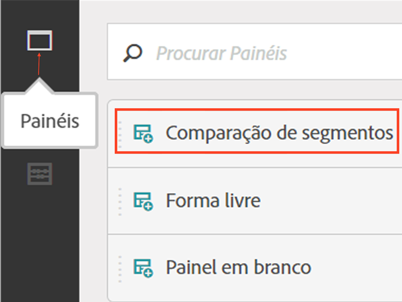

1. Selecione segmentos para comparar e arraste-os para o painel.

   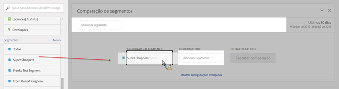

   Uma vez arrastado um segmento para o painel, o Analytics cria automaticamente um segmento [!UICONTROL “Todos os outros”] que inclui todos os que NÃO estão no segmento escolhido. É um segmento usado com frequência no painel de comparação, mas você pode removê-lo e comparar um segmento diferente à sua escolha.

   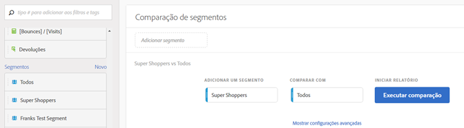

1. Depois de determinar dois segmentos a serem comparados, clique em [!UICONTROL Criar].

   Essa ação inicia um processo de backend que busca diferenças estatísticas entre os dois segmentos selecionados e todas as dimensões, métricas e outros segmentos. Uma barra de progresso na parte superior do painel indica o tempo restante até que cada métrica e dimensão sejam analisadas. As métricas, as dimensões e os segmentos usados com mais frequência são priorizados e executados primeiro para que os resultados mais relevantes retornem em tempo hábil.

## Excluir componentes da comparação

Às vezes, é necessário excluir algumas dimensões, métricas ou segmentos das comparações de segmentos. Suponhamos que você deseja comparar o segmento “Usuários de dispositivos móveis dos EUA” com “Usuários de dispositivos móveis da Alemanha”. A inclusão de dimensões geográficas não faria sentido, já que esses segmentos já implicam essas diferenças.

1. Depois que os dois segmentos desejados estiverem no painel, clique em [!UICONTROL “Mostrar opções avançadas”].
1. Arraste e solte os componentes que deseja excluir no painel [!UICONTROL Componentes excluídos].

   

Clique em [!UICONTROL “Definir como padrão”] para excluir esses componentes automaticamente em todas as comparações de segmentos futuras. Se quiser editar componentes excluídos, clique em um tipo de componente e, em seguida, clique no “X” ao seu lado para tornar a incluí-lo na análise. Clique em “Limpar tudo” para tornar a incluir todos os componentes na comparação de segmentos.

## Exibição de um relatório de comparação de segmentos

Quando a Adobe terminar de analisar os dois segmentos desejados, mostrará várias visualizações dos resultados:

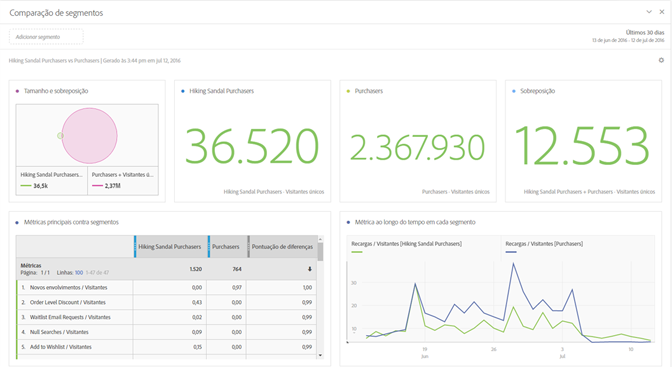

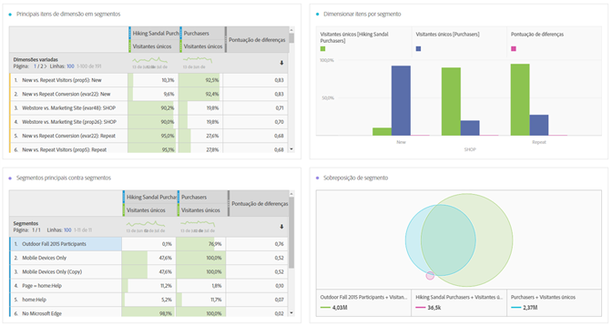

### Tamanho e sobreposição

Ilustra os tamanhos comparativos de cada segmento selecionado e a quantidade de sobreposições entre eles em um diagrama de Venn. Você pode passar o mouse sobre o visual para ver quantos visitantes estavam em cada sobreposição ou na seção de não sobreposição. Você também pode clicar com o botão direito do mouse na sobreposição para criar um novo segmento para uma análise futura. Se os dois segmentos forem mutuamente exclusivos, nenhuma sobreposição será mostrada entre os dois círculos (normalmente segmentos que usam um contêiner de ocorrência).

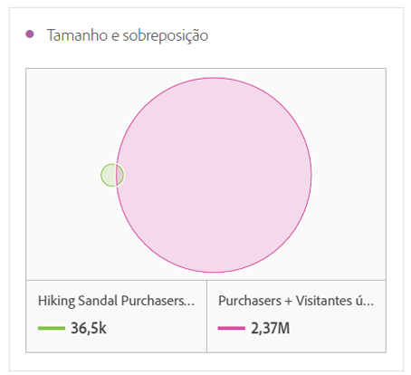

### Resumos populacionais

À direita da visualização Tamanho e sobreposição, mostra-se a contagem total de visitantes únicos em cada segmento e sobreposição.

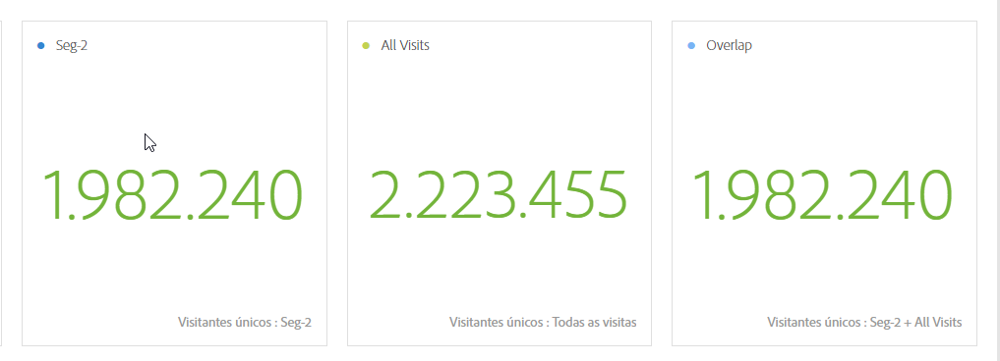

### Principais métricas

Exibe as métricas estatisticamente mais significativas entre os dois segmentos. Cada linha desse gráfico representa uma métrica diferenciadora, classificada segundo a pontuação de diferenças entre os segmentos. Se a pontuação de diferenças for 1, há significância estatística. Se for 0, não há significância estatística.

Essa visualização é semelhante às tabelas de forma livre no Analysis Workspace. Para uma análise mais profunda de uma métrica específica, passe o mouse sobre um item da linha e clique em “Criar visual”: será criada uma nova tabela para analisar essa métrica específica. Se alguma das métricas for irrelevante para sua análise, passe o mouse sobre o item da linha e clique no X para removê-la.

> [!NOTE] As métricas adicionadas a essa tabela após a conclusão da comparação de segmentos não recebem Pontuação de diferenças.

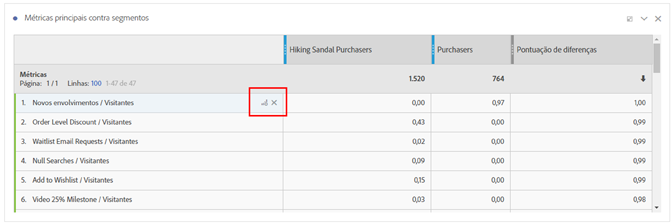

### Métrica ao longo do tempo por segmento

À direita do gráfico de métricas há uma visualização vinculada. Você pode clicar em um item da linha na tabela à esquerda, e essa visualização será atualizada para mostrar a tendência da métrica ao longo do tempo.

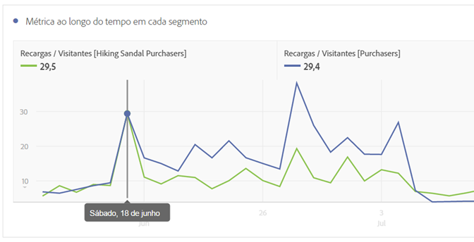

### Dimensões principais

Mostra os valores de dimensão com mais significância estatística entre todas as suas dimensões. Cada linha mostra a porcentagem de cada segmento que exibe esse valor de dimensão. Por exemplo, essa tabela pode revelar que 100% dos visitantes do “Segmento A” tinham o item de dimensão “Tipo de navegador: Google”, enquanto apenas 19,6% do “Segmento B” tinha esse item de dimensão. Se a pontuação de diferenças for 1, há significância estatística. Se for 0, não há significância estatística.

Essa visualização é semelhante às tabelas de forma livre no Analysis Workspace. Para uma análise mais profunda de uma métrica específica, passe o mouse sobre um item da linha e clique em “Criar visual”. Assim será criada uma nova tabela para analisar esse valor de dimensão específico. Se algum dos valores de dimensão for irrelevante para sua análise, passe o mouse sobre o item da linha e clique no X para removê-lo.

> [!NOTE] Os valores de dimensão adicionados a esta tabela após a conclusão da comparação de segmentos não recebem Pontuação de diferenças.

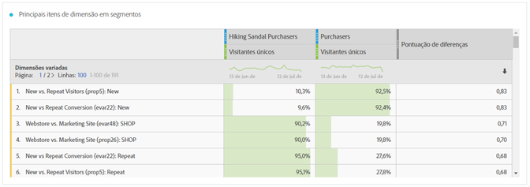

### Itens de dimensão por segmento

À direita do gráfico de dimensões há uma visualização vinculada de gráfico de barras. Ela mostra todos os valores de dimensão exibidos em um gráfico de barras. Clicar em uma linha na tabela à esquerda atualiza a visualização à direita.

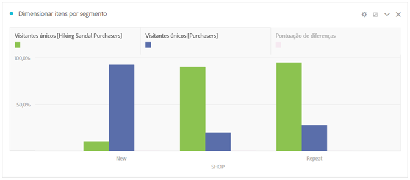

### Principais segmentos

Mostra quais outros segmentos (diferentes dos dois segmentos selecionados para comparação) têm sobreposição estatisticamente significativa. Por exemplo, esta tabela pode mostrar que um terceiro segmento, “Visitantes repetidos”, se sobrepõe fortemente ao “Segmento A”, mas não se sobrepõe ao “Segmento B”. Se a pontuação de diferenças for 1, há significância estatística. Se for 0, não há significância estatística.

Essa visualização é semelhante às tabelas de forma livre no Analysis Workspace. Para uma análise mais profunda de um segmento específico, passe o mouse sobre um item da linha e clique em “Criar visual”. Assim será criada uma nova tabela para analisar esse segmento específico. Se algum dos segmentos for irrelevante para sua análise, passe o mouse sobre o item da linha e clique no X para removê-lo.

> [!NOTE] Os segmentos adicionados a esta tabela após a conclusão da comparação de segmentos não recebem Pontuação de diferenças.

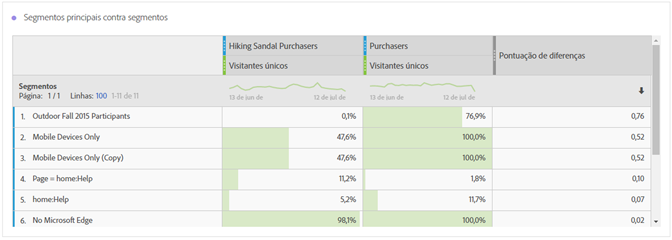

### Sobreposição de segmentos

À direita do gráfico de segmentos há uma visualização vinculada de diagrama de Venn. Ela mostra o segmento de maior significância estatística aplicado aos segmentos da sua comparação. Por exemplo, “Segmento A” + “Segmento estatisticamente significativo” vs. “Segmento B” + “Segmento estatisticamente significativo”. Clicar em um item de linha de segmento na tabela à esquerda atualiza o diagrama de Venn à direita.

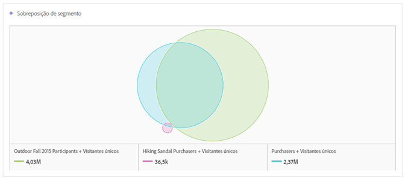
