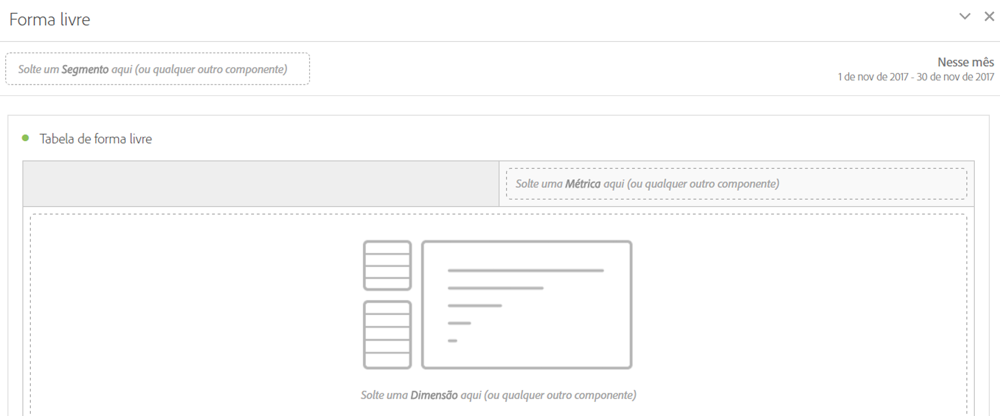

# Painel de forma livre

>[!BEGINSHADEBOX]

_Este artigo documenta o Painel de forma livre no_  _&#x200B;**Adobe Analytics**._ _Consulte o [Painel de forma livre](/help/analyze/analysis-workspace/c-panels/freeform-panel.md) da versão_  _&#x200B;**Customer Journey Analytics** deste artigo._

>[!ENDSHADEBOX]

Um **[!UICONTROL Painel de forma livre]** é um painel em branco com uma visualização de [Tabela de forma livre](/help/analyze/analysis-workspace/visualizations/freeform-table/freeform-table.md) como estado inicial padrão.

## Usar

Para usar um **[!UICONTROL Painel de forma livre]**:

1. Crie um **[!UICONTROL Painel de forma livre]**. Para obter informações sobre como criar um painel, consulte [Criar um painel](panels.md#create-a-panel).

   

1. Consulte o [Guia de componentes do Analytics](/help/components/home.md) para saber como adicionar componentes ao painel de forma livre e à visualização da [tabela de forma livre](/help/analyze/analysis-workspace/visualizations/freeform-table/freeform-table.md).

>[!MORELIKETHIS]
>
>[Criar um painel](/help/analyze/analysis-workspace/c-panels/panels.md#create-a-panel)
>[Guia de componentes do Analytics](/help/components/home.md)
>[Visualização de tabela de forma livre](/help/analyze/analysis-workspace/visualizations/freeform-table/freeform-table.md)
>
