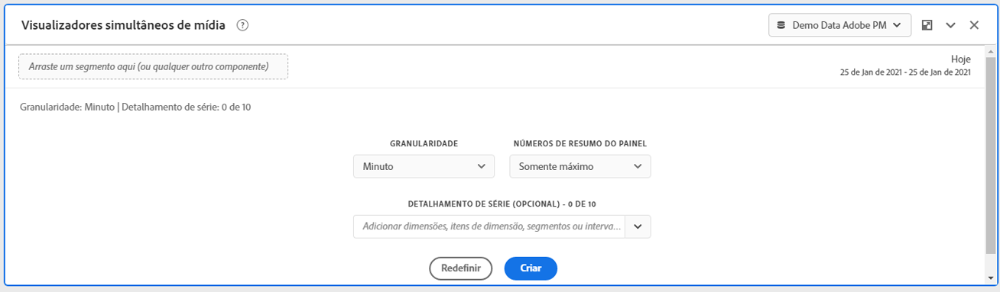
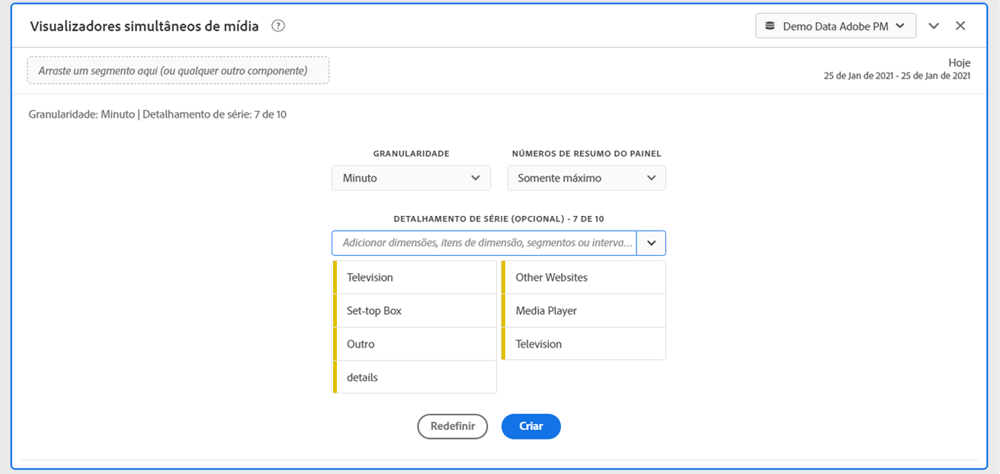
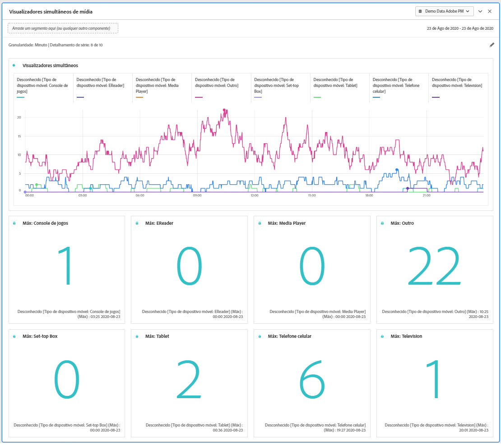
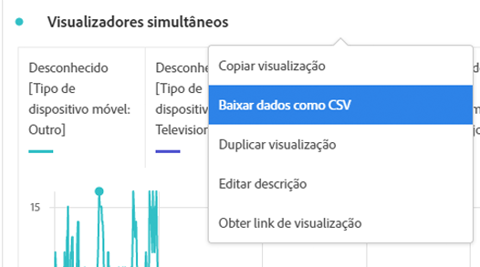

# Painel de visualizadores simultâneos de mídia

Os clientes do Media Analytics podem analisar visualizadores simultâneos para entender onde ocorreu o pico de simultaneidade ou onde ocorreram quedas para fornecer insights valiosos sobre a qualidade do conteúdo e o envolvimento do visualizador e para ajudar na solução de problemas ou no planejamento de volume ou escala.

No Analysis Workspace, Visualizadores simultâneos é o número de visitantes únicos que visualizam seus fluxos de mídia em um ponto específico do tempo, independentemente do número de sessões.

O painel Visualizadores simultâneos de mídia permite a análise de visualizadores simultâneos ao longo do tempo, com detalhes sobre o pico de simultaneidade e a capacidade de detalhar e comparar.  Para acessar o painel Visualizadores simultâneos de mídia, navegue até um conjunto de relatórios com os componentes do Media Analytics ativados. Em seguida, clique no ícone do painel na extremidade esquerda e arraste o painel para o Projeto do Analysis Workspace.

## Entradas do painel {#Input}

Você pode configurar o painel Visualizadores simultâneos de mídia usando estas configurações de entrada:

| Configuração | Descrição |
|---|---|
| Intervalo de datas do painel | O padrão do intervalo de datas do painel é Hoje.  Você pode editá-lo para exibir um único dia ou muitos meses de cada vez.    Essa visualização é limitada a 1440 linhas de dados (por exemplo, 24 horas na granularidade no nível de minuto).  Se uma combinação de intervalo de datas e granularidade resultar em mais de 1440 linhas, a granularidade será atualizada automaticamente para ajustar o intervalo de datas completo. |
| Granularidade | O padrão de granularidade é Minuto.    Essa visualização é limitada a 1440 linhas de dados (por exemplo, 24 horas na granularidade no nível de minuto).  Se uma combinação de intervalo de datas e granularidade resultar em mais de 1440 linhas, a granularidade será atualizada automaticamente para ajustar o intervalo de datas completo. |
| Números de resumo do painel | Para visualizar os detalhes de data ou hora de visualizadores simultâneos, um número de resumo está disponível. O Máximo mostra detalhes para a simultaneidade de pico. O Mínimo mostra detalhes para o vale.  O padrão do painel mostra somente Máximo, mas você pode alterá-lo para mostrar Mínimo ou Máximo e Mínimo.  Se você estiver usando detalhamentos, um número de resumo será exibido para cada um. |
| Detalhamento por séries | Como opção, você pode detalhar sua visualização por segmentos, dimensões, itens de dimensão ou intervalos de datas.   - É possível exibir até 10 linhas por vez. Os detalhamentos são limitados a um único nível.  - Ao arrastar uma dimensão, os itens de dimensão principais serão selecionados automaticamente com base no intervalo de datas do painel selecionado.  - Para comparar intervalos de datas, arraste dois ou mais intervalos de datas para o filtro de detalhamento por séries. |

### Visualização padrão

### Visualização de detalhamento por séries

## Saída do painel {#Output}

O painel Visualizadores simultâneos de mídia retorna um gráfico de linha e números de resumo para incluir detalhes do máximo e/ou mínimo de visualizadores simultâneos.  Na parte superior do painel, uma linha de resumo é fornecida para lembrar das configurações do painel que você selecionou.

A qualquer momento, você pode editar e reconstruir o painel clicando no lápis de edição na parte superior direita.

Se você selecionou o detalhamento por séries, uma linha no gráfico de linha e um número de resumo é exibida para cada:

### Fonte de dados

A única métrica que pode ser usada nesse painel é a de Visualizadores simultâneos:

| Métrica | Descrição |
|---|---|
| Visualizadores simultâneos | Número de visitantes únicos que visualizam seus fluxos de mídia em um ponto específico do tempo, independentemente do número de sessões.  Isso é diferente dos relatórios do Visualizador simultâneo na seção Relatórios, que usa Sessões ativas simultâneas.  A utilização de contas de visitantes únicos para remover &quot;picos&quot; indesejados nos limites de exibição (em que as sessões estão terminando e começando ao mesmo tempo). |

Uma tabela de forma livre não está disponível nessa visualização.  Para visualizar a fonte de dados, clique com o botão direito do mouse no gráfico de linha e baixe como um arquivo .csv.  Os detalhamentos por séries serão incluídos.

## Perguntas frequentes {#FAQ}

| Pergunta | Resposta |
|---|---|
| Onde está a tabela de forma livre? Como posso ver a fonte de dados? | A tabela de forma livre não está disponível nessa visualização.  Você pode baixar a fonte de dados clicando com o botão direito do mouse no gráfico de linha e baixando o arquivo CSV. |
| Por que minha granularidade mudou? | Essa visualização é limitada a 1440 linhas de dados (por exemplo, 24 horas na granularidade no nível de minuto).  Se uma combinação de intervalo de datas e granularidade resultar em mais de 1440 linhas, a granularidade será atualizada automaticamente para acomodar o intervalo de datas completo.  Ao alterar de um intervalo de datas maior para menor, a granularidade será atualizada para o detalhe mais baixo permitido quando o intervalo de datas for alterado. Para exibir uma granularidade mais alta, edite o painel e recrie. |
| Como comparar nomes de vídeo, segmentos, tipos de conteúdo etc.? | Para compará-los em uma única visualização, arraste segmentos, dimensões ou itens de dimensão específicos no filtro de detalhamento por séries.  A visualização é limitada a 10 detalhamentos.  Para exibir mais de 10, você deve usar vários painéis. |
| Como comparar intervalos de datas? | Para comparar intervalos de data em uma única visualização, use os detalhamentos por séries arrastando dois ou mais intervalos de datas.  Esses intervalos de datas substituirão o intervalo de datas do painel. |
| Como alterar o tipo de visualização? | Esse painel permite somente a visualização de linha para a série de tempo. |
| Posso executar a detecção de anomalias? | Não.  A detecção de anomalias não está disponível para esse painel. |
| Por que usar visitantes únicos em vez de sessões ativas? | A utilização de visitantes únicos permite a remoção de picos indesejados nos limites da exibição (em que as sessões estão terminando e começando ao mesmo tempo). |
| O que significa ter visualizadores simultâneos com maior granularidade do que um minuto? | Com uma granularidade maior que um minuto, visualizadores simultâneos é a soma de visualizadores simultâneos exclusivos para todos os minutos desse intervalo de tempo.  Por exemplo, visualizadores simultâneos de granularidade em nível de hora é a soma de visualizadores simultâneos exclusivos para todos os minutos da hora. |
| O painel Espaço de trabalho mostra as mesmas informações que o Relatório de visualizadores simultâneos? | Não.  No Analysis Workspace, Visualizadores simultâneos é o número de visitantes únicos que visualizam seus fluxos de mídia em um ponto específico do tempo, independentemente do número de sessões.  Isso é diferente dos relatórios do Visualizador simultâneo na seção Relatórios, que usa Sessões ativas simultâneas.  Usar contas de visitantes únicos para remover picos indesejados nos limites de exibição, em que as sessões estão terminando e iniciando ao mesmo tempo. |

<!-- For more information about Media Concurrent Viewers, visit [MA doc page]( https://url). -->
