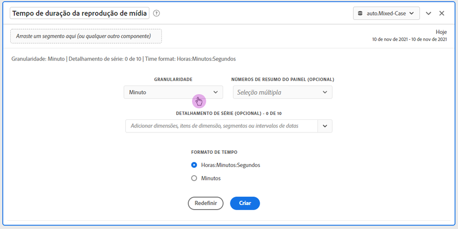
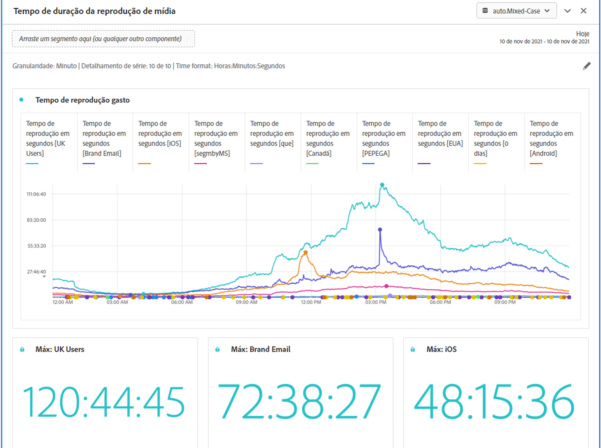

# Painel de tempo gasto com a reprodução da mídia {#media-playback-time-spent-panel}

<!-- markdownlint-disable MD034 -->

>[!CONTEXTUALHELP]
>id="workspace_mediaplaybacktimespent_button"
>title="Tempo gasto com a reprodução da mídia"
>abstract="Crie um painel para analisar o consumo de vídeo ao longo do tempo, com vários níveis de granularidade e a capacidade de detalhar e comparar."

<!-- markdownlint-enable MD034 -->

<!-- markdownlint-disable MD034 -->

>[!CONTEXTUALHELP]
>id="workspace_mediaplaybacktimespent_panel"
>title="Tempo gasto com a reprodução da mídia"
>abstract="Analise o consumo de vídeo ao longo do tempo, selecione várias granularidades, faça o detalhamento e compare.  **Granularidade**: selecione o período pelo qual exibir visualizadores simultâneos. **Números de resumo do painel (opcional)**: opção para mostrar números de resumo com detalhes de data ou hora para cada linha. O máximo mostra detalhes do tempo de pico de reprodução gasto. O mínimo mostra detalhes para o vale. A soma mostra detalhes sobre a soma total do tempo gasto com a reprodução. **Detalhamento de série (opcional)**: divide a visualização por segmentos, dimensões, itens de dimensão ou intervalos de datas. Visualize até 10 linhas por vez. Os detalhamentos são limitados a um único nível. **Formato de hora**: opção para mostrar o formato de hora das visualizações em horas ou minutos."

<!-- markdownlint-enable MD034 -->

>[!BEGINSHADEBOX]

_Este artigo é sobre o painel Tempo gasto com a reprodução de mídia no_  _&#x200B;**Adobe Analytics**._ _Consulte [Painel de tempo gasto com a reprodução de mídia](https://experienceleague.adobe.com/pt-br/docs/analytics/analyze/analysis-workspace/panels/media-playback-time-spent) para ver a versão do_  _&#x200B;**Customer Journey Analytics** deste artigo._

>[!ENDSHADEBOX]

>[!NOTE]
>
>O painel Público médio a cada minuto de mídia está disponível somente para clientes que compraram o complemento Coleção de mídia de streaming para o Adobe Analytics.
>&#x200B;>Entre em contato com o(a) representante de vendas ou com a equipe de contas da Adobe para obter mais informações.
>

O painel **[!UICONTROL Tempo gasto com a reprodução de mídia]** permite analisar a reprodução ao longo do tempo, com detalhes sobre o pico de simultaneidade e a capacidade de detalhar e comparar. 

No Analysis Workspace, o tempo gasto com a reprodução é a quantidade de tempo gasta com a visualização de fluxos de mídia em um ponto específico no tempo. Inclui pausa, buffer e inicialização.

Clientes que adquiriram o complemento Coleção de mídia de streaming podem analisar o tempo gasto com a reprodução para obter insights valiosos sobre a qualidade do conteúdo e o engajamento do visualizador. E para ajudar na solução de problemas ou no planejamento de volume ou escala.

O tempo gasto com a reprodução pode ajudar a entender:

* Onde ocorreu o pico de simultaneidade.

* Onde ocorreram desistências.

>[!BEGINSHADEBOX]

Consulte  [Painel de tempo gasto com a reprodução de mídia](https://video.tv.adobe.com/v/338699?quality=12&learn=on){target="_blank"} para assistir a um vídeo de demonstração.

>[!ENDSHADEBOX]

## Usar

Para usar um painel **[!UICONTROL Tempo gasto com a reprodução da mídia]**:

1. Crie um painel **[!UICONTROL Tempo gasto com a reprodução da mídia]**. Para obter informações sobre como criar um painel, consulte [Criar um painel](panels.md#create-a-panel).

1. Selecione uma exibição de dados para o painel que tenha componentes configurados da Coleção de mídia de transmissão.

1. Especifique a [entrada](#panel-input) do painel.

1. Observe a [saída](#panel-output) do painel.

### Entrada do painel

Você pode configurar o painel Tempo gasto com a reprodução de mídia usando estas configurações de entrada:

| Configuração | Descrição |
|---|---|
| Intervalo de datas do painel | O padrão do intervalo de datas do painel é Hoje. Você pode editá-lo para exibir um único dia ou muitos meses de cada vez. Essa visualização é limitada a 1440 linhas de dados (por exemplo, 24 horas na granularidade no nível de minuto). Se um intervalo de datas e combinação de granularidade resultar em mais de 1440 linhas, a granularidade será atualizada automaticamente para acomodar todo o intervalo de datas. |
| Granularidade | O padrão de granularidade é Minuto. Essa visualização é limitada a 1440 linhas de dados (por exemplo, 24 horas na granularidade no nível de minuto). Se um intervalo de datas e combinação de granularidade resultar em mais de 1440 linhas, a granularidade será atualizada automaticamente para acomodar todo o intervalo de datas. |
| Números de resumo do painel | Para visualizar os detalhes de data ou hora do tempo gasto com a reprodução, um número de resumo está disponível. O Máximo mostra detalhes para a simultaneidade de pico. O Mínimo mostra detalhes para o vale. O total soma o tempo total gasto com a reprodução para a seleção. O padrão do painel mostra somente o Máximo, mas você pode alterá-lo para mostrar Mínimo, Total ou qualquer combinação dos três. Se você estiver usando detalhamentos, um número de resumo será exibido para cada um. |
| Detalhamento por séries | Opcionalmente, é possível detalhar a visualização por filtros, dimensões, itens de dimensão ou intervalos de datas.
- É possível exibir até 10 linhas por vez. Os detalhamentos são limitados a um único nível.

- Ao arrastar uma dimensão, os itens de dimensão principais serão selecionados automaticamente com base no intervalo de datas do painel selecionado.
- Para comparar intervalos de datas, arraste dois ou mais intervalos de datas para o filtro de detalhamento por séries. |
| Formato de tempo | É possível visualizar o tempo gasto com a reprodução em `Hours:Minutes:Seconds` (padrão) ou em `Minutes` (que é exibido em números inteiros, arredondados em 0,5). |
| Exibição da sequência de data | Se você inseriu pelo menos dois filtros de intervalo de datas como detalhamentos por série, verá as opções Sobreposição (padrão) ou Sequencial. “Sobreposição” exibe as linhas com uma origem comum no eixo x para que evoluam em paralelo, enquanto que “Sequencial” exibe as linhas com suas origens específicas no eixo x. Se os dados se alinharem (por exemplo, o filtro 1 termina às 20:44 e o filtro 2 começa às 8:45), as linhas serão exibidas em sequência. |

### Saída do painel

O painel Tempo gasto com a reprodução de mídia retorna um gráfico de linhas e números de resumo para incluir detalhes sobre o tempo máximo, mínimo e/ou a soma do tempo gasto com a reprodução. Na parte superior do painel, uma linha de resumo é fornecida para lembrar das configurações do painel que você selecionou.

A qualquer momento, selecione  para editar e recriar o painel.

Se você selecionou o detalhamento por série, haverá uma linha no gráfico de linhas e um número de resumo para cada:

### Fonte de dados

A única métrica que pode ser usada nesse painel é Tempo gasto com a reprodução.

| Métrica | Descrição |
|---|---|
| Tempo gasto com a reprodução | Total de `hours:minutes:seconds` (ou `minutes`) de exibição de conteúdo na granularidade selecionada, incluindo o tempo de pausa, buffer e inicialização. |

## Perguntas frequentes

| Pergunta | Resposta |
|---|---|
| Onde está a tabela de forma livre? Como posso ver a fonte de dados? | 

A tabela de forma livre não está disponível nessa visualização. Para baixar a fonte de dados, no menu de contexto do gráfico de linhas, selecione a opção para baixar o arquivo CSV.
 |
| 
Por que minha granularidade mudou?
 | 
Essa visualização é limitada a 1440 linhas de dados (por exemplo, 24 horas na granularidade no nível de minuto). Se uma combinação de intervalo de datas e granularidade resultar em mais de 1440 linhas, a granularidade será atualizada automaticamente para ajustar o intervalo de datas completo.

Ao mudar de um intervalo de datas maior para um menor, a granularidade será atualizada para oferecer o mínimo de detalhes possível após a alteração. Para exibir uma granularidade mais alta, edite o painel e recrie.
 |
| 

Como comparar nomes de vídeo, filtros, tipos de conteúdo etc.?
 | 
Para compará-los em uma única visualização, arraste os filtros, dimensões ou itens de dimensão específicos para o filtro de detalhamento por série.

A visualização é limitada a 10 detalhamentos. Para exibir mais de 10, você deve usar vários painéis.
 |
| Como comparar intervalos de datas? | Para comparar intervalos de data em uma única visualização, use os detalhamentos por séries arrastando dois ou mais intervalos de datas. Esses intervalos de datas substituirão o intervalo de datas do painel. |
| Como alterar o tipo de visualização? | 

Esse painel permite somente a visualização de linha para a série temporal.
 |
| Posso executar a detecção de anomalias? | 

Não. A detecção de anomalias não está disponível para esse painel.
 |

>[!MORELIKETHIS]
>
>[Criar um painel](/help//analyze/analysis-workspace/c-panels/panels.md#create-a-panel)
>&#x200B;>[Painel de público-alvo médio a cada minuto de mídia](average-minute-audience-panel.md)
>&#x200B;>[Painel de visualizadores simultâneos de mídia](media-concurrent-viewers.md)
>

<!--
# Media Playback Time Spent panel

In Analysis Workspace, Playback Time Spent is the amount of time spent viewing your media streams at a specific point in time. It includes pause, buffer, and time to start.

The Media Playback Time Spent panel enables analysis of playback over time, with details on peak concurrency and the ability to break down and compare. 

Customers who have purchased the Streaming Media Collection Add-on can analyze playback time spent to gain valuable insight into the quality of content and viewer engagement, and to help when troubleshooting or planning for volume or scale.

Playback Time Spent can help you understand:

* Where peak concurrency occurred

* Where drop-offs occurred 

Following is a video overview of this panel:

>[!VIDEO](https://video.tv.adobe.com/v/338699)

## Use the Media Playback Time Spent panel

1. Go to a report suite with streaming media components enabled. 
1. Select the panel icon on the far-left, then drag the panel into your Analysis Workspace project.
1. Continue with the following sections to customize the Media Playback Time Spent panel

   * [Panel Inputs](#panel-inputs)
   * [Panel Output](#panel-output)

## Panel Inputs {#Input}

You can configure the Media Playback Time Spent panel using these input settings:

|Setting|Description|
|---|---|
|Panel date range|The panel date range default is Today. You may edit it to view a single day or many months at a time. This visualization is limited to 1440 rows of data (for example, 24-hours at minute-level granularity). If a date range and granularity combination results in more than 1440 rows, the granularity is automatically updated to accommodate the full date range.|
|Granularity|The granularity default is Minute. This visualization is limited to 1440 rows of data (for example, 24-hours at minute-level granularity). If a date range and granularity combination results in more than 1440 rows, the granularity is automatically updated to accommodate the full date range.|
|Panel summary numbers|To see date or time details for playback time spent, a summary number is available. The Maximum shows details for peak concurrency. The Minimum shows details for the trough. Sum adds up the total playback time spent for the selection. The panel default shows Maximum only, but you can change it to show Minimum, Sum, or any combination of the three. If you are using breakdowns, a summary number is displayed for each.|
|Series breakdown|Optionally, you can break down your visualization by segments, dimensions, dimension items, or date ranges.
- You may view up to 10 lines at a time. Breakdowns are limited to a single level.

- When dragging a dimension, the top dimension items will be automatically selected based on the selected panel date range.
- To compare date ranges, drag 2 or more date ranges into the series breakdown filter.|
|Time format|You can view the playback time spent in either `Hours:Minutes:Seconds` (default) or in `Minutes` (which is displayed in whole numbers, rounded up at .5). |
|Date sequence display|If you've placed at least two date range segments as series breakdowns you'll see the option to select either overlay (default) or sequential. Overlay will display the lines with a common x-axis start so that they run in parallel, while sequential will display the lines with their specific x-axis start. If the data lines up (for example, segment 1 ends at 8:44 pm and segment 2 starts at 8:45 pm), then the lines will show in sequence. |

## Default view

## Panel Output {#Output}

The Media Playback Time Spent panel returns a line chart and summary numbers to include details for the maximum, minimum, and/or sum of playback time spent. At the top of the panel, a summary line is provided to remind you of the panel settings you selected.

At any time, you can edit and rebuild the panel by clicking the edit pencil on the top right.

If you selected series breakdown, a line on the line chart and a summary number is displayed for each:

### Data Source

The only metric that can be used in this panel is Playback Time Spent.

|Metric|Description|
|---|---|
|Playback Time Spent|Total `hours:minutes:seconds` (or `minutes`) of content viewed during the selected granularity including pause, buffer, and time to start.|

## FAQs

|Question|Answer|
|---|---|
|Where is the Freeform table? How can I see the data source?|The Freeform table is not available in this view. You can download the data source by right-clicking on the line chart and downloading the CSV file.|
|Why did my granularity change?|This visualization is limited to 1440 rows of data (for example, 24-hours at minute-level granularity). If a date range and granularity combination results in more than 1440 rows, the granularity will be automatically updated to accommodate the full date range. 
When changing from a larger date range to a smaller one, the granularity will be updated to the lowest detail allowable once the date range is changed. To view a higher granularity, edit the panel and rebuild.
|
| How do I compare video names, segments, content types, etc?| To compare these in a single visualization, drag segments, dimensions, or specific dimension items in the series breakdown filter.The view is limited to 10 breakdowns. To view more than 10, you must use multiple panels.|
|How do I compare date ranges?|To compare date ranges in a single visualization, use the series breakdowns by dragging 2 or more date ranges. These date ranges will override the panel date range.|
|How do I change the visualization type?|This panel only allows for the line visualization for the time series.|
|Can I run anomaly detection?|No. Anomaly detection is not available for this panel.|

-->
