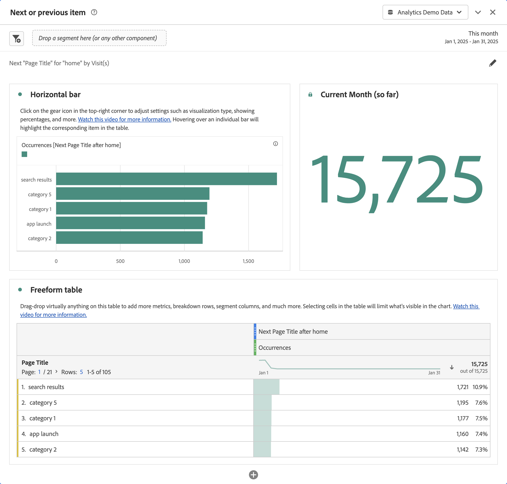
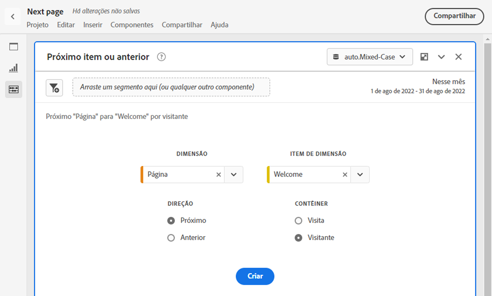
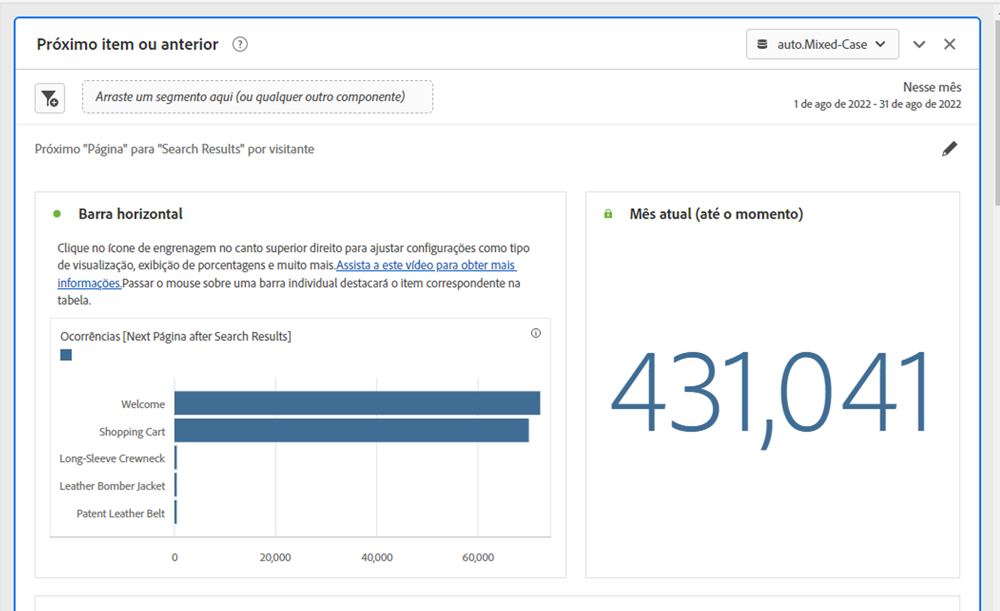
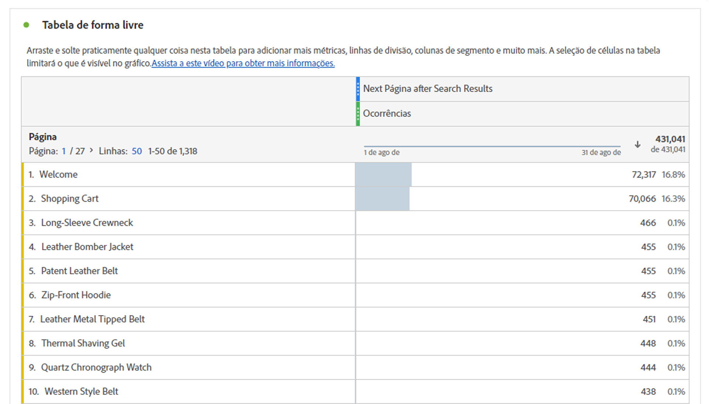

# Painel Próximo item ou anterior {#next-or-previous-item-panel}

>[!CONTEXTUALHELP]
>id="workspace_nextorpreviousitem_button"
>title="Próximo item ou anterior"
>abstract="Crie um painel para entender as dimensões anteriores de onde as pessoas vêm ou a próxima dimensão que as pessoas acessam."

>[!CONTEXTUALHELP]
>id="workspace_nextorpreviousitem_panel"
>title="Item anterior ou seguinte"
>abstract="Analise quais são os lugares mais comuns de onde os visitantes vieram ou para onde irão em seguida.  **Dimensão**: selecione uma dimensão. Por exemplo, **Página**. **item de dimensão**: selecione um item de dimensão específico. Por exemplo, **Página inicial**. **Direção**: selecione **Próximo** para ver os itens de dimensão imediatamente a seguir ao item de dimensão selecionado. Selecione **Anterior** para ver os itens de dimensão que antecedem o item de dimensão selecionado. **Contêiner**: selecione **Sessão** para ver os itens de dimensão anteriores/seguintes na mesma sessão ou selecione **Pessoa** para ver o item de dimensão anterior/seguinte para a mesma pessoa."

>[!BEGINSHADEBOX]

_Este artigo é sobre o painel Item seguinte ou anterior no_  _**Adobe Analytics**._ _Consulte o [Painel do item seguinte ou anterior](/help/analyze/analysis-workspace/c-panels/next-previous.md) da_ versão  _**Customer Journey Analytics** deste artigo._

>[!ENDSHADEBOX]

O painel **[!UICONTROL Próximo item ou anterior]** contém várias tabelas e visualizações para identificar o item de dimensão seguinte ou anterior de uma dimensão específica. Por exemplo, você pode querer explorar quais páginas os clientes acessaram com mais frequência depois de visitarem a página inicial.

## Usar

Para usar um painel **[!UICONTROL Próximo item ou anterior]**:

1. Criar um painel **[!UICONTROL Próximo item ou anterior]**. Para obter informações sobre como criar um painel, consulte [Criar um painel](panels.md#create-a-panel).

1. Especifique a [entrada](#panel-input) do painel.

1. Observe a [saída](#panel-output) do painel.

### Entrada do painel

Você pode configurar o painel [!UICONTROL Próximo ou item anterior] usando estas configurações de entrada:

| Entrada | Descrição |
| --- | --- |
| **[!UICONTROL Dimensão]** | Selecione a dimensão para a qual deseja explorar os itens seguintes ou anteriores. |
| **[!UICONTROL Item de dimensão]** | Selecione o item de dimensão específico no centro da consulta seguinte/anterior. |
| **[!UICONTROL Direção]** | Especifique se você está procurando pelo item de dimensão [!UICONTROL Próximo] ou [!UICONTROL Anterior]. |
| **[!UICONTROL Contêiner]** | Selecione o contêiner **[!UICONTROL Visita]** ou **[!UICONTROL Visitante]** (padrão) para determinar o escopo da sua consulta. |

{style="table-layout:auto"}

Selecione **[!UICONTROL Criar]** para criar o painel.

### Saída do painel

O painel [!UICONTROL Próximo item ou anterior] retorna um conjunto avançado de dados e visualizações para ajudar você a entender melhor quais ocorrências seguem ou precedem itens de dimensão específicos.

| Visualização | Descrição |
| --- | --- |
| **[!UICONTROL Barra horizontal]** | Lista os próximos itens (ou anteriores) com base no item de dimensão selecionado. Passar o mouse sobre uma barra individual destacará o item correspondente na tabela de forma livre. |
| **[!UICONTROL Número do resumo]** | Número de resumo de alto nível de todas as ocorrências de itens de dimensão anteriores ou seguintes do mês atual (até o momento). |
| **[!UICONTROL Tabela de forma livre]** | Lista os próximos itens (ou anteriores) com base no item de dimensão selecionado em um formato de tabela. Por exemplo, quais eram as páginas mais populares (por ocorrências) às quais as pessoas foram depois (ou antes) da página inicial ou da página do espaço de trabalho. |

{style="table-layout:auto"}

>[!MORELIKETHIS]
>
>[Criar um painel](/help//analyze/analysis-workspace/c-panels/panels.md#create-a-panel)
>

<!--
# Next or previous item panel

This panel contains a number of tables and visualizations to easily identify the next or previous dimension item for a specific dimension. For example, you might want to explore which pages customers went to most often after they visited the Home page.

## Access the panel

You can access the panel from within [!UICONTROL Reports] or within [!UICONTROL Workspace].

| Access point | Description |
| --- | --- |
| [!UICONTROL Reports] | <ul><li>The panel is already dropped into a project.</li><li>The left rail is collapsed.</li><li>If you selected [!UICONTROL Next page], default settings have already been applied, such as [!UICONTROL Page] for [!UICONTROL Dimension], and the top page as the [!UICONTROL Dimension Item], [!UICONTROL Next] for [!UICONTROL Direction] and [!UICONTROL Visit] for [!UICONTROL Container]. You can modify all these settings.</li></ul>|
| Workspace | Create a new project and select the Panel icon in the left rail. Then drag the [!UICONTROL Next or previous item] panel above the Freeform table. Notice that the [!UICONTROL Dimension] and [!UICONTROL Dimension Item] fields are left blank. Select a dimension from the drop-down list. [!UICONTROL Dimension items] are populated based on the [!UICONTROL dimension] you chose. The top dimension item gets added, but you can select a different item. The defaults are Next and Visitor. Again, you can modify these as well.
 |

{style="table-layout:auto"}

## Panel Inputs {#Input}

You can configure the [!UICONTROL Next or previous item] panel panel using these input settings:

| Setting | Description |
| --- | --- |
| Segment (or other component) drop zone | You can drag and drop segments or other components to further filter your panel results. |
| Dimension | The dimension for which you want to explore next or previous items. |
| Dimension Item | The specific item at the center of your next/previous inquiry. |
| Direction | Specify whether you are looking for the [!UICONTROL Next] or the [!UICONTROL Previous] dimension item. |
| Container | [!UICONTROL Visit] or [!UICONTROL Visitor] (default) determine the scope of your inquiry. |

{style="table-layout:auto"}

Click **[!UICONTROL Build]** to build the panel.

## Panel output {#output}

The [!UICONTROL Next or previous item] panel returns a rich set of data and visualizations to help you better understand what occurrences follow or precede specific dimension items.

| Visualization | Description |
| --- | --- |
| Horizontal bar | Lists the next (or previous) items based on the dimension item you chose. Hovering over an individual bar highlights the corresponding item in the Freeform table. |
| Summary number | High-level summary number of all next or previous dimension item occurrences for the current month (so far.) |
| Freeform table | Lists the next (or previous) items based on the dimension item you chose, in a table format. For example, which were the most popular pages (by occurrences) that people went to after (or before) the home page or the workspace page. |

{style="table-layout:auto"}

-->