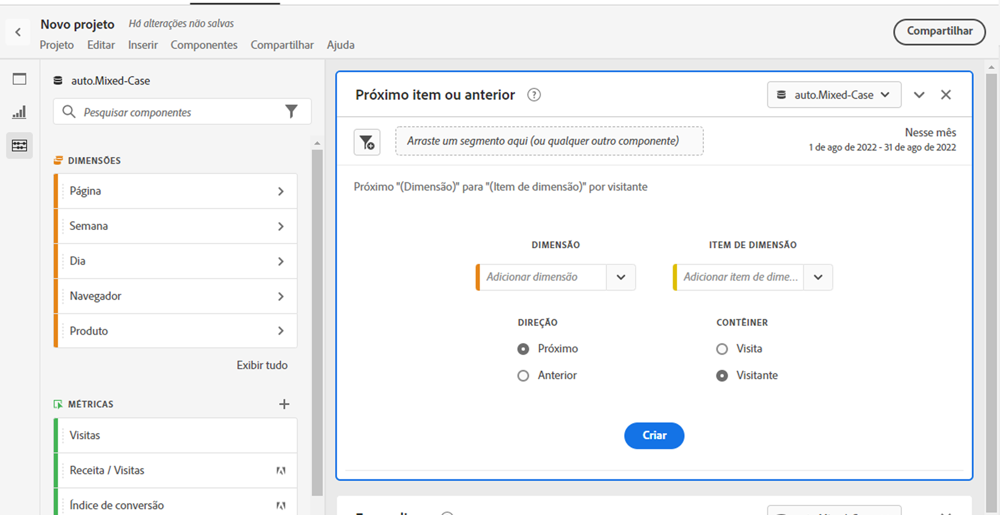

# Painel Item anterior ou seguinte

A variável [!UICONTROL Próximo item ou anterior] painel começou como um relatório no Reports &amp; Analytics, em [!UICONTROL Relatórios] > [!UICONTROL Mais popular] > [!UICONTROL Próxima página/Página anterior]. Agora, ele também é um painel do Espaço de trabalho. Esse painel contém várias tabelas e visualizações para identificar facilmente o item de dimensão seguinte ou anterior de uma dimensão específica. Por exemplo, você pode querer explorar quais páginas os clientes acessaram com mais frequência depois de visitarem a Página inicial.

## Acessar o painel

Você pode acessar o painel de dentro do [!UICONTROL Relatórios] ou no prazo de [!UICONTROL Workspace].

| Ponto de acesso | Descrição |
| --- | --- |
| [!UICONTROL Relatórios] | <ul><li>O painel já está solto em um projeto.</li><li>O painel esquerdo está recolhido.</li><li>Se você selecionou [!UICONTROL Próxima página], as configurações padrão já foram aplicadas, como [!UICONTROL Página] para [!UICONTROL Dimension]e a página superior como a [!UICONTROL Item Dimension], [!UICONTROL Próxima] para [!UICONTROL Direção] e [!UICONTROL Visita] para [!UICONTROL Container]. Você pode modificar todas essas configurações.</li></ul> |
| Workspace | Crie um novo projeto e selecione o ícone Painel no painel à esquerda. Em seguida, arraste o [!UICONTROL Próximo item ou anterior] acima da tabela de Forma livre. Observe que [!UICONTROL Dimension] e [!UICONTROL Item Dimension] Os campos ficam em branco. Selecione uma dimensão na lista suspensa. [!UICONTROL itens de Dimension] são preenchidos com base na variável [!UICONTROL dimension] você escolheu. O item de dimensão principal é adicionado, mas você pode selecionar um item diferente. Os padrões são Next e Visitor. Novamente, você também pode modificá-los.
 |

{style="table-layout:auto"}

## Entradas do painel {#Input}

Você pode configurar o [!UICONTROL Próximo item ou anterior] painel usando estas configurações de entrada:

| Configuração | Descrição |
| --- | --- |
| Zona de destino do segmento (ou outro componente) | Você pode arrastar e soltar segmentos ou outros componentes para filtrar ainda mais os resultados do painel. |
| Dimensão | A dimensão para a qual você deseja explorar os itens seguintes ou anteriores. |
| Item Dimension | O item específico no centro da pesquisa seguinte/anterior. |
| Direção | Especifique se você está procurando a variável [!UICONTROL Próxima] ou o [!UICONTROL Anterior] item de dimensão. |
| Contêiner | [!UICONTROL Visita] ou [!UICONTROL Visitante] (padrão) determine o escopo da sua consulta. |

{style="table-layout:auto"}

Clique em **[!UICONTROL Build]** para criar o painel.

## Saída do painel {#output}

A variável [!UICONTROL Próximo item ou anterior] O painel retorna um conjunto avançado de dados e visualizações para ajudar você a entender melhor quais ocorrências seguem ou precedem itens de dimensão específicos.

| Visualização | Descrição |
| --- | --- |
| Barra horizontal | Lista os itens seguintes (ou anteriores) com base no item de dimensão escolhido. Passar o mouse sobre uma barra individual destaca o item correspondente na tabela de Forma livre. |
| Número do resumo | Número de resumo de alto nível de todas as ocorrências de itens de dimensão anteriores ou seguintes do mês atual (até o momento). |
| Tabela de forma livre | Lista os itens seguintes (ou anteriores) com base no item de dimensão escolhido em um formato de tabela. Por exemplo, quais eram as páginas mais populares (por ocorrências) que as pessoas foram depois (ou antes) da página inicial ou da página do espaço de trabalho. |

{style="table-layout:auto"}
