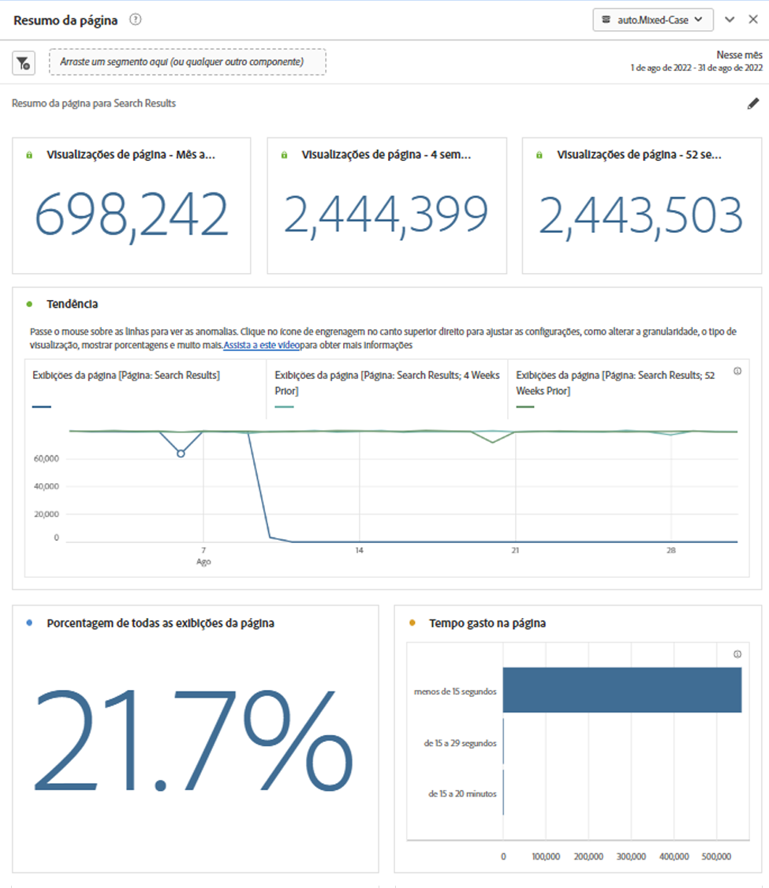
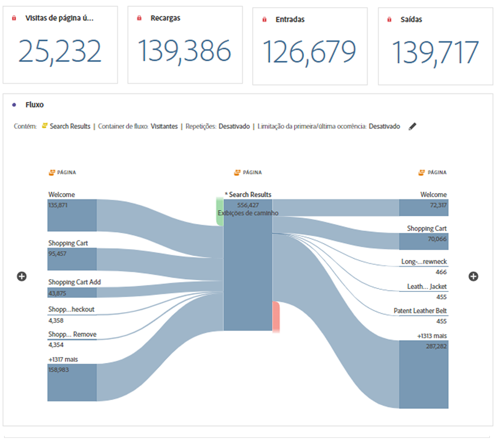

# Painel Resumo da página

A variável [!UICONTROL Resumo da página] O painel começou como um relatório no Reports &amp; Analytics, em Relatórios > Envolvimento > Análise de página > Resumo da página. Agora, ele também é um painel do Espaço de trabalho. Esse painel permite explorar facilmente as principais estatísticas sobre páginas específicas.

## Acessar o painel

Você pode acessar o painel de dentro do [!UICONTROL Relatórios] ou no prazo de [!UICONTROL Workspace].

| Ponto de acesso | Descrição |
| --- | --- |
| [!UICONTROL Relatórios] | <ul><li>O painel já está solto em um projeto.</li><li>O painel esquerdo está recolhido.</li><li>Somente a dimensão Página é compatível.</li><li>Uma configuração padrão já foi aplicada; nesse caso, a página mais visitada da[!UICONTROL Página] dimensão. Você pode modificar essa configuração.</li></ul> |
| Workspace | Crie um novo projeto e selecione o ícone Painel no painel à esquerda. Arraste o [!UICONTROL Resumo da página] acima da tabela de Forma livre. Observe que a página [!UICONTROL Item Dimension] é deixado em branco. Selecione um item de dimensão na lista suspensa. |

## Entradas do painel {#Input}

Você pode configurar o [!UICONTROL Resumo da página] usando estas configurações de entrada:

| Configuração | Descrição |
| --- | --- |
| Zona de destino do segmento (ou outro componente) | Você pode arrastar e soltar segmentos ou outros componentes para filtrar ainda mais os resultados do painel. |
| Item de dimensão de página | Na lista suspensa, selecione o item de dimensão Página cujas estatísticas principais você deseja explorar. |

{style="table-layout:auto"}

Clique em **[!UICONTROL Build]** para criar o painel.

## Saída do painel {#output}

A variável [!UICONTROL Resumo da página] O painel retorna um conjunto avançado de métricas, dados e visualizações para ajudar você a entender melhor as estatísticas sobre páginas específicas.

| Métrica/Visualização | Descrição |
| --- | --- |
| [!UICONTROL Exibições de página] - Mês atual, até agora | Número de exibições de página para esta página no mês atual. |
| [!UICONTROL Exibições de página] - 4 semanas atrás | Número de exibições de página para esta página no último mês. |
| [!UICONTROL Exibições de página] - 52 semanas atrás | Número de exibições de página para esta página no último ano. |
| [!UICONTROL Tendência] | Um gráfico de exibição de página de tendência para este mês, 4 semanas antes e 52 semanas antes. |
| [!UICONTROL Porcentagem de todas as exibições de página] | Um número de resumo para a porcentagem de todas as exibições de página que foram para esta página. |
| [!UICONTROL Tempo gasto na página] | Um gráfico de barras horizontal listando o tempo gasto nesta página. |
| [!UICONTROL Visitas em única página] | Um número de resumo listando o número de exibições de página nas quais esta foi a única página visitada. |
| [!UICONTROL Recargas] | A variável [!UICONTROL Recargas] métrica mostra o número de vezes que um item de dimensão foi apresentado durante um recarregamento. A atualização do navegador por um visitante é a maneira mais comum de acionar um recarregamento. |
| [!UICONTROL Entradas] | A variável [!UICONTROL Entradas] métrica mostra o número de vezes que um determinado item de dimensão é capturado como o primeiro valor em uma visita. |
| [!UICONTROL Saídas] | A variável [!UICONTROL Saídas] métrica mostra o número de vezes que um determinado item de dimensão é registrado como o último valor em uma visita. |
| [!UICONTROL Fluxo] | Um diagrama de Fluxo com a página selecionada como ponto focal. Você pode detalhar os dados da mesma forma que em qualquer [Diagrama de Fluxo](/help/analyze/analysis-workspace/visualizations/c-flow/create-flow.md). |

{style="table-layout:auto"}

