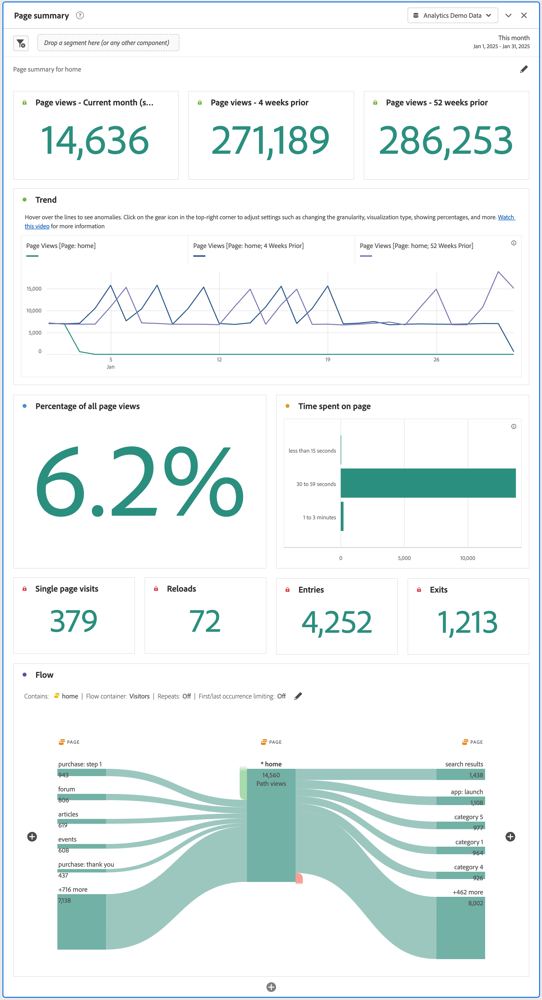

# Painel de resumo da página {#page-summary}

<!-- markdownlint-disable MD034 -->

>[!CONTEXTUALHELP]
>id="workspace_pagesummary_button"
>title="Resumo da página"
>abstract="Revise rapidamente algumas das métricas de alto nível, bem como o movimento de e para uma página específica."

<!-- markdownlint-enable MD034 -->

<!-- markdownlint-disable MD034 -->

>[!CONTEXTUALHELP]
>id="workspace_pagesummary_panel"
>title="Painel de resumo da página"
>abstract="Revise rapidamente algumas das métricas de alto nível, bem como o movimento de e para uma página específica.  **Parâmetros ** **Adicionar um item da dimensão página**: abra o painel de componentes, localize a dimensão Página e expanda-a clicando na cenoura para ver os itens de dimensão. Em seguida, arraste e solte a página específica sobre a qual deseja ter conhecimento no construtor. Após arrastar e soltar o item de dimensão, o relatório será preenchido automaticamente com informações importantes sobre a página."

<!-- markdownlint-enable MD034 -->

>[!BEGINSHADEBOX]

_Este artigo é sobre o painel de resumo da página no_  _**Adobe Analytics**._ _Não há um painel equivalente no_  _**Customer Journey Analytics**._

>[!ENDSHADEBOX]

Um painel de **[!UICONTROL resumo da página]** permite verificar as principais estatísticas sobre páginas específicas.

## Usar

Para usar um painel de **[!UICONTROL resumo da página]**:

1. Crie um painel de **[!UICONTROL resumo da página]**. Para obter informações sobre como criar um painel, consulte [Criar um painel](panels.md#create-a-panel).

1. Especifique a [entrada](#panel-input) do painel.

1. Observe a [saída](#panel-output) do painel.

É possível acessar o painel a partir de [!UICONTROL Relatórios] ou no [!UICONTROL Workspace].

| Ponto de acesso | Descrição |
| --- | --- |
| [!UICONTROL Relatórios] | <ul><li>O painel já foi solto em um projeto.</li><li>O painel esquerdo está recolhido.</li><li>Somente a dimensão Página é compatível.</li><li>Uma configuração padrão já foi aplicada, neste caso, é a página mais visitada da dimensão [!UICONTROL Página]. É possível modificar essa configuração.</li></ul> |
| Workspace | Crie um novo projeto e selecione o ícone Painel no menu à esquerda. Arraste o painel de [!UICONTROL resumo da página] sobre a tabela de forma livre. Observe que o campo [!UICONTROL Item de dimensão] da página está em branco. Selecione um item de dimensão da lista suspensa. |

### Entrada do painel {#panel-input}

É possível configurar o painel de [!UICONTROL resumo da página] usando estas configurações de entrada:

| Entrada | Descrição |
| --- | --- |
| **[!UICONTROL Página]** | Selecione uma dimensão de página para a página cujas estatísticas principais você deseja verificar. |

{style="table-layout:auto"}

Selecione **[!UICONTROL Criar]** para criar o painel.

### Saída do painel {#panel-output}

O painel de [!UICONTROL resumo da página] retorna um conjunto avançado de métricas, dados e visualizações para ajudar a entender melhor as estatísticas sobre páginas específicas.

| Visualização | Descrição |
| --- | --- |
| **[!UICONTROL Exibições de página] - Mês atual (até agora)** | Uma visualização de [número de resumo](/help/analyze/analysis-workspace/visualizations/summary-number-change.md) que mostra o número de exibições desta página no mês atual. |
| **[!UICONTROL Exibições de página] - 4 semanas antes** | Uma visualização de [número de resumo](/help/analyze/analysis-workspace/visualizations/summary-number-change.md) que mostra o número de exibições desta página no último mês. |
| **[!UICONTROL Exibições de página] - 52 semanas antes** | Uma visualização de [número de resumo](/help/analyze/analysis-workspace/visualizations/summary-number-change.md) que mostra o número de exibições desta página no último ano. |
| **[!UICONTROL Tendência]** | Uma visualização de tendência de [linha](/help/analyze/analysis-workspace/visualizations/line.md) para exibições de página neste mês, 4 semanas antes e 52 semanas antes. |
| **[!UICONTROL Porcentagem de todas as exibições de página]** | Um número de resumo para a porcentagem de todas as exibições referentes a esta página. |
| **[!UICONTROL Tempo gasto na página]** | Uma visualização de [barra horizontal](/help/analyze/analysis-workspace/visualizations/horizontal-bar.md) que mostra o tempo gasto nesta página. |
| **[!UICONTROL Visitas em uma única página]** | Um [número de resumo](/help/analyze/analysis-workspace/visualizations/summary-number-change.md) que mostra o número de exibições de página em que esta página foi a única visitada. |
| **[!UICONTROL Recarregamentos]** | Um [número de resumo](/help/analyze/analysis-workspace/visualizations/summary-number-change.md) que mostra a quantidade de vezes que um item de dimensão estava presente durante um recarregamento. A atualização do navegador por um(a) visitante é a maneira mais comum de acionar um recarregamento. |
| **[!UICONTROL Entradas]** | Um [número de resumo](/help/analyze/analysis-workspace/visualizations/summary-number-change.md) que mostra a quantidade de vezes que um determinado item de dimensão foi capturado como o primeiro valor em uma visita.  |
| **[!UICONTROL Saídas]** | Um [número de resumo](/help/analyze/analysis-workspace/visualizations/summary-number-change.md) que mostra a quantidade de vezes que um determinado item de dimensão foi capturado como o último valor em uma visita.  |
| **[!UICONTROL Fluxo]** | Uma visualização de [fluxo](/help/analyze/analysis-workspace/visualizations/c-flow/flow.md) com a página selecionada como ponto focal. É possível aprofundar a análise dos dados da mesma forma que em qualquer visualização de [fluxo](/help/analyze/analysis-workspace/visualizations/c-flow/create-flow.md). |

{style="table-layout:auto"}

Use  para reconfigurar e recriar o painel.
