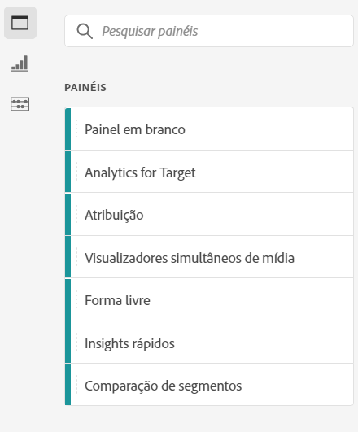
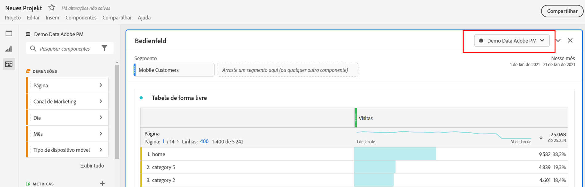
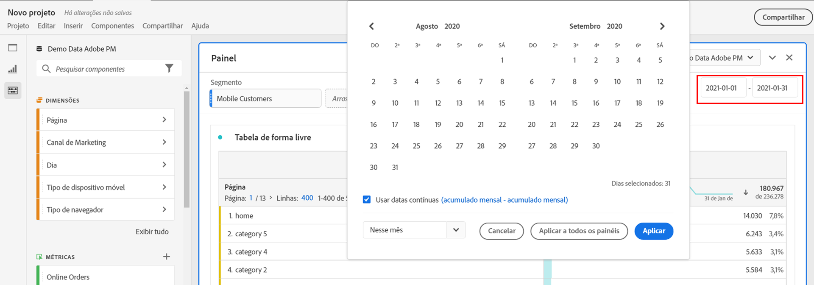
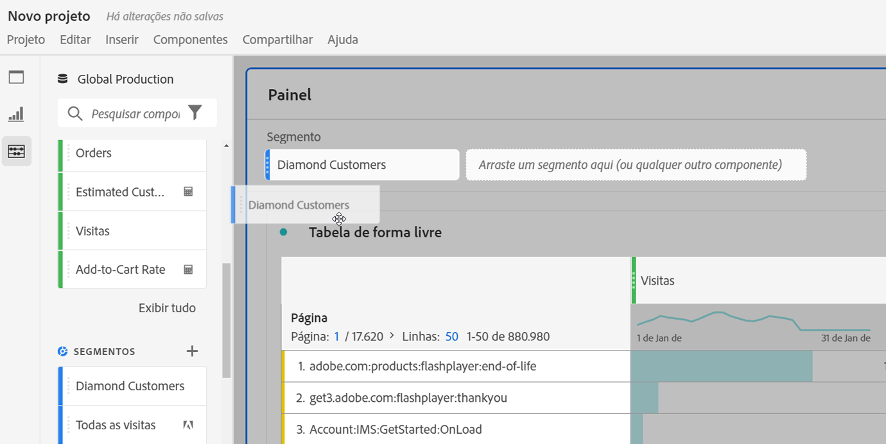
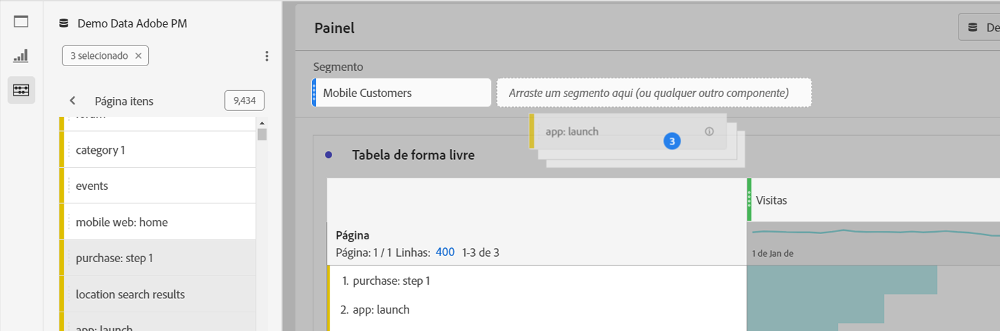
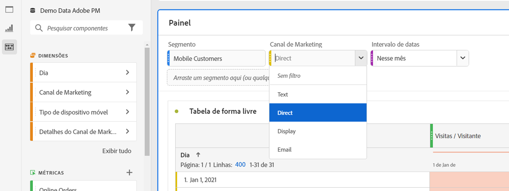
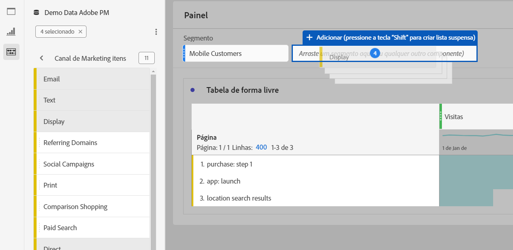
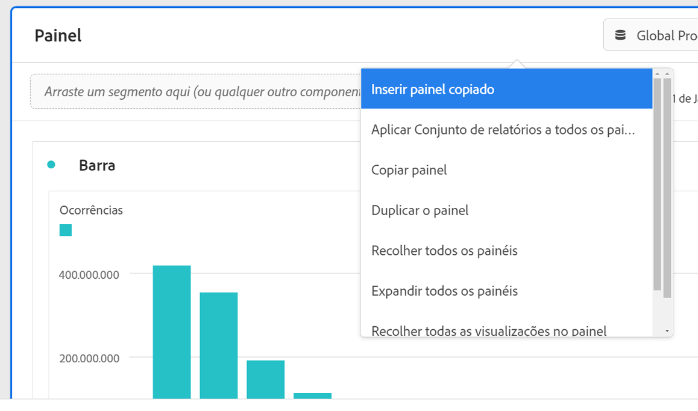

# Visão geral dos painéis

Um [!UICONTROL painel] é uma coleção de tabelas e visualizações. Você pode acessar os painéis por meio do ícone superior esquerdo no Workspace ou um [painel em branco](blank-panel.md). Os painéis são úteis quando você deseja organizar seus projetos de acordo com períodos, conjuntos de relatórios ou caso de uso de análise. Os seguintes tipos de painel estão disponíveis no Analysis Workspace:

| Nome do painel | Descrição |
| --- | --- |
| [Painel em branco](blank-panel.md) | Escolha entre os painéis e visualizações disponíveis para iniciar a análise. |
| [Painel do Quick Insights](quickinsight.md) | Crie rapidamente uma tabela de forma livre e uma visualização de acompanhamento para analisar e descobrir insights mais rapidamente. |
| [Painel do Analytics for Target](a4t-panel.md) | Analisar atividades e experiências do Target no Analysis Workspace. |
| [Painel de atribuição](attribution.md) | Compare e visualize modelos de atribuição rapidamente usando qualquer dimensão e métrica de conversão. |
| [Painel de forma livre](freeform-panel.md) | Realize comparações e detalhamentos ilimitados e, em seguida, adicione visualizações para obter uma visão ampla dos dados. |
| [Painel de visualizadores simultâneos de mídia](media-concurrent-viewers.md) | Analise os visualizadores simultâneos ao longo do tempo, com detalhes sobre o pico de simultaneidade e a capacidade de analisar e comparar. |
| [Painel de comparação de segmentos](c-segment-comparison/segment-comparison.md) | Compare rapidamente dois segmentos em todos os pontos de dados para encontrar automaticamente diferenças relevantes. |

[!UICONTROL Os painéis Insights rápidos], [!UICONTROL Em branco] e [!UICONTROL Forma livre] são ótimos locais para iniciar a análise, enquanto o [!UICONTROL Analytics for Target], [!UICONTROL Attribution IQ], [!UICONTROL Visualizadores simultâneos de mídia] e [!UICONTROL Comparação de segmento] se prestam a análises mais avançadas. Um botão `"+"` está disponível nos projetos para que você possa adicionar painéis em branco a qualquer momento.

O painel inicial padrão é o painel [!UICONTROL Forma livre], mas você também pode definir o [painel em branco](/help/analyze/analysis-workspace/c-panels/blank-panel.md) como padrão.

## Conjunto de relatórios {#report-suite}

Tabelas e visualizações em um painel derivam dados do [!UICONTROL conjunto de relatórios] selecionado na parte superior direita do painel. O conjunto de relatórios também determina quais componentes estão disponíveis no painel esquerdo. Em um projeto, você pode usar um ou [vários conjuntos de relatórios](https://docs.adobe.com/content/help/pt-BR/analytics/analyze/analysis-workspace/build-workspace-project/multiple-report-suites.html) dependendo dos casos de uso da análise. Para aplicar um único conjunto de relatórios a todos os painéis em um projeto, **clique com o botão direito do mouse no cabeçalho do painel > Aplicar conjunto de relatórios a todos os painéis**.

A lista dos conjuntos de relatórios é classificada de acordo com a relevância, que a Adobe define levando em conta quão recentemente e frequentemente o pacote foi usado pelo usuário atual e com que frequência o pacote é usado na organização.

## Calendário {#calendar}

O calendário do painel controla o intervalo de relatórios para tabelas e visualizações em um painel.

Observação: se um componente de intervalo de datas (roxo) for usado em uma tabela, uma visualização ou uma zona suspensa do painel, ele substituirá o calendário do painel.

## Zona suspensa {#dropzone}

A área suspensa do painel permite aplicar filtros de segmento e lista suspensa a todas as tabelas e visualizações em um painel. Você pode aplicar um ou vários filtros a um painel. O título acima de cada filtro pode ser modificado clicando no lápis de edição ou você pode clicar com o botão direito do mouse para removê-lo completamente.

### Filtros de segmento

Arraste e solte qualquer segmento do painel esquerdo na área suspensa do painel para começar a filtrar o painel.

### Filtros de segmento Ad-hoc

Os componentes que não são de segmento também podem ser arrastados diretamente para a zona suspensa para criar segmentos ad-hoc, economizando tempo e esforço de ir para o Construtor de segmentos. Segmentos criados dessa forma são definidos automaticamente como segmentos de nível de ocorrência. Essa definição pode ser modificada clicando no ícone de informações (i) ao lado do segmento e, em seguida, no ícone de edição em forma de lápis e editando-os no Construtor de segmento.

Os segmentos ad-hoc são locais ao projeto e não serão exibidos no painel esquerdo, a menos que você os torne públicos.

### Filtros suspensos {#dropdown-filter}

Além dos filtros de segmento, os filtros suspensos permitem que você interaja com os dados de forma controlada. Por exemplo, você pode adicionar um filtro suspenso para Tipos de dispositivo móvel para segmentar o painel por Tablet, Celular ou Desktop.

Filtros suspensos também podem ser usados para consolidar vários projetos em um único. Por exemplo, se você tiver muitas versões do mesmo projeto com diferentes segmentos de País aplicados, será possível consolidar todas as versões em um único projeto e adicionar um filtro suspenso de País.

Para criar filtros suspensos:

1. Para criar um filtro suspenso usando [!UICONTROL itens de Dimension], como valores dentro da dimensão [!UICONTROL Canal de marketing], clique no ícone de seta para a direita ao lado da dimensão no painel esquerdo. Essa ação expõe todos os itens disponíveis. Selecione um ou vários itens do componente no painel esquerdo e solte-os na área suspensa do painel **enquanto mantém pressionada a tecla Shift**. Isso transformará os componentes em um filtro suspenso, em vez de em um segmento único.
1. Para criar um filtro suspenso usando outro componente, como métricas, segmentos ou intervalos de datas, selecione um tipo de componente no painel esquerdo e solte na área suspensa do painel **enquanto mantém pressionada a tecla Shift**.
1. Selecione uma das opções na lista suspensa para alterar os dados no painel. Também é possível optar por não filtrar os dados do painel ao selecionar **[!UICONTROL Nenhum filtro]**.

[Assista ao vídeo](https://docs.adobe.com/content/help/pt-BR/analytics-learn/tutorials/analysis-workspace/using-panels/using-panels-to-organize-your-analysis-workspace-projects.html) para saber mais sobre como adicionar filtros suspensos ao seu projeto.

## Clique com o botão direito do mouse no menu {#right-click}

A funcionalidade adicional para um painel está disponível clicando com o botão direito do mouse no cabeçalho do painel.

As seguintes configurações estão disponíveis:

| Configuração | Descrição |
| --- | --- |
| Inserir visualização/painel copiado | Permite colar (“inserir”) um painel ou visualização copiada em outro lugar no projeto ou em outro projeto completamente diferente. |
| Copiar painel | Permite clicar com o botão direito do mouse e copiar um painel, para que você possa inseri-lo em outro lugar no projeto ou em um projeto completamente diferente. |
| Aplicar o conjunto de relatórios a todos os painéis | Permite aplicar o conjunto de relatórios do painel principal a todos os painéis do projeto. |
| Duplicar o painel | Cria uma duplicata exata do painel atual, que você pode modificar. |
| Recolher/expandir todos os painéis | Recolhe e expande todos os painéis do projeto. |
| Recolher/Expandir todas as visualizações no painel | Recolhe e expande todas as visualizações no painel atual. |
| Editar descrição | Adicione (ou edite) uma descrição de texto para o painel. |
| Obter link do painel | Permite direcionar alguém a um painel específico em um projeto. Quando o link for clicado, o destinatário será solicitado a fazer logon antes de ser direcionado para o painel exato que está vinculado. |
