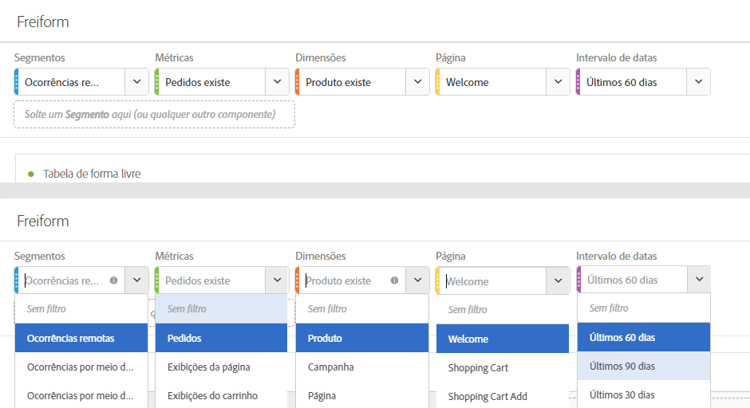
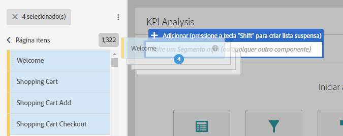
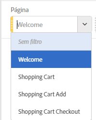
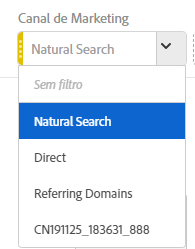

# Visão geral dos painéis

Um painel é uma coleção de tabelas e visualizações. Você pode acessar painéis usando o ícone superior esquerdo no Workspace. Os painéis são úteis quando você deseja organizar seus projetos de acordo com períodos de tempo, unidades comerciais, geografia etc. Esses quatro tipos de painéis estão disponíveis no Analysis Workspace: Painel em branco, Atribuição, Painel de forma livre e Comparação de segmentos.

O Painel em branco e o Painel de forma livre são para análises iniciais, e Attribution IQ e Comparação de segmentos servem para análises mais avançadas. Além disso, adicionamos um botão de painel “+”, para que você possa adicionar painéis em branco a qualquer momento.

O painel inicial padrão é o Painel de forma livre, mas também é possível definir o [Painel em branco](/help/analyze/analysis-workspace/c-panels/blank-panel.md) como o padrão.

## Filtros suspensos em painéis  {#section_D2828EEDD52944528E87F470EAB581CF}

A área de soltar do painel agora tem recursos suspensos de filtragem. Esses filtros permitem interagir com os dados do projeto de forma controlada para fazer análises mais detalhadas, simplificar seus projetos e/ou compartilhar insights com outras pessoas.

Um exemplo de um projeto simplificado: suponhamos que você tenha várias versões de um projeto/painel para fazer relatórios específicos de país. Agora, você pode retrair esses projetos/painéis em um único painel, e adicioná-lo em um detalhamento de países em vez de filtrar entre conjuntos de dados diferentes.

Lembre-se:

* É possível soltar vários componentes (ou itens de dimensão) e alternar entre eles em uma lista suspensa para filtrar os conteúdos do painel.
* Além disso, você pode criar várias listas suspensas no mesmo painel.
* Você pode personalizar o título da lista suspensa ao clicar no título e modificá-lo, ou remover o título ao clicar no x ao lado dele.
* É possível criar filtros suspenso usando qualquer tipo de componente: dimensões, intervalos de datas, segmentos e métricas. Observe que os intervalos de datas suspensos sempre substituirão os intervalos de datas do painel.
* Mantemos as cores do componente do painel à esquerda: amarelo para itens suspensos da dimensão, verde para métricas, azul para segmentos e roxo para intervalos de datas.
* A área de soltar itens ainda criará segmentos a nível de ocorrência para itens arrastados como segmentos. É possível modificá-los como de costume ao clicar no ícone de informações (i) ao lado do segmento, em seguida no ícone de edição em forma de lápis e editá-los no Construtor de segmento.

**Para criar e usar filtros suspensos:**

1. Selecione quaisquer itens no painel à esquerda e, **mantendo pressionada a tecla**, solte-os na área de soltar do painel.

   

   Isso os transformará em uma lista suspensa, em vez de em um segmento. (Também é possível adicionar segmentos sem manter a tecla pressionada.)

   

1. Selecione uma das opções na lista suspensa para alterar os dados no painel abaixo. (Também é possível optar por não filtrar os dados do painel ao selecionar **[!UICONTROL Nenhum filtro]**.)
1. Por exemplo, se você também quiser dividir os dados por canal de marketing, você pode adicionar outra lista suspensa chamada “Canal de marketing”:

   

