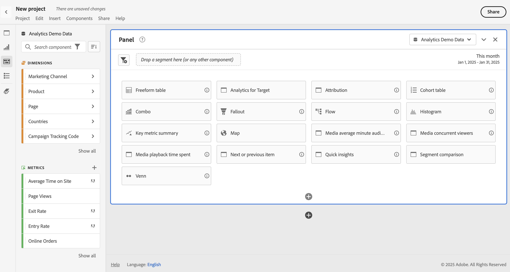
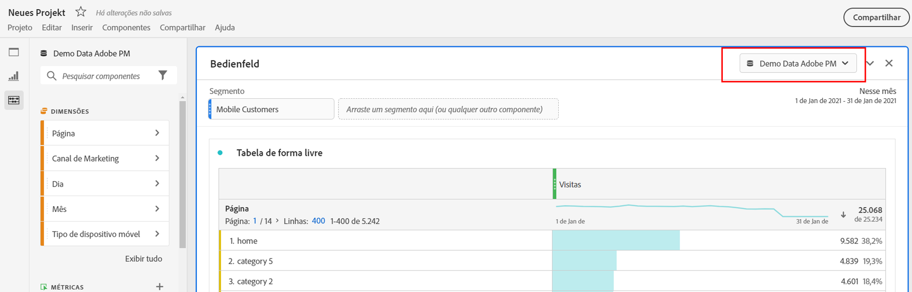
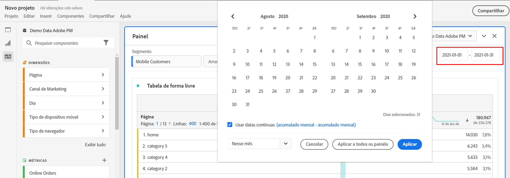
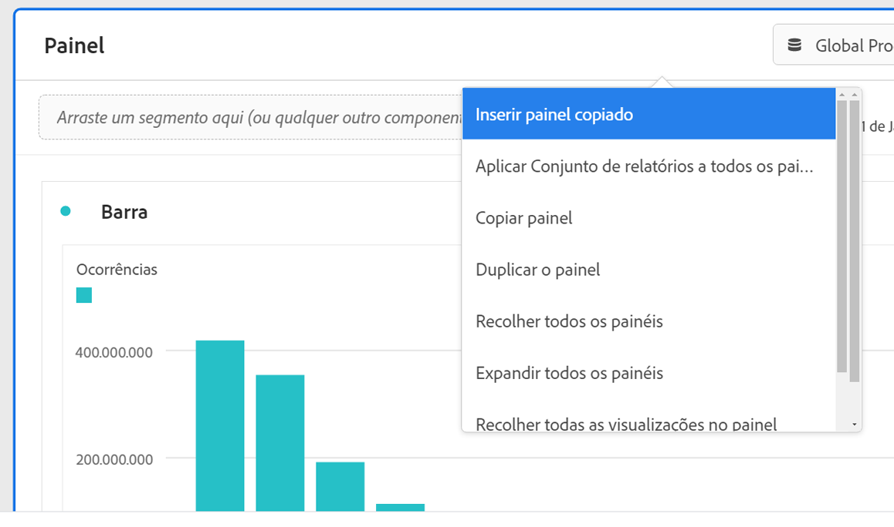

# Visão geral dos painéis

Um [!UICONTROL painel] é uma coleção de tabelas e visualizações. Você pode acessar os painéis utilizando o ícone no canto superior esquerdo do espaço de trabalho ou por meio de um [painel em branco](/help/analyze/analysis-workspace/c-panels/blank-panel.md). Os painéis são úteis para organizar projetos de acordo com períodos, conjuntos de relatórios ou caso de uso de análise.

## Tipos de painel

Os seguintes tipos de painel estão disponíveis no Analysis Workspace para o [!UICONTROL Adobe Analytics]:

| Nome do painel | Descrição |
| --- | --- |
| [Painel em branco](/help/analyze/analysis-workspace/c-panels/blank-panel.md) | Escolha entre os painéis e visualizações disponíveis para iniciar a análise. |
| [Atribuição](attribution.md) | Compare e visualize modelos de atribuição rapidamente usando qualquer dimensão e métrica de conversão. |
| [Analytics for Target](a4t-panel.md) | Analisar atividades e experiências do Target no Analysis Workspace. |
| [Forma livre](freeform-panel.md) | Realize comparações e detalhamentos ilimitados e, em seguida, adicione visualizações para obter uma visão ampla dos dados. |
| [Público-alvo médio a cada minuto de mídia](average-minute-audience-panel.md) | Analise o público-alvo médio por minuto de um conteúdo específico ou ao longo de um período personalizado. |
| [Visualizadores simultâneos de mídia &#x200B;](media-concurrent-viewers.md) | Analise os visualizadores simultâneos ao longo do tempo, com detalhes sobre o pico de simultaneidade e a capacidade de criar um detalhamento e comparar. |
| [Tempo gasto com a reprodução da mídia](/help/analyze/analysis-workspace/c-panels/media-playback-time-spent.md) | Analise o tempo de reprodução gasto para entender onde ocorrem os picos de simultaneidade ou as desistências. |
| [Próximo item ou anterior](next-previous.md) | Mostra as páginas seguintes ou anteriores que as pessoas acessam. |
| [Insights rápidos](quickinsight.md) | Crie rapidamente uma tabela de forma livre e uma visualização de acompanhamento para analisar e descobrir insights mais rapidamente. |
| [Resumo da página](page-summary.md) | Explore as principais estatísticas sobre páginas específicas. |
| [Comparação de segmentos](/help/analyze/analysis-workspace/c-panels/c-segment-comparison/segment-comparison.md) | Compare rapidamente todos os pontos de dados de dois segmentos para encontrar diferenças relevantes automaticamente. |

Os painéis [!UICONTROL Insights rápidos], [!UICONTROL Em branco] e [!UICONTROL Forma livre] são ótimos lugares para começar a análise, enquanto que o painel [!UICONTROL Atribuição] é recomendado para análises mais avançadas. Um  está disponível na parte inferior da tela para que você possa adicionar painéis em branco a qualquer momento.

O painel inicial padrão é o de [!UICONTROL Forma livre], mas você também pode definir o [Painel em branco](/help/analyze/analysis-workspace/c-panels/blank-panel.md) ou [Insights rápidos](/help/analyze/analysis-workspace/c-panels/quickinsight.md) como padrão. Consulte [Preferências de projetos e análise](/help/analyze/analysis-workspace/user-preferences.md#projects--analyses-preferences).

## Criar um painel

Para criar um painel:

* Arraste e solte um painel do menu esquerdo **[!UICONTROL Painéis]** sobre a tela.
* Selecione um painel no [Painel em branco](blank-panel.md).
* Use o menu **[!UICONTROL Inserir]** no espaço de trabalho e selecione seu painel. Você também pode usar qualquer um dos [atalhos](../build-workspace-project/fa-shortcut-keys.md) para inserir um painel.

  

É possível:

* Selecione  **em** qualquer painel para adicionar outra visualização. Isso exibe um pop-up que permite selecionar uma visualização.

  

  | Selecione... | Para criar um(a)... |
  |---|---|
  |  | [Tabela de forma livre](/help/analyze/analysis-workspace/visualizations/freeform-table/freeform-table.md) |
  |  | [Linha](/help/analyze/analysis-workspace/visualizations/line.md) |
  |  | [Barra](/help/analyze/analysis-workspace/visualizations/bar.md) |
  |  | [Número do resumo](/help/analyze/analysis-workspace/visualizations/summary-number-change.md) |
  |  | [Texto](/help/analyze/analysis-workspace/visualizations/text.md) |
  |  | [Fallout](/help/analyze/analysis-workspace/visualizations/fallout/fallout-flow.md) |
  |  | [Fluxo](/help/analyze/analysis-workspace/visualizations/c-flow/flow.md) |
  |  | [Área empilhada](/help/analyze/analysis-workspace/visualizations/area.md) |
  |  | [Tabela de coorte](/help/analyze/analysis-workspace/visualizations/cohort-table/t-cohort.md) |
  |  | [Marcador](/help/analyze/analysis-workspace/visualizations/bullet-graph.md) |
  |  | [Rosca](/help/analyze/analysis-workspace/visualizations/donut.md) |
  |  | [Alteração de resumo](/help/analyze/analysis-workspace/visualizations/summary-number-change.md) |
  |  | [Histograma](/help/analyze/analysis-workspace/visualizations/histogram.md) |
  |  | [Dispersão](/help/analyze/analysis-workspace/visualizations/scatterplot.md) |
  |  | [Venn](/help/analyze/analysis-workspace/visualizations/venn.md) |
  |  | [Mapas de árvore](/help/analyze/analysis-workspace/visualizations/treemap.md) |

* Selecione  **fora** do último painel no espaço de trabalho para adicionar outro [painel em branco](blank-panel.md).

## Gerenciar um painel

Você pode gerenciar um painel das seguintes maneiras:

* Para recolher um painel, selecione .
* Para revelar um painel recolhido, selecione .
* Para excluir um painel, selecione . Para desfazer, selecione **[!UICONTROL Editar]** > **[!UICONTROL Desfazer]** (**[!UICONTROL *cmd *+*z *]**|**[!UICONTROL * ctrl *+* z *]**).
* Para mover um painel, arraste e solte o painel sempre que um  estiver visível (geralmente quando você passa o mouse sobre o cabeçalho).

## Conjunto de relatórios

Cada painel é associado a um [conjunto de relatórios](/help/admin/tools/manage-rs/report-suites-admin.md), identificado pelo nome  **[!UICONTROL *do conjunto de relatórios *]**&#x200B;no menu suspenso, localizado no canto superior direito do painel.

Ao criar um novo painel, o conjunto de relatórios padrão se baseia no conjunto de relatórios do painel que você utilizou pela última vez no projeto do Analysis Workspace.

Em um projeto, é possível usar um ou [vários conjuntos de relatórios](/help/analyze/analysis-workspace/build-workspace-project/multiple-report-suites.md), dependendo dos casos de uso de análise. 

A lista dos conjuntos de relatórios é classificada de acordo com a relevância, que a Adobe define com base na recente e frequente utilização do conjunto pelo usuário atual. E com que frequência o conjunto é usado na organização.

>[!IMPORTANT]
>
>O conjunto de relatórios selecionado determina quais dimensões, métricas e segmentos estão disponíveis para criar visualizações em um painel.
>
>
>Ao alterar um conjunto de relatórios de um painel, alguns dos componentes podem não estar disponíveis no novo conjunto de relatórios. Essa alteração pode fazer com que a visualização não seja renderizada corretamente. Você poderá ver avisos como:
>
>* Esse painel contém componentes que não estão habilitados no conjunto de relatórios selecionado. Altere o conjunto de relatórios ou habilite os componentes necessários no conjunto de relatórios.
>* Não é possível renderizar a visualização: verifique as colunas e linhas para garantir que elas contenham componentes válidos.
>

## Calendário

O calendário do painel controla o intervalo de datas de relatórios para tabelas e visualizações em um painel.

>[!NOTE]
>
>Se um componente de intervalo de datas  for usado em uma visualização ou painel (por exemplo, como um segmento), esse componente substituirá o calendário do painel.
>

1. Selecione um intervalo de datas escolhendo primeiro a data inicial e, em seguida, a data final.
Também é possível selecionar uma **[!UICONTROL predefinição]** no menu suspenso [!UICONTROL *Selecionar uma predefinição*].

1. Ou selecione **[!UICONTROL Mostrar configurações avançadas]** para:

   * Especificar uma **[!UICONTROL Hora de início]** e **[!UICONTROL Hora de término]** diferentes das opções padrão `12:00 AM` (`0:00`) e `11:59 PM` (`23:59`). Os horários de término sempre incluem 59 segundos. No caso de um intervalo de datas que abrange muitos dias, a hora inicial se aplica ao primeiro dia do intervalo de datas, e a hora final se aplica ao último dia do intervalo de datas. Use **[!UICONTROL (Redefinir valores de tempo)]** para redefinir os valores padrão de hora inicial e final.
   * **[!UICONTROL Tornar os componentes do intervalo de datas relativos ao calendário do painel]**. Se desativado, os componentes do intervalo de datas usados no painel são relativos à hora atual. Se ativado, os componentes do intervalo de datas usados no painel são relativos ao calendário do painel.
   * **[!UICONTROL Usar datas contínuas]**. Se habilitado, intervalos de datas predefinidos como **[!UICONTROL Últimos 7 dias completos]** são atualizados dinamicamente como a data e a hora atuais em andamento. Se desabilitada, essas predefinições não são atualizadas depois de aplicadas.

     

     É possível selecionar o texto entre parênteses (por exemplo, **[!UICONTROL início fixo - rolagem diária]**) para estender o painel e especificar detalhes para **[!UICONTROL Início]** e **[!UICONTROL Fim]**.

      1. Selecione **[!UICONTROL Início de]**, **[!UICONTROL Fim de]** ou **[!UICONTROL Dia fixo]**.
      1. Ao selecionar **[!UICONTROL Início de]** ou **[!UICONTROL Fim de]**, você pode criar uma expressão completa. Por exemplo: **[!UICONTROL Fim do]** **[!UICONTROL ano atual]** **[!UICONTROL mais]** `1` **[!UICONTROL dia]**. Escolha o valor apropriado para cada parte individual da expressão.
         * Selecione um valor para o atual. Por exemplo, **[!UICONTROL ano atual]**.
         * Selecione um valor para o cálculo adicional. Por exemplo, **[!UICONTROL mais]**.
         * Após definir um cálculo adicional, especifique um valor. Por exemplo, `1`.
         * Depois de especificar um cálculo adicional, selecione o período a ser usado para o cálculo. Por exemplo, **[!UICONTROL dia]**.

     Selecione **[!UICONTROL Ocultar detalhes]** para ocultar os detalhes do cálculo de datas contínuas.

1. Selecione **[!UICONTROL Aplicar]** para aplicar o intervalo de datas ao painel no qual você abriu o calendário.
Selecione **[!UICONTROL Aplicar a todos os painéis]** para aplicar o intervalo de datas a todos os painéis no projeto do espaço de trabalho.

## Área de arrastar e soltar {#dropzone}

A área de destino do painel, chamada **[!UICONTROL _Soltar um componente para filtrar ou analisar os dados_]**, permite filtrar ou analisar os dados do painel. Os segmentos ou detalhamentos usados para filtrar ou detalhar os dados se aplicam a todas as tabelas e visualizações de forma livre no painel.

Segmentos e detalhamentos permitem interagir com os dados de forma controlada. Por exemplo, você pode adicionar um menu suspenso de segmento para Tipos de dispositivo móvel para poder filtrar o painel selecionando Tablet, Celular ou Desktop.

Segmentos também podem ser usados para consolidar vários projetos em um só. Por exemplo, se você tiver versões diferentes do mesmo projeto com cada segmento de país diferente aplicado, será possível consolidar todas as versões em um único projeto e adicionar um menu suspenso de Segmento de país.

A ilustração abaixo mostra as diferentes variações de segmentos (rápidos) ou detalhamentos que resultam da adição de componentes à área de soltar.

### Adicionar ou substituir

Para adicionar ou substituir segmentos ou detalhamentos (rápidos):

1. Selecione um ou mais componentes no painel Componentes. Use &lt;b> ou &lt;b> para selecionar mais de um componente.
1. Arraste a seleção para a área designada, identificada **[!UICONTROL _Solte um componente para filtrar ou analisar os dados_]** ❶, ou sobre um componente existente já colocado próximo à área designada.
1. Você tem duas opções quando vê  **[!UICONTROL Adicionar (pressione &quot;shift&quot; para criar a lista suspensa)]** ou  **[!UICONTROL Substituir (pressione &quot;shift&quot; para adicionar à lista suspensa)]**:

   

   * Solte a seleção para criar os seguintes componentes:
      * [Segmentar](#segment) para qualquer componente de segmento que você soltar ❷.
      * [Segmento rápido](#quick-segment) para quaisquer componentes que não sejam de segmentos (intervalos de datas, métricas, dimensões, itens de dimensão) nos quais você solta ❸.
   * Solte a seleção **enquanto mantém pressionada** (shift) para criar os seguintes componentes:
      * Segmento estático [menu suspenso](#drop-down-menu) com itens para filtrar para os segmentos selecionados que você solta ❹.
      * Segmento estático [menu suspenso](#drop-down-menu) com itens para filtrar para os intervalos de datas selecionados que você solta ❺.
      * Segmento estático [menu suspenso](#drop-down-menu) com itens para filtrar para as métricas selecionadas que você solta ❻.
      * Segmento estático [menu suspenso](#drop-down-menu) ou detalhamento [menu suspenso](#drop-down-menu) com itens para filtrar ou detalhar para a dimensão selecionada *itens* que você solta ❼.
      * Segmento dinâmico [menu suspenso](#drop-down-menu) ou detalhamento [menu suspenso](#drop-down-menu) com itens para filtrar ou detalhar para as dimensões selecionadas nas quais você solta ❽.

### Segmento

Qualquer componente de segmento solto é usado para segmentar o painel. Use segmentos para obter insights segmentados sobre os dados e as visualizações do seu painel.

### Segmento rápido

Qualquer componente que não seja de segmento (dimensão, item de dimensão, métrica, intervalo de datas) que é descartado define um [segmento rápido](#quick-segment) para segmentar o painel. Use qualquer componente sem segmento para criar um segmento rápido sem usar o [Construtor de segmentos](/help/components/segmentation/segmentation-workflow/seg-quick.md). Um segmento criado dessa maneira é automaticamente definido como um segmento de nível de evento e rotulado como **[!UICONTROL Segmento rápido]** por padrão.

Como alternativa, você pode usar  para criar um segmento rápido.

Consulte [Segmentos rápidos](/help/components/segmentation/segmentation-workflow/seg-quick.md) para saber como criar e gerenciar segmentos rápidos.

### Menu suspenso

Um menu suspenso que é criado enquanto você mantém pressionada a opção:

* contém uma lista de itens [estáticos](#static) ou [dinâmicos](#dynamic).
* comporte-se para [filtrar um painel](#filter) ou [dividir um painel](#breakdown).

#### Estático

Menus suspensos estáticos são criados para a dimensão selecionada *itens*, métricas, segmentos e intervalos de datas. Os itens em um menu suspenso estático são baseados nos componentes selecionados que você solta e os itens não são alterados quando você adiciona ou substitui componentes.

#### Dinâmico

Os menus suspensos dinâmicos são criados somente quando você solta componentes de dimensões. Os menus suspensos dinâmicos são indicados com  como parte do rótulo.

Os itens disponíveis em um menu suspenso dinâmico são baseados em:

* os dados resultantes dos itens selecionados em outros menus suspensos, segmentos e segmentos rápidos dentro da área de soltar do painel e
* os dados disponíveis no intervalo de relatórios do painel.

Por exemplo, você pode adicionar dois menus suspensos dinâmicos usando uma dimensão de países e uma dimensão de cidades. Quando você seleciona um país no menu suspenso **[!UICONTROL Países]**, o menu suspenso **[!UICONTROL Cidades]** se ajusta dinamicamente para mostrar apenas as cidades do país selecionado. Quando você tem menus suspensos estáticos adicionais, os itens selecionados nesses menus suspensos também afetam os itens disponíveis nos menus suspensos dinâmicos. Os itens selecionados nos menus suspensos dinâmicos não afetam os itens disponíveis nos menus suspensos estáticos.

#### Filtrar um painel

Para qualquer componente de métrica, segmento ou intervalo de datas em que você solta **enquanto mantém**, um menu suspenso de segmentos é criado. Esse menu suspenso permite filtrar o painel com base nos itens disponíveis para o componente solto.

Para qualquer componente de *dimensão* que você solta **enquanto mantém**, um menu suspenso de segmentos é criado. Esse menu suspenso permite filtrar o painel com base nos itens disponíveis para os itens de dimensão ignorados (menu suspenso de segmentos [static](#static)) ou componente de dimensão (menu suspenso de segmentos [dynamic](#dynamic)). Para configurar o menu suspenso explicitamente para filtrar usando segmentos:

* Selecione  e  no menu de contexto do componente ❾.

#### Detalhar um painel

Para qualquer componente de *dimensão* que você solta **enquanto mantém**, um menu suspenso de segmentos é criado. Em vez disso, você pode configurar o menu suspenso para detalhar. Para configurar explicitamente o menu suspenso para detalhar usando detalhamentos:

* Selecione  e selecione o  no menu de contexto do componente ❾.

>[!IMPORTANT]
>
>Os detalhamentos só estão disponíveis para dimensões e itens de dimensão, não para segmentos, intervalos de datas ou métricas.
>

#### Segmentos versus detalhamentos

Considere detalhar um painel em vez de filtrar um painel (usando segmentos) nos seguintes cenários:

* Se você estiver usando métricas habilitadas para atribuição no seu painel, os segmentos geralmente limpam suas métricas habilitadas para atribuição. Os detalhamentos são aplicados em um ponto diferente na query executada para recuperar os dados do painel. Como resultado, os detalhamentos não limpam essas métricas habilitadas para atributos.

  Como exemplo, veja a diferença entre a métrica **[!UICONTROL Receita Online]** baseada em atributo ao usar o detalhamento **[!UICONTROL Luma: Categoria do Produto]**  **[!UICONTROL Mulheres]** versus **[!UICONTROL Luma: Categoria do Produto]**  **[!UICONTROL Mulheres]**.

  

* Se você estiver usando uma dimensão de nível de subevento em um menu suspenso de detalhamento, os detalhamentos serão executados nesse nível de subevento. Em vez disso, os segmentos em um menu suspenso de segmentos são executados no nível do evento.

  Como exemplo, veja a diferença entre a métrica **[!UICONTROL Receita Online]** ao usar o detalhamento **[!UICONTROL Luma: Subcategoria do Produto]**  **[!UICONTROL Tops]** versus **[!UICONTROL Luma: Subcategoria do Produto]**  **[!UICONTROL Tops]**. O detalhamento executa a consulta explicitamente no nível do subevento, enquanto o segmento executa a consulta no nível do evento.

  

### Gerenciar

Você pode gerenciar os componentes na área de lançamento da seguinte maneira:

| O que fazer na área de soltar do painel... | Como fazer... |
|---|---|
| Para remover um segmento ou segmento rápido. | Selecione  dentro do componente. |
| Para remover um item selecionado de um menu suspenso. | Selecione  dentro do item. |
| Para remover todos os itens selecionados de um menu suspenso. | Selecione  no menu suspenso. |
| Para editar o rótulo de qualquer componente. | Passe o mouse sobre o rótulo do componente e selecione . |
| Para excluir o rótulo de qualquer componente. | Passe o mouse sobre o rótulo do componente e selecione **[!UICONTROL Excluir rótulo]** no menu de contexto do componente. |
| Para excluir o componente da área de lançamento. | Selecione **[!UICONTROL Excluir menu suspenso]** no menu de contexto do componente. |
| Para obter informações sobre um segmento ou segmento rápido. | Passe o mouse dentro do componente e selecione  para abrir o Dicionário de Dados com informações sobre o componente. |
| Para obter informações sobre o componente que define um menu suspenso. | Passe o mouse dentro do menu suspenso e selecione  para abrir o Dicionário de Dados com informações sobre o componente. |
| Para editar um segmento rápido. | Passe o mouse dentro do segmento rápido e selecione . Consulte [Segmentos rápidos](/help/components/segmentation/segmentation-workflow/seg-quick.md) para obter mais detalhes. |
| Para exigir uma seleção para um menu suspenso. | Selecione **[!UICONTROL Exigir seleção]** no menu de contexto do componente. |
| Para não permitir filtros em um menu suspenso. | Selecione **[!UICONTROL Não permitir filtro]** no menu de contexto do componente. |
| Para redefinir todos os componentes e limpar todas as seleções dos menus suspensos. | Selecione **[!UICONTROL Redefinir tudo]**. |

>[!BEGINSHADEBOX]

Consulte  [Using filters in Analysis Workspace](https://experienceleague.adobe.com/en/docs/analytics-learn/tutorials/analysis-workspace/using-panels/using-drop-down-filters){target="_blank"} para ver um vídeo de demonstração.

>[!ENDSHADEBOX]

>[!BEGINSHADEBOX]

Consulte  [Menus suspensos dinâmicos](https://experienceleague.adobe.com/en/docs/customer-journey-analytics-learn/tutorials/analysis-workspace/tips-and-tricks/dynamic-drop-downs){target="_blank"} para ver um vídeo de demonstração.

{{videocja}}

>[!ENDSHADEBOX]

## Menu de contexto

Outras funcionalidades do painel estão disponíveis por meio do menu de contexto (clique com o botão direito) no cabeçalho do painel.

As seguintes opções estão disponíveis:

| Opção | Descrição |
| --- | --- |
| **[!UICONTROL Inserir painel copiado]** | Permite colar um painel copiado em outro lugar dentro do projeto ou em um projeto diferente. |
| **[!UICONTROL Inserir visualização copiada]** | Cola uma visualização copiada em outro lugar dentro do painel, projeto ou em um projeto diferente. |
| **[!UICONTROL Aplicar o conjunto de relatórios a todos os painéis]** | Aplique o conjunto de relatórios desse painel a todos os outros painéis no projeto. |
| **[!UICONTROL Copiar painel]** | Copia um painel para que você possa inseri-lo em outro lugar dentro do projeto ou em um projeto diferente. |
| **[!UICONTROL Duplicar o painel]** | Cria uma duplicata exata do painel atual, a qual você pode modificar. |
| **[!UICONTROL Recolher todos os painéis]** | Recolhe todos os painéis do projeto. |
| **[!UICONTROL Expandir todos os painéis]** | Expande todos os painéis do projeto. |
| **[!UICONTROL Recolher todas as visualizações no painel]** | Recolhe todas as visualizações no painel atual. |
| **[!UICONTROL Expandir todas as visualizações no painel]** | Expande todas as visualizações no painel atual. |
| **[!UICONTROL Editar descrição]** | Adicione (ou edite) uma descrição de texto para o painel. |
| **[!UICONTROL Obter link do painel]** | Direciona alguém para um painel específico dentro de um projeto. Ao clicar no link, o destinatário deverá fazer logon antes de acessar o painel exato vinculado. |

## Configuração

Alguns painéis (como [!UICONTROL Atribuição], [!UICONTROL Experimentação], [!UICONTROL Público-alvo médio por minuto de mídia] e outros) têm uma caixa de diálogo de configuração para ajudar você a criar a visualização. Use a opção  na parte superior do painel para acessar e alterar a configuração.

