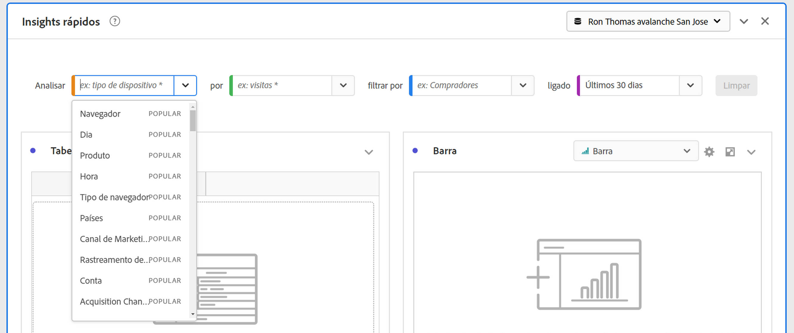

# Painel do Quick Insights

O painel do [!UICONTROL Quick Insights] fornece orientação para não analistas e novos usuários do [!UICONTROL Analysis Workspace] para saber como responder a perguntas comerciais de forma rápida e fácil. É também uma excelente ferramenta para usuários avançados que desejam responder rapidamente a uma pergunta simples sem precisar criar uma tabela.

Ao usar o [!UICONTROL Analysis Workspace] pela primeira vez, você pode se perguntar quais visualizações seriam mais úteis, quais dimensões e métricas podem promover insights, onde arrastar e soltar itens, onde criar um segmento etc.

Para ajudar nisso, e com base no uso de componentes de dados da sua própria empresa no [!UICONTROL Analysis Workspace], o [!UICONTROL Quick Insights] usa um algoritmo que apresentará as dimensões, as métricas, os segmentos e os intervalos de datas mais usados pela sua empresa. Na verdade, você verá dimensões, métricas e segmentos marcados como [!UICONTROL Popular] na lista suspensa, como mostrado aqui:

O [!UICONTROL Quick insights] ajuda a

* Criar corretamente uma tabela de dados e uma visualização que a acompanha no [!UICONTROL Analysis Workspace].
* Aprender a terminologia e o vocabulário de componentes básicos e pedaços do [!UICONTROL Analysis Workspace].
* Fazer detalhamentos simples de dimensões, adicionar várias métricas ou comparar segmentos facilmente em uma [!UICONTROL tabela de forma livre].
* Alterar ou experimentar vários tipos de visualização para encontrar a ferramenta para sua análise de forma rápida e intuitiva.

## Terminologia básica

A seguir, estão alguns dos termos básicos que você precisa conhecer. Cada tabela de dados consiste em 2 ou mais elementos (componentes) que você usa para contar sua história de dados.

| Elemento (Componente) | Definição |
|---|---|
| [!UICONTROL Dimensão] | Dimensões são descrições ou características de dados de métricas que podem ser visualizadas, analisadas e comparadas em um projeto. São valores não numéricos e datas que se dividem em itens de dimensão. Por exemplo, &quot;navegador&quot; ou &quot;página&quot; são dimensões. |
| [!UICONTROL Item de dimensão] | Os itens de dimensão são valores individuais para uma dimensão. Por exemplo, os itens de dimensão para a dimensão do navegador seriam &quot;Chrome&quot;, &quot;Firefox&quot;, &quot;Edge&quot; etc. |
| [!UICONTROL Métrica] | As métricas são informações quantitativas sobre a atividade do visitante, como exibições, click-throughs, recarregamentos, tempo médio gasto, unidades, ordens, receita, e assim por diante. |
| [!UICONTROL Visualização] | O Workspace oferece [várias visualizações](/help/analyze/analysis-workspace/visualizations/freeform-analysis-visualizations.md) para criar representações visuais de seus dados, como gráficos de barras, gráficos de rosca, histogramas, gráficos de linhas, mapas, gráficos de dispersão e outros. |
| [!UICONTROL Detalhamento de dimensão] | Um detalhamento de dimensão é uma forma de detalhar literalmente uma dimensão por outras dimensões. Em nosso exemplo, você pode dividir os Estados Unidos por dispositivos móveis para obter as visitas de dispositivos móveis por estado, ou pode dividir os dispositivos móveis por tipos de dispositivos móveis, por regiões, por campanhas internas, etc. |
| [!UICONTROL Segmento] | Os segmentos permitem identificar subconjuntos de visitantes de acordo com características ou interações de site. Por exemplo, você pode criar segmentos de [!UICONTROL Visitantes] com base em atributos: tipo de navegador, dispositivo, número de visitas, país, gênero ou com base em interações: campanhas, pesquisa por palavra-chave, mecanismo de pesquisa ou com base em saídas e entradas: visitantes do Facebook, uma landing page definida, um domínio de referência ou com base em variáveis personalizadas: campo de formulário, categorias definidas, ID do cliente. |

## Introdução ao Quick Insights

1. Faça logon no Adobe Analytics usando as credenciais fornecidas.
1. Vá para o [!UICONTROL Workspace], clique em **[!UICONTROL Criar novo projeto]** e depois em **[!UICONTROL Quick Insights]**. (Você também pode acessar esse painel no menu **[!UICONTROL Painel]** no painel esquerdo.)

   

   

1. Ao iniciar pela primeira vez, confira o breve tutorial que aborda as noções básicas do [!UICONTROL painel do Quick Insights]. Ou clique em **[!UICONTROL Ignorar tutorial]**.
1. Selecione os elementos (também conhecidos como componentes): dimensões (laranja), métricas (verde), segmentos (azul) ou intervalos de datas (roxo). É necessário selecionar pelo menos uma dimensão e uma métrica para que uma tabela seja criada automaticamente.

   

   Há três maneiras de selecionar os elementos:
   * Arraste e solte-os do painel esquerdo.
   * Se você souber o que está procurando: comece a digitar e o [!UICONTROL Quick Insights] preencherá os espaços em branco para você.
   * Clique na lista suspensa e pesquise a lista.

1. Quando você tiver adicionado pelo menos uma dimensão e uma métrica, o seguinte será criado:

   * Uma tabela de forma livre com a dimensão (aqui, Estados dos EUA) verticalmente e a métrica (aqui, Visitas) horizontalmente na parte superior. Confira esta tabela:

   

   * Uma visualização complementar, neste caso um [gráfico de barras](/help/analyze/analysis-workspace/visualizations/bar.md). A visualização gerada tem como base o tipo de dados que você adicionou à tabela. Todos os dados com base no tempo (como [!UICONTROL Visitas] por dia/mês) assumem o padrão de um gráfico de [!UICONTROL Linha]. Todos os dados não baseados em tempo (como [!UICONTROL Visitas] por [!UICONTROL dispositivo]) assumem o padrão de um gráfico de [!UICONTROL Barra]. Você pode alterar o tipo de visualização clicando na seta suspensa ao lado do tipo de visualização.

1. (Opcional) Detalhe as dimensões e veja os itens de dimensão clicando na seta > direita ao lado da dimensão.

1. Tente adicionar mais detalhes conforme descrito abaixo em &quot;Mais dicas&quot;.

1. Salve o projeto clicando em **[!UICONTROL Projeto > Salvar]**.

## Mais dicas

Outras dicas úteis aparecerão no [!UICONTROL Quick Insights Builder], algumas delas dependendo da última ação.

* Primeiro, siga o tutorial **[!UICONTROL Mais dicas]**: acesse-o por meio da Ajuda (?) ícone ao lado do título [!UICONTROL Quick Insights]. Esse tutorial é exibido 24 horas após você ter criado um projeto com pelo menos uma dimensão e uma métrica.

   

* **Detalhamento por**: você pode usar até três níveis de detalhamento em dimensões para detalhar os dados que realmente precisa.

   

* **Adicionar mais métricas**: você pode adicionar até mais duas métricas usando o operador E para adicioná-las à tabela.

   

* **Adicionar mais segmentos**: você pode adicionar até mais 2 segmentos usando os operadores E ou OU para adicioná-los à tabela. Observe o que acontece com a tabela quando você adiciona usuários móveis OU Visitantes leais. Eles ficam próximos um do outro, acima das métricas. Se você adicionasse Usuários móveis E Visitantes fidelizados, veria os resultados de ambos os segmentos juntos e eles seriam empilhados um sobre o outro na tabela.

   

## Limitações conhecidas

Se você tentar editar diretamente na tabela, o painel do [!UICONTROL Quick Insights] ficará fora de sincronia. Você pode restaurá-lo para as configurações anteriores do [!UICONTROL Quick Insights] clicando em **[!UICONTROL Ressincronizar o construtor]** na parte superior direita do painel.

Você receberá um aviso antes de adicionar algo diretamente à tabela:

Caso contrário, criar diretamente fará com que a tabela se comporte como uma tabela de forma livre tradicional, sem os recursos úteis para novos usuários.

