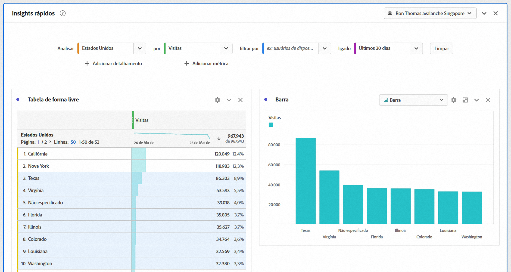
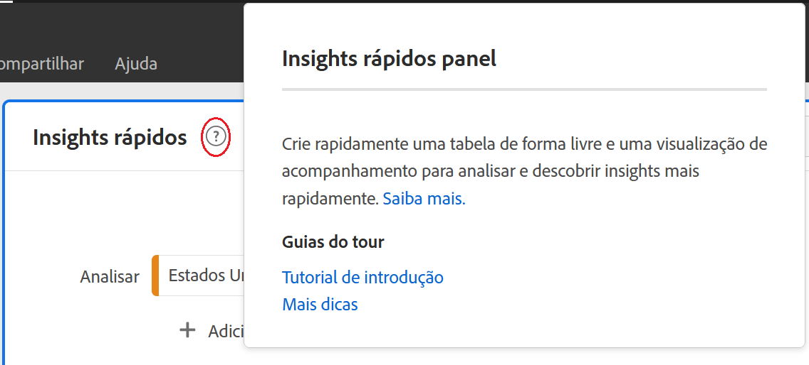
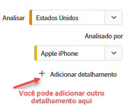
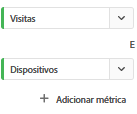
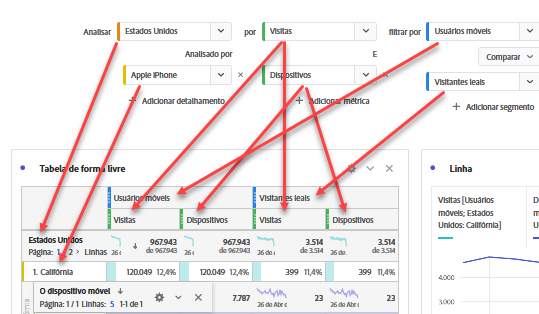
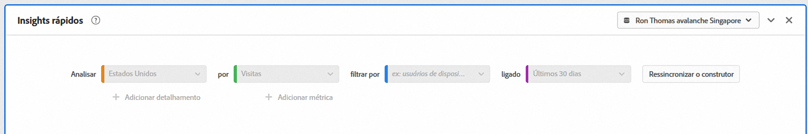

# Construtor do Quick Insights

>[!IMPORTANT]
>
>**[!UICONTROL Quick Insights]** está atualmente em testes limitados e ainda não está disponível para todos os clientes do Adobe Analytics.

[!UICONTROL Quick Insights] fornece orientação para que não analistas e novos usuários aprendam [!UICONTROL Analysis Workspace] a responder perguntas comerciais de forma rápida e fácil. É também uma excelente ferramenta para usuários avançados que desejam responder rapidamente a uma pergunta simples sem precisar criar uma tabela eles mesmos.

Ao usar esse start pela primeira vez, você pode se perguntar quais visualizações seriam mais úteis, quais dimensões e métricas podem facilitar insights, onde arrastar e soltar itens, onde criar um segmento etc. [!UICONTROL Analysis Workspace]

Para ajudar nisso, e com base no uso dos componentes de dados pelo seu próprio empresa no [!UICONTROL Analysis Workspace], [!UICONTROL Quick Insights] aproveita um algoritmo que apresentará as dimensões, métricas, segmentos e intervalos de datas mais populares que sua empresa usa.

[!UICONTROL Quick Insights] ajuda você

* Crie corretamente uma tabela de dados e uma visualização a ela no [!UICONTROL Analysis Workspace].
* Aprenda a terminologia e o vocabulário para componentes básicos e partes de [!UICONTROL Analysis Workspace].
* Faça detalhamentos simples de dimensões, adicione várias métricas ou compare segmentos facilmente em uma [!UICONTROL Freeform table].
* Altere ou experimente vários tipos de visualização para encontrar a ferramenta localizar para sua análise de forma rápida e intuitiva.

## Terminologia básica

A seguir, alguns dos termos básicos que você precisa conhecer. Cada tabela de dados consiste em 2 ou mais blocos componentes (componentes) que você utiliza para contar sua história de dados.

| Bloco de construção (Componente) | Definição |
|---|---|
| [!UICONTROL Dimension] | Dimensões são descrições ou características de dados de métricas que podem ser visualizadas, analisadas e comparadas em um projeto. São valores não numéricos e datas que se dividem em itens de dimensão. Por exemplo, &quot;navegador&quot; ou &quot;página&quot; são dimensões. |
| [!UICONTROL Dimension item] | Os itens de dimensão são valores individuais para uma dimensão. Por exemplo, os itens de dimensão para a dimensão do navegador seriam &quot;Chrome&quot;, &quot;Firefox&quot;, &quot;Edge&quot; etc. |
| [!UICONTROL Metric] | As métricas são informações quantitativas sobre a atividade do visitante, como exibições, click-throughs, recarregamentos, tempo médio gasto, unidades, ordens, receita, e assim por diante. |
| [!UICONTROL Visualization] | O Workspace oferta [várias visualizações](/help/analyze/analysis-workspace/visualizations/t-sync-visualization.md) para criar representações visuais de seus dados, como gráficos de barras, gráficos de rosca, histogramas, gráficos de linha, mapas, gráficos de dispersão e outros. |
| [!UICONTROL Breakdown] | Um detalhamento é uma maneira de literalmente dividir uma dimensão por outras dimensões. Em nosso exemplo, você pode dividir os Estados Unidos por dispositivos móveis para obter as visitas de dispositivos móveis por estado, ou pode dividir os dispositivos móveis por tipos de dispositivos móveis, por regiões, por Campanhas internas, etc. |
| [!UICONTROL Segment] | Os segmentos permitem que você identifique subconjuntos de visitantes com base em características ou interações de site. Por exemplo, você pode criar [!UICONTROL Visitor] segmentos com base em atributos: tipo de navegador, dispositivo, número de visitas, país, gênero ou com base em interações: campanhas, pesquisa por palavra-chave, mecanismo de pesquisa ou com base em saídas e entradas: visitantes do Facebook, uma landing page definida, um domínio de referência ou com base em variáveis personalizadas: campo de formulário, categorias definidas, ID do cliente. |

## Introdução ao Quick Insights

1. Faça logon no Adobe Analytics usando as credenciais fornecidas.
1. Vá para [!UICONTROL Workspace] e clique **[!UICONTROL Create New Project]** e clique em **[!UICONTROL Quick Insights]**.

   

1. Ao sair pela primeira vez do start, percorra o curto tutorial que lhe ensina algumas das [!UICONTROL Quick Insights panel] noções básicas. Ou clique para **[!UICONTROL Skip Tutorial]**.
1. Selecione os blocos componentes (também conhecidos como componentes): dimensões (laranja), métricas (verde), segmentos (azul) ou intervalos de datas (roxo) É necessário selecionar pelo menos uma dimensão e uma métrica para que uma tabela seja criada automaticamente.

   

   Você tem três maneiras de selecionar os blocos de construção:
   * Arraste e solte-os do painel esquerdo.
   * Se você sabe o que está procurando: Digitação de Start e [!UICONTROL Quick Insights] preencherá os espaços para você.
   * Clique na lista suspensa e pesquise a lista.

1. Quando você tiver adicionado pelo menos uma dimensão e uma métrica, o seguinte será criado para você:

   * Uma tabela de forma livre com a dimensão (aqui, Estados dos EUA) verticalmente e a métrica (aqui, Visitas) horizontalmente na parte superior. Confira esta tabela:
   

   * Uma visualização acompanhante, neste caso um gráfico [de](/help/analyze/analysis-workspace/visualizations/bar.md)barras. A visualização gerada baseia-se no tipo de dados que você adicionou à tabela. Você pode alterar o tipo de visualização clicando na seta suspensa ao lado de **[!UICONTROL Bar]**.

1. (Opcional) Detalhe as dimensões e veja os itens de dimensão clicando na seta > direita ao lado da dimensão.

1. Tente adicionar mais refinamentos conforme descrito abaixo em &quot;Outras opções úteis&quot;.

## Outras opções úteis

Outras dicas úteis aparecerão no [!UICONTROL Quick Insights Builder], algumas delas dependendo de sua última ação.

* Primeiro, conclua o **[!UICONTROL More tips]** tutorial: Acesse-o por meio da Ajuda (?) ao lado do [!UICONTROL Quick Insights Panel] título.

   

* **Detalhamento por**: Você pode usar até três níveis de detalhamento em dimensões para detalhar os dados que realmente precisa.

   

* **Adicionar mais métricas**: Você pode adicionar até mais duas métricas usando o operador E para adicioná-las à tabela.

   

* **Adicionar mais segmentos**: Você pode adicionar até mais 2 segmentos usando os operadores E ou OU para adicioná-los à tabela. Observe o que acontece com a tabela quando você adiciona usuários móveis OU Visitantes leais. Eles estão próximos um do outro, acima das métricas. Se você adicionasse Usuários Móveis E Visitantes Fidelizados, veria os resultados de ambos os segmentos juntos e eles seriam empilhados um sobre o outro na tabela.

   

## Limitações conhecidas

Se você tentar editar diretamente na tabela, isso fará com que o [!UICONTROL Quick Insights] painel (a ferramenta de preenchimento) fique dessincronizado. Você pode restaurá-la para as [!UICONTROL Quick Insights] configurações anteriores clicando **[!UICONTROL Resync Builder]** na parte superior direita do painel.

Você receberá um aviso antes de adicionar algo diretamente à tabela:

Caso contrário, criar diretamente fará com que a tabela se comporte agora como uma tabela de forma livre tradicional, sem os recursos úteis para novos usuários.

