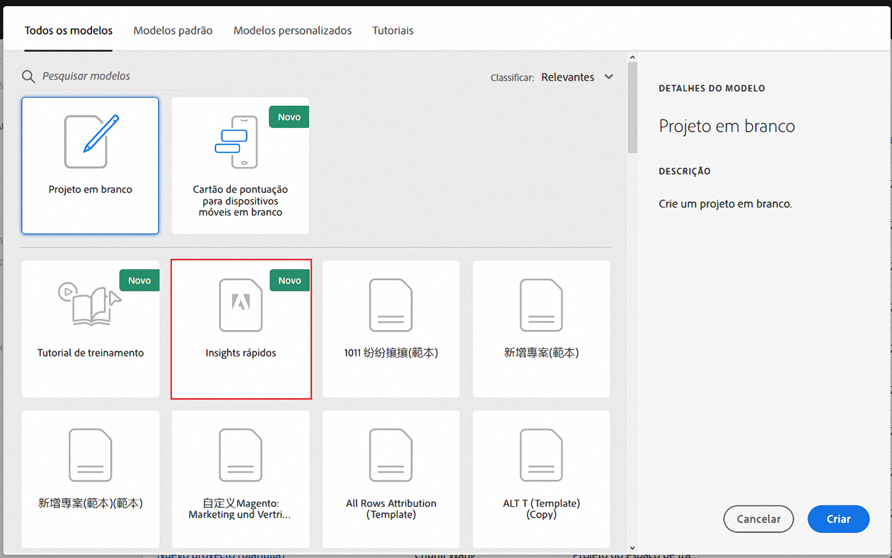
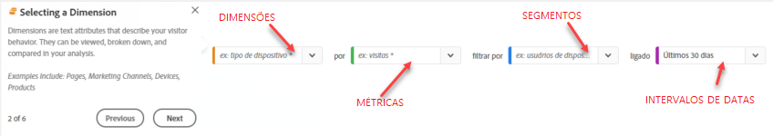

# Criador de insights rápidos

>[!IMPORTANT]
>
>O Quick Insights está atualmente em testes beta e ainda não está disponível para todos os clientes do Adobe Analytics.

O Quick Insights fornece orientação para não analistas e novos usuários da área de trabalho da Análise para aprender a responder perguntas comerciais de forma rápida e fácil. É também uma excelente ferramenta para usuários avançados que desejam responder rapidamente a uma pergunta simples sem terem que criar uma tabela eles mesmos.

Ao usar este espaço de trabalho de Análise pela primeira vez, você pode se perguntar quais visualizações seriam mais úteis, quais dimensões e métricas podem facilitar insights, onde arrastar e soltar itens, onde criar um segmento etc.

Para ajudar nisso, com base no uso dos componentes de dados pela sua própria empresa na área de trabalho da Análise, o Quick Insights aproveita um algoritmo que apresentará as dimensões, métricas, segmentos e intervalos de datas mais populares que sua empresa usa.

Os insights rápidos ajudam você a

* Crie corretamente uma tabela de dados e a visualização que a acompanha na área de trabalho da Análise.
* Conheça a terminologia e o vocabulário para componentes básicos e partes da área de trabalho da Análise.
* Faça detalhamentos simples de dimensões, adicione várias métricas ou compare segmentos facilmente em uma tabela de forma livre.
* Altere ou experimente vários tipos de visualização para encontrar a ferramenta localizar para sua análise de forma rápida e intuitiva.

## Terminologia básica

A seguir, alguns dos termos básicos que você precisa conhecer. Cada tabela de dados consiste em 2 ou mais blocos componentes que você utiliza para contar sua história de dados.

| Bloco de construção | Definição |
|---|---|
| Dimensão | Dimensões são descrições ou características de dados de métricas que podem ser visualizadas, analisadas e comparadas em um projeto. São valores não numéricos e datas que se dividem em itens de dimensão. Por exemplo, &quot;navegador&quot; ou &quot;página&quot; são dimensões. |
| Item de dimensão | Os itens de dimensão são valores individuais para uma dimensão. Por exemplo, os itens de dimensão para a dimensão do navegador seriam &quot;Chrome&quot;, &quot;Firefox&quot;, &quot;Edge&quot; etc. |
| Métrica | As métricas são informações quantitativas sobre a atividade do visitante, como visualizações, click-throughs, recarregamentos, tempo médio gasto, unidades, pedidos, receita e assim por diante. |
| Visualização | O Workspace oferta [várias visualizações](/help/analyze/analysis-workspace/visualizations/t-sync-visualization.md) para criar representações visuais dos seus dados. |
| Segmento | Os segmentos permitem que você identifique subconjuntos de visitantes com base em características ou interações de site. Por exemplo, você pode criar segmentos de Visitantes com base em atributos: tipo de navegador, dispositivo, número de visitas, país, gênero ou com base em interações: campanhas, pesquisa por palavra-chave, mecanismo de pesquisa ou com base em saídas e entradas: visitantes do Facebook, uma landing page definida, um domínio de referência ou com base em variáveis personalizadas: campo de formulário, categorias definidas, ID do cliente. |

## Introdução ao Quick Insights

1. Faça logon no Adobe Analytics usando as credenciais fornecidas.
1. Vá para [!UICONTROL Workspace] e clique **[!UICONTROL Create New Project]** e clique em **[!UICONTROL Quick Insights Builder]**.

   

1. Ao sair pela primeira vez do start, passe pelo breve tutorial que ensina algumas das noções básicas do Quick Insight Builder. Ou clique para **[!UICONTROL Skip Tutorial]**.
1. Selecione os blocos componentes (também conhecidos como componentes): dimensões (laranja), métricas (verde), segmentos (azul) ou intervalos de datas (roxo) É necessário selecionar pelo menos uma dimensão e uma métrica para que uma tabela seja criada automaticamente.

   

   Você tem três maneiras de selecionar os blocos de construção:
   * Arraste e solte-os do painel esquerdo
   * Se você sabe o que está procurando: O Start que digitar o nome e os insights rápidos preencherão os espaços em branco para você
   * Clique na lista suspensa e pesquise a lista

1. Quando você tiver adicionado pelo menos uma dimensão e uma métrica, o seguinte será criado para você:

   * Uma tabela de forma livre com a dimensão à esquerda (vertical) e as métricas na parte superior (horizontal). Confira esta tabela:

1. (Opcional) Detalhe as dimensões e veja os itens de dimensão clicando na seta > direita ao lado da dimensão.

## Limitações conhecidas

Se você tentar editar diretamente na tabela, isso fará com que o construtor do Quick Insight (a ferramenta de preenchimento) fique fora de sincronia. Você pode restaurá-la para as configurações anteriores do Quick Insight, mas, se não, a criação direta fará com que a tabela se comporte como uma tabela de forma livre tradicional.

