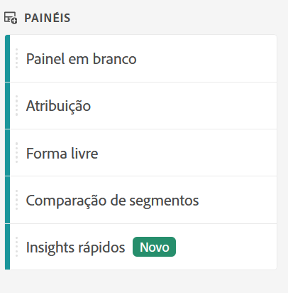

# Painel Quick Insights

>[!IMPORTANT]
>
>**[!UICONTROL O painel Quick Insights]** está atualmente em testes limitados. [Saiba mais](https://docs.adobe.com/content/help/en/analytics/landing/an-releases.html)

[!UICONTROL O Quick Insights] fornece orientação para não analistas e novos usuários da [!UICONTROL Análise Workspace] para saber como responder perguntas comerciais de forma rápida e fácil. É também uma excelente ferramenta para usuários avançados que desejam responder rapidamente a uma pergunta simples sem precisar criar uma tabela eles mesmos.

Ao usar este espaço de trabalho [!UICONTROL de]Análise pela primeira vez, você pode se perguntar quais visualizações seriam mais úteis, quais dimensões e métricas podem facilitar insights, onde arrastar e soltar itens, onde criar um segmento etc.

Para ajudar nisso, e com base na sua própria utilização de componentes de dados na [!UICONTROL Análise Workspace], o [!UICONTROL Quick Insights] aproveita um algoritmo que apresentará as dimensões, métricas, segmentos e intervalos de datas mais populares que sua empresa usa.

[!UICONTROL Os insights] rápidos ajudam você a

* Crie corretamente uma tabela de dados e uma visualização que a acompanha na [!UICONTROL Análise Workspace].
* Conheça a terminologia e o vocabulário para componentes básicos e partes da [!UICONTROL Análise Workspace].
* Faça detalhamentos simples de dimensões, adicione várias métricas ou compare segmentos facilmente em uma tabela [!UICONTROL de forma]livre.
* Altere ou experimente vários tipos de visualização para encontrar a ferramenta localizar para sua análise de forma rápida e intuitiva.

## Terminologia básica

A seguir, alguns dos termos básicos que você precisa conhecer. Cada tabela de dados consiste em 2 ou mais blocos componentes (componentes) que você utiliza para contar sua história de dados.

| Bloco de construção (Componente) | Definição |
|---|---|
| [!UICONTROL Dimensão] | Dimensões são descrições ou características de dados de métricas que podem ser visualizadas, analisadas e comparadas em um projeto. São valores não numéricos e datas que se dividem em itens de dimensão. Por exemplo, &quot;navegador&quot; ou &quot;página&quot; são dimensões. |
| [!UICONTROL Item de dimensão] | Os itens de dimensão são valores individuais para uma dimensão. Por exemplo, os itens de dimensão para a dimensão do navegador seriam &quot;Chrome&quot;, &quot;Firefox&quot;, &quot;Edge&quot; etc. |
| [!UICONTROL Métrica] | As métricas são informações quantitativas sobre a atividade do visitante, como exibições, click-throughs, recarregamentos, tempo médio gasto, unidades, ordens, receita, e assim por diante. |
| [!UICONTROL Visualização] | O Workspace oferta [várias visualizações](/help/analyze/analysis-workspace/visualizations/freeform-analysis-visualizations.md) para criar representações visuais de seus dados, como gráficos de barras, gráficos de rosca, histogramas, gráficos de linha, mapas, gráficos de dispersão e outros. |
| [!UICONTROL Detalhamento de dimensão] | Um detalhamento de dimensão é uma forma de detalhar literalmente uma dimensão por outras dimensões. Em nosso exemplo, você pode dividir os Estados Unidos por dispositivos móveis para obter as visitas de dispositivos móveis por estado, ou pode dividir os dispositivos móveis por tipos de dispositivos móveis, por regiões, por Campanhas internas, etc. |
| [!UICONTROL Segmento] | Os segmentos permitem que você identifique subconjuntos de visitantes com base em características ou interações de site. Por exemplo, você pode criar segmentos de [!UICONTROL Visitantes] com base em atributos: tipo de navegador, dispositivo, número de visitas, país, gênero ou com base em interações: campanhas, pesquisa por palavra-chave, mecanismo de pesquisa ou com base em saídas e entradas: visitantes do Facebook, uma landing page definida, um domínio de referência ou com base em variáveis personalizadas: campo de formulário, categorias definidas, ID do cliente. |

## Introdução ao Quick Insights

1. Faça logon no Adobe Analytics usando as credenciais fornecidas.
1. Vá para o [!UICONTROL Workspace] e clique em **[!UICONTROL Criar novo projeto]** e clique em **[!UICONTROL Insights]** rápidos. (Você também pode acessar esse painel no menu **[!UICONTROL Painel]** no painel esquerdo.)

   

   

1. Ao sair pela primeira vez do start, passe pelo breve tutorial que ensina algumas das noções básicas do painel [!UICONTROL Insights] rápidos. Ou clique para **[!UICONTROL Ignorar tutorial]**.
1. Selecione os blocos componentes (também conhecidos como componentes): dimensões (laranja), métricas (verde), segmentos (azul) ou intervalos de datas (roxo) É necessário selecionar pelo menos uma dimensão e uma métrica para que uma tabela seja criada automaticamente.

   

   Você tem três maneiras de selecionar os blocos de construção:
   * Arraste e solte-os do painel esquerdo.
   * Se você sabe o que está procurando: Digitação de Start e insights  rápidos preencherão os espaços em branco para você.
   * Clique na lista suspensa e pesquise a lista.

1. Quando você tiver adicionado pelo menos uma dimensão e uma métrica, o seguinte será criado para você:

   * Uma tabela de forma livre com a dimensão (aqui, Estados dos EUA) verticalmente e a métrica (aqui, Visitas) horizontalmente na parte superior. Confira esta tabela:
   

   * Uma visualização acompanhante, neste caso um gráfico [de](/help/analyze/analysis-workspace/visualizations/bar.md)barras. A visualização gerada baseia-se no tipo de dados que você adicionou à tabela. Todos os dados baseados em tempo (como [!UICONTROL Visitas] por dia/mês) assumem o padrão de um gráfico de [!UICONTROL Linha] . Todos os dados não baseados em tempo (como [!UICONTROL Visitas] por [!UICONTROL dispositivo]) assumem o padrão de um gráfico de [!UICONTROL Barra] . Você pode alterar o tipo de visualização clicando na seta suspensa ao lado do tipo de visualização.

1. (Opcional) Detalhe as dimensões e veja os itens de dimensão clicando na seta > direita ao lado da dimensão.

1. Tente adicionar mais refinamentos conforme descrito abaixo em &quot;Mais dicas&quot;.

1. Salve o projeto clicando em **[!UICONTROL Projeto > Salvar]**.

## Mais dicas

Outras dicas úteis aparecerão no Criador [!UICONTROL de insights]rápidos, algumas delas dependendo da última ação.

* Primeiro, preencha o tutorial **[!UICONTROL Mais dicas]** : Acesse-o por meio da Ajuda (?) ícone ao lado do título [!UICONTROL Quick Insights] . Este tutorial é exibido 24 horas após você ter criado um projeto com pelo menos uma dimensão e uma métrica.

   

* **Detalhamento por**: Você pode usar até três níveis de detalhamento em dimensões para detalhar os dados que realmente precisa.

   

* **Adicionar mais métricas**: Você pode adicionar até mais duas métricas usando o operador E para adicioná-las à tabela.

   

* **Adicionar mais segmentos**: Você pode adicionar até mais 2 segmentos usando os operadores E ou OU para adicioná-los à tabela. Observe o que acontece com a tabela quando você adiciona usuários móveis OU Visitantes leais. Eles estão próximos um do outro, acima das métricas. Se você adicionasse Usuários Móveis E Visitantes Fidelizados, veria os resultados de ambos os segmentos juntos e eles seriam empilhados um sobre o outro na tabela.

   

## Limitações conhecidas

Se você tentar editar diretamente na tabela, isso fará com que o painel [!UICONTROL Quick Insights] fique fora de sincronização. Você pode restaurá-lo para as configurações anteriores do [!UICONTROL Quick Insights] clicando em **[!UICONTROL Ressincronizar o Construtor]** na parte superior direita do painel.

Você receberá um aviso antes de adicionar algo diretamente à tabela:

Caso contrário, criar diretamente fará com que a tabela se comporte agora como uma tabela de forma livre tradicional, sem os recursos úteis para novos usuários.

