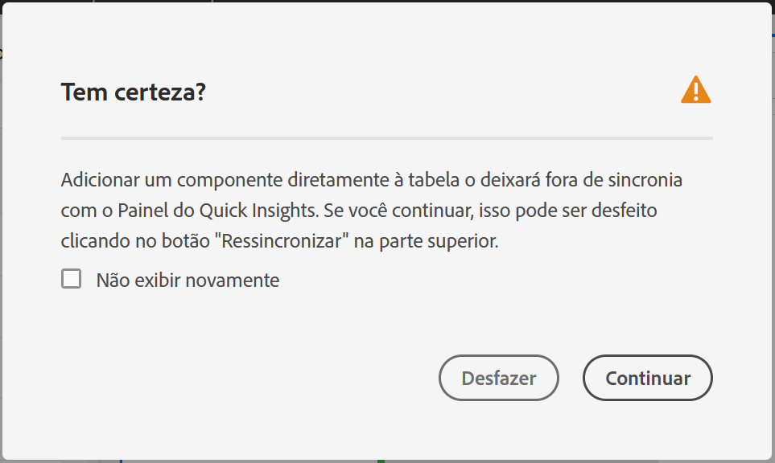

# Painel do Insights rápidos {#quick-insights-panel}

<!-- markdownlint-disable MD034 -->

>[!CONTEXTUALHELP]
>id="workspace_quickinsights_button"
>title="Insights rápidos"
>abstract="Crie um painel para gerar rapidamente uma tabela de forma livre e uma visualização correspondente para analisar e descobrir insights mais rapidamente."

<!-- markdownlint-enable MD034 -->

>[!BEGINSHADEBOX]

_Este artigo é sobre o painel Insights rápidos no_  _&#x200B;**Adobe Analytics**._ _Consulte [Painel de insights rápidos](https://experienceleague.adobe.com/pt-br/docs/analytics/analyze/analysis-workspace/panels/quickinsight) para ver a versão do_  _&#x200B;**Customer Journey Analytics** deste artigo._

>[!ENDSHADEBOX]

O painel do [!UICONTROL Insights rápidos] fornece orientação para não analistas e novos usuários do [!UICONTROL Analysis Workspace] para saber como responder a perguntas comerciais de forma rápida e fácil. É também uma excelente ferramenta para usuários avançados que desejam responder rapidamente a uma pergunta simples sem precisar criar uma tabela.

Ao começar a usar o [!UICONTROL Analysis Workspace] pela primeira vez, você pode se perguntar:

* quais visualizações são mais úteis,
* quais dimensões e métricas podem facilitar os insights,
* para onde arrastar e soltar itens,
* onde criar um filtro,
* e muito mais.

Para ajudar com essas questões, o painel [!UICONTROL Insights rápidos] usa um algoritmo que apresenta as dimensões, métricas, segmentos e intervalos de datas mais populares que sua empresa usa. Este algoritmo se baseia no uso de componentes de dados da sua própria empresa no [!UICONTROL Analysis Workspace]. Você verá dimensões, métricas e segmentos marcados como [!UICONTROL POPULAR] na lista suspensa, como mostrado aqui:

O [!UICONTROL Insights rápidos] ajuda a

* Criar corretamente uma tabela de dados e uma visualização que a acompanha no [!UICONTROL Analysis Workspace].
* Aprender a terminologia e o vocabulário de componentes básicos e pedaços do [!UICONTROL Analysis Workspace].
* Fazer detalhamentos simples de dimensões, adicionar várias métricas ou comparar segmentos facilmente em uma [!UICONTROL tabela de forma livre].
* Alterar ou experimentar vários tipos de visualização para encontrar a ferramenta para sua análise de forma rápida e intuitiva.

## Terminologia básica

Veja a seguir alguns dos termos básicos que você precisa conhecer. Cada tabela de dados consiste em 2 ou mais blocos de construção (componentes) que você usa para criar uma visão dos dados.

| Elemento (Componente) | Definição |
|---|---|
| **[!UICONTROL Dimensão]** | Dimensões são descrições ou características de dados de métricas que podem ser visualizadas, analisadas e comparadas em um projeto. São valores não numéricos e datas que se dividem em itens de dimensão. Por exemplo, *navegador* ou *página* são dimensões. |
| **[!UICONTROL Item de dimensão]** | Os itens de dimensão são valores individuais para uma dimensão. Por exemplo, itens da dimensão de navegador seriam *Chrome*, *Firefox*, *Edge* ou outros. |
| **[!UICONTROL Métrica]** | Métricas são informações quantitativas sobre a atividade da pessoa, como exibições, click-throughs, recarregamentos, tempo médio gasto, unidades, pedidos, receita e assim por diante. |
| **[!UICONTROL Visualização]** | O espaço de trabalho oferece [várias visualizações](/help/analyze/analysis-workspace/visualizations/freeform-analysis-visualizations.md) para criar representações visuais dos seus dados. Como gráficos de barras, gráficos de rosca, histogramas, gráficos de linhas, mapas, gráficos de dispersão, entre outros. |
| **[!UICONTROL Detalhamento de dimensão]** | Um detalhamento de dimensão é uma forma de detalhar uma dimensão com outras dimensões. Por exemplo, você pode analisar os Estados Unidos por dispositivos móveis para obter o número de visitas em dispositivos móveis por estado. Também é possível detalhar dispositivos móveis por tipos de dispositivos móveis, por regiões, por campanhas internas e muito mais. |
| **[!UICONTROL Segmentos]** | Os segmentos permitem identificar subconjuntos de pessoas com base em características ou interações no site. Por exemplo, é possível criar segmentos de [!UICONTROL visitantes] com base em <li>atributos: tipo de navegador, dispositivo, número de visitas, país, gênero ou</li><li>interações: campanhas, pesquisa por palavra-chave, mecanismo de pesquisa ou</li><li>saídas e entradas: visitantes do Facebook, uma página de destino definida, um domínio referenciador ou</li><li> variáveis personalizadas: campos de formulário, categorias definidas, ID do cliente. |

## Usar

Para usar um painel de **[!UICONTROL Insights rápidos]**:

1. Crie um painel de **[!UICONTROL Insights rápidos]**. Para obter informações sobre como criar um painel, consulte [Criar um painel](panels.md#create-a-panel).

1. Ao usar o painel de **[!UICONTROL Insights rápidos]** pela primeira vez, é recomendado conferir o breve [!UICONTROL tutorial de introdução] que aborda as noções básicas sobre o painel. Selecione  ao lado do título do painel de Insights rápidos e selecione **[!UICONTROL Tutorial de introdução]** no pop-up.

1. Especifique a [entrada](#panel-input) do painel.

1. Observe a [saída](#panel-output) do painel.

### Entrada do painel

Selecione os blocos de construção:

* **[!UICONTROL Analisar]**: especifique uma dimensão (laranja)
* **[!UICONTROL por]**: especifique uma métrica (verde)
* **[!UICONTROL filtrar por]**: especifique um segmento (azul)
* **[!UICONTROL em]**: especifique um intervalo de datas (roxo).

É necessário selecionar pelo menos uma dimensão e uma métrica para que a visualização funcione corretamente.

Você pode especificar os blocos de construção de três maneiras:

* Arraste e solte os componentes a partir do painel esquerdo.
* Comece a digitar em um dos campos de blocos de construção. Após encontrar a entrada, o campo de blocos de construção é preenchido automaticamente com valores possíveis.
* Especifique uma lista suspensa de blocos de construção (por exemplo, `Country` em **[!UICONTROL Analisar]**) e pesquise na lista de valores possíveis (usando ) para encontrar o valor que deseja usar (por exemplo, **[!UICONTROL Código do país]**).

Selecione **[!UICONTROL Limpar]** para limpar todos os campos de entrada.

### Saída do painel

1. Após adicionar pelo menos uma dimensão e uma métrica, é possível ver os resultados.

   

   * Uma tabela de forma livre com a dimensão ([!UICONTROL Local do país]) e a métrica ([!UICONTROL Visitas]) segmentada por [!UICONTROL visitas] de [!UICONTROL mecanismos de pesquisa] durante os [!UICONTROL últimos 12 meses].

   * Uma visualização complementar, neste caso um [gráfico de barras](/help/analyze/analysis-workspace/visualizations/bar.md). A visualização gerada tem como base o tipo de dados que você adicionou à tabela. Todos os dados com base no tempo (como [!UICONTROL Visitas] por dia/mês) assumem o padrão de um gráfico de [!UICONTROL Linha]. Todos os dados não baseados em tempo (como [!UICONTROL Visitas] por [!UICONTROL dispositivo]) assumem o padrão de um gráfico de [!UICONTROL Barra]. Você pode alterar o tipo de visualização clicando na seta suspensa ao lado do tipo de visualização.

1. Tente adicionar mais alguns detalhes conforme descrito em [Mais dicas](#more-tips)

1. É recomendado salvar seu projeto, usando **[!UICONTROL Projeto > Salvar]**.

## Mais dicas

Outras dicas úteis aparecerão no [!UICONTROL Criador de insights rápidos] e algumas delas dependem da última ação realizada.

* Primeiro, é recomendado concluir o tutorial **[!UICONTROL Mais dicas]**. Esse tutorial é exibido 24 horas após você criar um projeto com pelo menos uma dimensão e uma métrica. Selecione  ao lado do título do painel Insights rápidos e selecione **[!UICONTROL Mais dicas]** no pop-up.

  

* É possível analisar várias dimensões e métricas, combinar ou comparar segmentos e especificar um intervalo de datas:

  

   * **[!UICONTROL Analisar]** a dimensão **[!UICONTROL detalhada por]**: permite usar até três níveis de detalhamento em dimensões para encontrar os dados específicos dos quais precisa. Consulte ➊, ➋ e ➌.

   * Adicionar mais métricas **[!UICONTROL por]**: permite adicionar um máximo de duas métricas. Consulte ➍ e ➎.

   * **[!UICONTROL filtrar por]**: adicione até dois segmentos adicionais. Por exemplo, adicione Reservas como um segmento e combine-o com os segmentos Pessoas que reservam com frequência e Primeiro voo para fazer uma comparação. Consulte ➏, ➐ e ➑.

   * em: permite especificar o intervalo de datas. Consulte ➒.

## Limitações conhecidas

Se você tentar editar diretamente na tabela, o painel [!UICONTROL Insights rápidos] pode ficar fora de sincronia. Selecione **[!UICONTROL Ressincronizar o criador]** na parte superior direita do painel para restaurá-lo às configurações anteriores de [!UICONTROL Insights rápidos].

Você receberá um aviso antes de adicionar algo diretamente à tabela:

Caso contrário, criar diretamente fará com que a tabela se comporte como uma tabela de forma livre tradicional, sem os recursos úteis para novos usuários.

>[!MORELIKETHIS]
>
>[Criar um painel](/help/analyze/analysis-workspace/c-panels/panels.md#create-a-panel)
>
<!--
# Quick Insights panel

[!UICONTROL Quick Insights] provides guidance for non-analysts and new users of [!UICONTROL Analysis Workspace] to learn how to answer business questions quickly and easily. It is also a great tool for advanced users who want to answer a simple question quickly without having to build a table themselves.

When you first start using this [!UICONTROL Analysis Workspace], you might wonder what visualizations would be most useful, which dimensions and metrics might facilitate insights, where to drag and drop items, where to create a segment, etc. 

To help with this, and based on your own company's usage of data components in [!UICONTROL Analysis Workspace], [!UICONTROL Quick Insights] leverages an algorithm that will present you with the most popular dimensions, metrics, segments, and date ranges your company uses. In fact, you will see dimensions, metrics, and segments tagged as [!UICONTROL Popular] in the drop-down list, as shown here:

[!UICONTROL Quick Insights] helps you

* Properly build a data table and an accompanying visualization in [!UICONTROL Analysis Workspace].
* Learn the terminology and vocabulary for basic components and pieces of [!UICONTROL Analysis Workspace].
* Do simple breakdowns of dimensions, add multiple metrics, or compare segments easily within a [!UICONTROL Freeform table].
* Change or try out various visualization types to find the find tool for your analysis quickly and intuitively.

Here is a video overview of the [!UICONTROL Quick Insights] panel:

>[!VIDEO](https://video.tv.adobe.com/v/326702/?quality=12&captions=por_br)

## Basic key terminology

Following are some of the basic terms you need to be familiar with. Each data table consists of 2 or more building blocks (components) that you utilize to tell your data story.

|Building block (Component)|Definition|
|---|---|
|[!UICONTROL Dimension]|Dimensions are descriptions or characteristics of metric data that can be viewed, broken down, and compared in a project. They are non-numeric values and dates that break down into dimension items. For example, "browser", or "page" are dimensions.|
|[!UICONTROL Dimension item]|Dimension items are individual values for a dimension. For example, dimension items for the browser dimension would be "Chrome", "Firefox", "Edge", etc.|
|[!UICONTROL Metric]|Metrics are quantitative information about visitor activity, such as views, click-throughs, reloads, average time spent, units, orders, revenue, and so on.|
|[!UICONTROL Visualization]|Workspace offers [a number of visualizations](/help/analyze/analysis-workspace/visualizations/freeform-analysis-visualizations.md) to build visual representations of your data, such as bar charts, donut charts, histograms, line charts, maps, scatterplots, and others.|
|[!UICONTROL Dimension Breakdown]|A dimension breakdown is a way to literally break down a dimension by other dimensions. In our example, you could break down US States by Mobile Devices to get the mobile device visits per state, or you could break Mobile Devices down by Mobile Device types, by Regions, by Internal Campaigns, etc..|
|[!UICONTROL Segment]|Segments let you identify subsets of visitors based on characteristics or website interactions. For example, you can build [!UICONTROL Visitor] segments based on attributes: browser type, device, number of visits, country, gender, or based on interactions: campaigns, keyword search, search engine, or based on exits and entries: visitors from Facebook, a defined landing page, referring domain, or based on custom variables: form field, defined categories, customer ID.  |

## Get started with Quick Insights

1. Log in to Adobe Analytics using the credentials you have been provided with.
1. Go to [!UICONTROL Workspace] and click **[!UICONTROL Create New Project]** and then click **[!UICONTROL Quick Insights]**. (You can also access this panel from the **[!UICONTROL Panel]** menu in the left rail.)

    

    

1. When you first start out, go through the short tutorial that teaches you some of the [!UICONTROL Quick Insights panel] basics. Or, click to **[!UICONTROL Skip Tutorial]**.
1. Select your building blocks (also known as components): dimensions (orange), metrics (green), segments (blue), or date ranges (purple) You have to select at least one dimension and one metric for a table to be built automatically. 

    

    You have three ways of selecting the building blocks:
    * Drag and drop them from the left rail.
    * If you know what you are looking for: Start typing and [!UICONTROL Quick Insights] will fill in the blanks for you.
    * Click on the drop-down and search the list.

1. When you have added at least one dimension and one metric, the following will be created for you:

    * A Freeform table with the dimension (here, US States) vertically and the metric (here, Visits) horizontally at the top. Check out this table: 

    

    * An accompanying visualization, in this case a [bar chart](/help/analyze/analysis-workspace/visualizations/bar.md). The visualization that is generated is based on the type of data you added to the table. Any time-based data (such as [!UICONTROL Visits] per Day/Month) defaults to a [!UICONTROL Line] chart. Any non-time-based data (such as [!UICONTROL Visits] per [!UICONTROL Device]) defaults to a [!UICONTROL Bar] chart. You can change the type of visualization by clicking on the drop-down arrow next to the visualization type.

1. (Optional) Drill down on dimensions and see dimension items by clicking the > right-arrow next to the dimension.

1. Try adding some more refinements as described below under "More tips."

1. Save your project by clicking **[!UICONTROL Project > Save]**.

## More tips

Other useful hints will pop up in the [!UICONTROL Quick Insights Builder], some of them depending on your last action.

* First, complete the **[!UICONTROL More tips]** tutorial: Access it via the Help (?) icon next to the [!UICONTROL Quick Insights] title. This tutorial shows up 24 hours after you have created a project with at least one dimension and one metric.

    

* **Breakdown by**: You can use up to 3 levels of breakdowns on dimensions to drill down to the data you really need.

    

* **Add more metrics**: You can add up to 2 more metrics by using the AND operator to add them the table.

    

* **Add more segments**: You can add up to 2 more segments by using the AND or OR operators to add them the table. Look at what happens to the table when you add Mobile Users OR Loyal Visitors. They are next to each other, above the metrics. If you added Mobile Users AND Loyal Visitors, you would see results from both segments together, and they would be stacked on top of each other in the table.

    

## Known limitations

If you try to edit directly within the table, it will cause the [!UICONTROL Quick Insights] panel to become out of sync. You can restore it to the previous [!UICONTROL Quick Insights] settings by clicking **[!UICONTROL Resync Builder]** at the top right of the panel.

 

You will get a warning before adding anything directly to the table:

 

Otherwise, building directly will cause the table to now behave as a traditional Freeform table, without the helpful features for new users.

-->