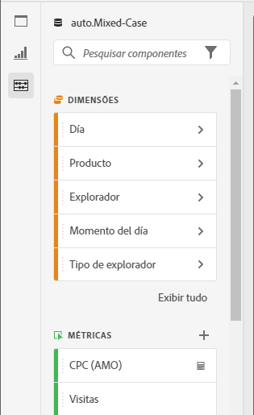
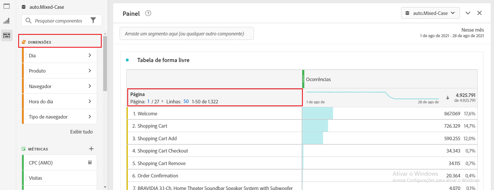
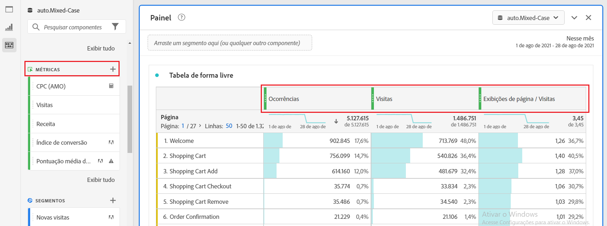
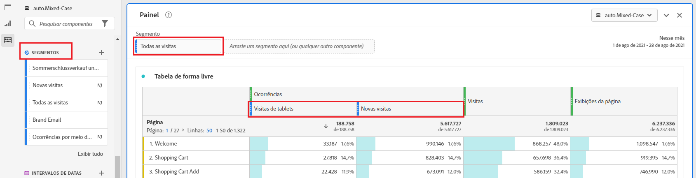
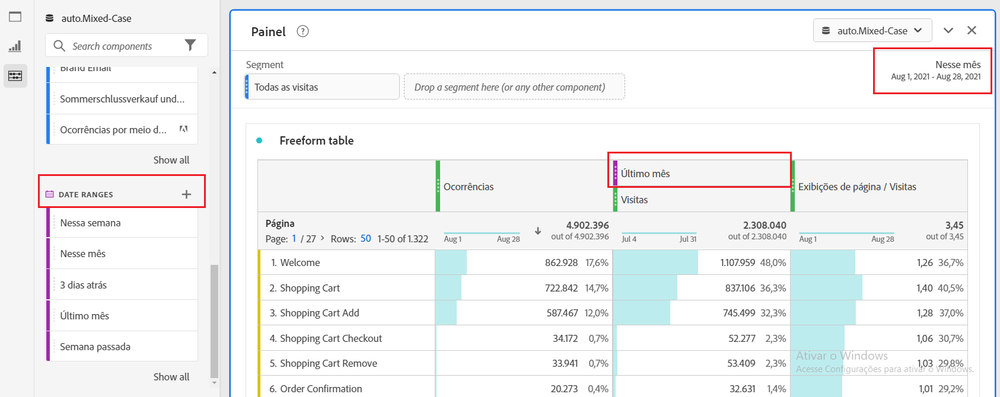
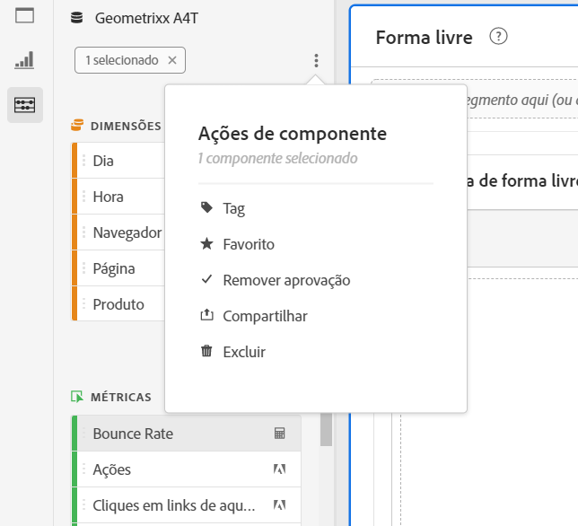

# Visão geral dos componentes

Os componentes no Analysis Workspace consistem em dimensões, métricas, segmentos e intervalos de datas que você pode arrastar e soltar em um projeto.

Para acessar o menu Componentes, clique no ícone **[!UICONTROL Componentes]** no painel à esquerda. Você pode alternar entre [Painéis](https://experienceleague.adobe.com/docs/analytics/analyze/analysis-workspace/panels/panels.html?lang=pt-BR), [Visualizações](https://docs.adobe.com/content/help/pt-BR/analytics/analyze/analysis-workspace/visualizations/freeform-analysis-visualizations.html) e Componentes dos ícones do painel esquerdo ou usando [teclas de atalho](/help/analyze/analysis-workspace/build-workspace-project/fa-shortcut-keys.md).

Você também pode ajustar as [Exibir configurações de densidade](https://docs.adobe.com/content/help/pt-BR/analytics/analyze/analysis-workspace/build-workspace-project/view-density.html) para que o projeto veja mais valores no painel à esquerda ao mesmo tempo em **[!UICONTROL Projeto > Informações e configurações do projeto > Exibir densidade]**.

## Dimensões {#dimensions}

[****](https://docs.adobe.com/content/help/en/analytics/components/dimensions/overview.html) Dimensões são atributos de texto que descrevem o comportamento do visitante e podem ser visualizadas, analisadas e comparadas na análise. Eles podem ser encontrados no painel Componente à esquerda (seção laranja) e normalmente são aplicados como linhas de uma tabela.

Os exemplos de dimensões incluem [!UICONTROL Nome da página], [!UICONTROL Canais de marketing], [!UICONTROL Tipo de dispositivo] e [!UICONTROL Produtos]. Os Dimension são fornecidos pelo Adobe e são capturados por meio de sua implementação personalizada (eVar, Props, classificações etc.).

Cada dimensão também contém **itens de dimensão** dentro dela. Os itens de Dimension podem ser encontrados no painel Componente esquerdo clicando na seta para a direita ao lado de qualquer nome de dimensão (os itens são amarelos).

Os exemplos de itens de dimensão incluem [!UICONTROL Página inicial] (dentro da dimensão [!UICONTROL Página]), [!UICONTROL Pesquisa paga] (dentro da dimensão [!UICONTROL Canal de marketing]), [!UICONTROL Tablet] (dentro do [!UICONTROL Tipo de dispositivo móvel&lt;a11/ ) e assim por diante.]

## Métricas {#metrics}

[****](https://docs.adobe.com/content/help/en/analytics/components/metrics/overview.html) As métricas são medidas quantitativas sobre o comportamento do visitante. Eles podem ser encontrados no painel Componente à esquerda (seção verde) e normalmente são aplicados como colunas de uma tabela.

Os exemplos de métricas incluem [!UICONTROL Visualizações de página], [!UICONTROL Visitas], [!UICONTROL Pedidos], [!UICONTROL Tempo médio gasto] e [!UICONTROL Receita/Ordem]. As métricas são fornecidas pelo Adobe ou capturadas por meio de sua implementação personalizada ([!UICONTROL Eventos bem-sucedidos]), ou criadas usando o [Criador de métricas calculadas](https://docs.adobe.com/content/help/pt-BR/analytics/components/calculated-metrics/calcmetric-workflow/cm-build-metrics.html).

## Segmentos {#segments}

[****](https://docs.adobe.com/content/help/pt-BR/analytics/analyze/analysis-workspace/components/t-freeform-project-segment.html) Segmentos são filtros de público-alvo aplicados à sua análise. Eles podem ser encontrados no painel Componente à esquerda (seção azul) e normalmente são aplicados na parte superior de um painel ou nas colunas de métrica acima em uma tabela.

Os exemplos de segmentos incluem [!UICONTROL Visitantes de dispositivo móvel], [!UICONTROL Visitas de email] e [!UICONTROL Ocorrências autenticadas]. Os segmentos são fornecidos pelo Adobe, ou criados no [painel suspenso](https://docs.adobe.com/content/help/en/analytics/analyze/analysis-workspace/panels/panels.html), ou criados usando o [Construtor de segmentos](https://docs.adobe.com/content/help/pt-BR/analytics/components/segmentation/segmentation-workflow/seg-build.html).

## Intervalos de datas {#date-ranges}

[****](https://docs.adobe.com/content/help/pt-BR/analytics/analyze/analysis-workspace/components/calendar-date-ranges/calendar.html) Intervalos de datas são o intervalo de datas em que você faz a análise. Eles podem ser encontrados no painel Componente à esquerda (seção violeta) e normalmente são aplicados no calendário de cada painel.

Exemplos de intervalos de datas incluem julho de 2019, [!UICONTROL Últimas 4 semanas] e [!UICONTROL Este mês]. Os intervalos de datas são fornecidos pelo Adobe, aplicados no [calendário do painel](https://docs.adobe.com/content/help/en/analytics/analyze/analysis-workspace/panels/panels.html), ou criados usando o [Criador de intervalo de datas](https://docs.adobe.com/content/help/en/analytics/analyze/analysis-workspace/components/calendar-date-ranges/custom-date-ranges.html).

## Ações dos componentes {#actions}

Você pode gerenciar componentes (individualmente ou ao selecionar mais de um) diretamente no painel esquerdo. Clique com o botão direito em um componente ou clique no ícone Ponto de ação na parte superior da lista de componentes.

| Ação de componente | Descrição |
|--- |--- |
| Tag | Organize ou gerencie componentes aplicando tags. Em seguida, você pode pesquisar por tag no painel esquerdo clicando no filtro ou digitando #. As tags também atuam como filtros nos gerenciadores de componentes. |
| Marcar como favorito | Adicione o componente à sua lista de favoritos. Como tags, você pode pesquisar por Favoritos no painel esquerdo e filtrar por eles nos gerentes de componentes. |
| Aprovar | Marque os componentes como Aprovado para avisar aos usuários que o componente é aprovado pela organização. Como tags , você pode pesquisar por Aprovado no painel esquerdo e filtrar por eles nos gerentes de componente. |
| Compartilhar | Compartilhe componentes com usuários em sua organização. Essa opção está disponível somente para componentes personalizados, como segmentos ou métricas calculadas. |
| Excluir | Exclua componentes que não são mais necessários. Essa opção está disponível somente para componentes personalizados, como segmentos ou métricas calculadas. |

Os componentes personalizados também podem ser gerenciados por meio de seus respectivos gerentes de componente. Por exemplo, o [Gerenciador de segmentos](/help/components/segmentation/segmentation-workflow/seg-manage.md).
