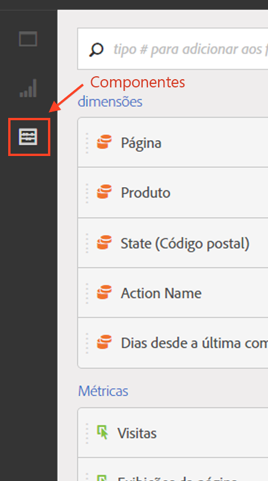

# Visão geral dos componentes

Os componentes da Analysis Workspace são métricas, dimensões, segmentos e granularidades que você pode arrastar e soltar em um projeto. Os componentes personalizados que você criou são adicionados a esses painéis, como intervalos de data personalizados.

Para acessar o painel Componentes, clique no ícone **[!UICONTROL Componentes]no trilho à esquerda.** You can switch among Panels (Blank panel, [Freeform panel](../../../analyze/analysis-workspace/visualizations/freeform-table.md#concept_0D2E24FCCBAF4194AA941448860E422F), or [Segment Comparison](../../../analyze/analysis-workspace/c-panels/c-segment-comparison/segment-comparison.md#concept_74FAC1C6D0204F9190A110B0D9005793) panel), [Visualizations](../../../analyze/analysis-workspace/visualizations/freeform-analysis-visualizations.md#concept_09242627629147A88A68F1506954C276), and Components using the left-rail icons or by using [hotkeys](../../../analyze/analysis-workspace/build-workspace-project/fa-shortcut-keys.md#concept_9A6356084DBC4D468E265E7A65B3E051).

See [Create a freeform analysis project](../../../analyze/analysis-workspace/build-workspace-project/t-freeform-project.md#task_C2C698ACC7954062A28E4784911E6CF2) for information about using Components in a project.

## Ações do componente {#section_B7BB29B89AE04297874CDE2C52EAD516}

Há várias maneiras de gerenciar componentes (individualmente ou ao selecionar mais de um). Clique com o botão direito em um componente ou clique em **[!UICONTROL Ações]na parte superior da lista de componentes.**

>[!NOTE]
>
>Essas ações não se aplicam a componentes de Tempo.

| Ação de componente | Descrição |
|--- |--- |
| Adicionar tag | Organize ou gerencie componentes aplicando guias. Em seguida, ele é exibido no gerenciador de componente respectivo, como Analytics &gt; Componentes &gt; Segmentos, ou Analytics &gt; Componentes &gt; Projetos |
| Marcar como favorito | Adicione o componente à sua lista de favoritos. Em seguida, ele é exibido no gerenciador de componente respectivo, como Analytics &gt; Componentes &gt; Segmentos, ou Analytics &gt; Componentes &gt; Projetos. |
| Aprovar | Aprove o componente para torná-lo canônico. Em seguida, ele é exibido no gerenciador de componente respectivo, como Analytics &gt; Componentes &gt; Segmentos, ou Analytics &gt; Componentes &gt; Projetos |
| Compartilhar | Aplica-se somente a segmentos. |
| Excluir | Aplica-se somente a segmentos. |

[Criar métricas, segmentos e datas no youtube](https://www.youtube.com/watch?v=XXJuNAte8E8&index=25&list=PL2tCx83mn7GuNnQdYGOtlyCu0V5mEZ8sS) (2:51)