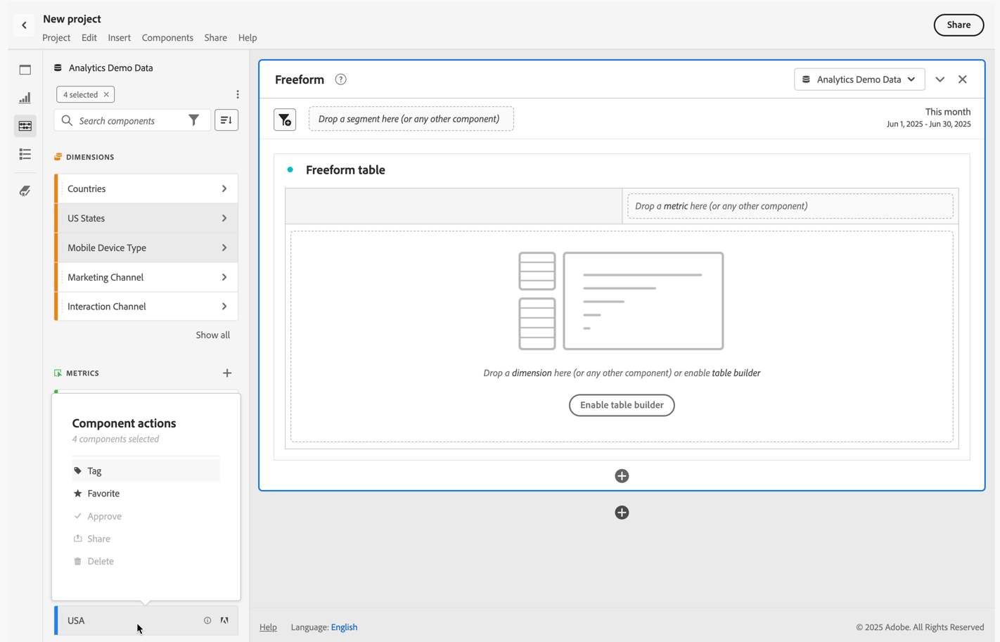

# Visão geral dos componentes

Componentes são recursos do Adobe Analytics que podem ser usados em visualizações (como a tabela de forma livre) ou para complementar recursos de geração de relatórios.

Para gerenciar componentes na interface principal do Adobe Analytics:

1. Selecione **[!UICONTROL Componentes]** na barra superior.
1. Selecione **[!UICONTROL Componentes]** para ter uma visão geral dos componentes que você pode gerenciar ou selecione diretamente o componente que deseja gerenciar no menu.

Você pode gerenciar os seguintes componentes:

* [Segmentos](/help/components/segmentation/seg-home.md): crie, gerencie, compartilhe e aplique segmentos de público-alvo eficientes e com foco em seus relatórios. Os segmentos permitem identificar subconjuntos de pessoas com base em características ou interações.
* [Métricas calculadas:](/help/components/calculated-metrics/cm-overview.md) use métricas e fórmulas como novos componentes para relatórios
* [Intervalos de data](calendar-date-ranges/custom-date-ranges.md): personalize e ajuste os intervalos de data do Analysis Workspace.
* [Projetos agendados](../curate-share/t-schedule-report.md): gerencie seus projetos agendados.
* [Locais](../../../components/locations/locations-manager.md): gerencie os locais para os quais os projetos serão exportados.
* [Alertas](/help/components/alerts/alerts-overview.md): permitem que você receba notificações após alterações nas porcentagens ou ao atingir pontos de dados específicos.
* [Anotações](annotations/overview.md): comunique nuances e insights de dados contextuais à sua organização.
* [Preferências](/help/analyze/analysis-workspace/user-preferences.md): gerencie as preferências do Analysis Workspace.

## Componentes do Analysis Workspace

Os componentes no Analysis Workspace consistem em métricas, dimensões, segmentos e intervalos de datas que você pode arrastar e soltar em painéis e visualizações no seu projeto do espaço de trabalho. Os componentes personalizados que você cria são adicionados a esses painéis, como uma métrica calculada ou um intervalo de datas personalizado.

Para acessar o painel Componentes, selecione  **[!UICONTROL Componentes]** no painel de botões.

Consulte [Criar um projeto](/help/analyze/analysis-workspace/home.md) para obter informações sobre como usar componentes em um projeto.

## Gerenciamento de componentes {#actions}

É possível criar rapidamente um novo componente usando o menu **[!UICONTROL Componentes]** do Analysis Workspace. Confira o [menu do Analysis Workspace](/help/analyze/analysis-workspace/home.md#menu) para obter mais detalhes.

É possível gerenciar componentes individualmente ou vários de uma só vez.

1. Selecione um ou mais componentes.

1. No menu de contexto ou no botão de ação do componente  (na parte superior de Componentes), selecione uma das seguintes ações.

   >[!TIP]
   >
   >Para selecionar vários componentes, mantenha a tecla **[!UICONTROL Shift]**, **[!UICONTROL Command]** (no macOS) ou **[!UICONTROL Ctrl]** (no Windows) pressionada.

   

   | Ação de componente | Descrição |
   |--- |--- |
   |  [!UICONTROL **Tag**] | Organize ou gerencie componentes aplicando tags. Em seguida, pesquise por uma tag no painel esquerdo selecionando o filtro  ou digitando `#`. As tags também atuam como filtros nos gerenciadores de componentes. |
   |  [!UICONTROL **Adicionar aos favoritos**] | Adicione o componente à sua lista de favoritos. Assim como as tags, é possível pesquisar por itens adicionados aos favoritos no painel esquerdo e utilizá-los como filtros nos gerenciadores de componentes. |
   |  **[!UICONTROL Remover dos favoritos]** | Remova o componente da sua lista de favoritos. |
   |  [!UICONTROL **Aprovar**] | Marque os componentes como Aprovado para avisar aos usuários que o componente é aprovado pela organização. Assim como as tags, você pode pesquisar e filtrar por itens aprovados no painel esquerdo. Uma  identifica componentes aprovados. |
   |  [!UICONTROL **Compartilhar**] | Compartilhe componentes com usuários em sua organização. Essa opção está disponível somente para componentes personalizados, como segmentos ou métricas calculadas. |
   |  [!UICONTROL **Excluir**] | Exclua componentes que não são mais necessários. Essa opção está disponível somente para componentes personalizados, como segmentos ou métricas calculadas. |

Os componentes personalizados também podem ser gerenciados por meio de seus respectivos Gerenciadores de componentes. Por exemplo, consulte [Gerenciar segmentos](/help/components/segmentation/segmentation-workflow/seg-manage.md).

## Gerenciar a lista de componentes

Você pode pesquisar, filtrar e classificar a lista de componentes no painel esquerdo do Analysis Workspace para localizar um componente específico.

### Pesquisar

1. Selecione **Componentes**  no painel esquerdo.

2. No campo de pesquisa, comece a digitar o nome do componente que deseja usar em seu projeto.

   Uma cor e um ícone identificam o tipo de componente. As **dimensões**  são laranjas, os **segmentos**  são azuis, os **intervalos de datas**  são roxos e as **métricas**  são verdes. O ícone da Adobe  indica um modelo de métrica calculado ou um modelo de segmento. O ícone de calculadora  indica uma métrica calculada criada por um(a) admin da organização.

3. Selecione o componente no menu suspenso.

### Filtro

1. Selecione o ícone **Componentes**  no painel esquerdo.

2. Selecione **Filtro**  ou digite `#` no campo de pesquisa.

3. Selecione qualquer uma das seguintes opções de filtro para filtrar a lista de componentes:

   | Ícone | Opção de filtro | Descrição |
   |---------|---|----------|
   |  | **[!UICONTROL Aprovado]** | Mostrar somente componentes marcados como Aprovado por um administrador. |
   |  | **[!UICONTROL Favoritos]** | Mostrar somente componentes que estão na lista de Favoritos.  Para obter informações sobre como adicionar componentes à lista de favoritos, consulte [Gerenciar componentes](#manage-components). |
   |  | **[!UICONTROL Dimensões]** | Mostrar somente componentes que são dimensões. |
   |  | **[!UICONTROL Métricas]** | Mostrar somente componentes que são métricas. |
   |  | **[!UICONTROL Segmentos]** | Mostrar somente componentes que são segmentos.  |
   |  | **[!UICONTROL Intervalos de datas]** | Mostrar somente componentes que são intervalos de datas. |
   |  | **[!UICONTROL *Nome da tag *]** | Mostrar somente componentes com as tags específicas selecionadas. Há uma tag dedicada disponível para o modelo da Adobe, que são as [métricas calculadas padrão](/help/components/calculated-metrics/cm-reference/default-calcmetrics.md) da Adobe. |

   Selecione  em um filtro para removê-lo.

4. Também é possível classificar a lista de componentes, conforme descrito em [Classificar a lista de componentes](#sort-the-component-list).

### Classificar

<!-- {{release-limited-testing-section}}-->

1. (Opcional) Aplique filtros à lista de componentes, conforme descrito em [Filtrar a lista de componentes](#filter-the-component-list).

2. Selecione **Componentes**  no painel esquerdo.

3. Selecione **Classificar**  e escolha uma das seguintes opções de filtro para classificar a lista de componentes.

As seguintes opções de classificação estão disponíveis:

{{components-sort-options}}

## Permissões de acesso

No Analysis Workspace, admins podem [selecionar](/help/analyze/analysis-workspace/curate-share/curate.md) quais componentes serão expostos aos usuários nos relatórios.

<!--
# Components overview

Components in Analysis Workspace consist of dimensions, metrics, segments, and date ranges that you can drag-and-drop onto a project. 

To access the Components menu, click the **[!UICONTROL Components]** icon in the left rail. You can switch among [panels](/help/analyze/analysis-workspace/c-panels/panels.md), [visualizations](/help/analyze/analysis-workspace/visualizations/freeform-analysis-visualizations.md), and components from the left rail icons or by using [hotkeys](/help/analyze/analysis-workspace/build-workspace-project/fa-shortcut-keys.md).

You can also adjust the [View density settings](/help/analyze/analysis-workspace/build-workspace-project/view-density.md) for the project to see more values in the left rail at once by going to **[!UICONTROL Project > Project Info & Settings > View Density]**.

## Dimensions {#dimensions}

[**Dimensions**](/help/components/dimensions/overview.md) are text attributes that describe your visitor behavior and can be viewed, broken down, and compared in your analysis. They can be found in the left Component rail (orange section) and are typically applied as rows of a table. 

Examples of dimensions include [!UICONTROL Page Name], [!UICONTROL Marketing Channels], [!UICONTROL Device Type], and [!UICONTROL Products]. Dimensions are provided by Adobe and are captured through your custom implementation (eVar, Props, classifications, etc).

Each dimension also contains **dimension items** within it. Dimension items can be found in the left Component rail by clicking the right-arrow next to any dimension name (items are yellow).

Examples of dimension items include [!UICONTROL Homepage] (within the [!UICONTROL Page] dimension), [!UICONTROL Paid Search] (within the [!UICONTROL Marketing Channel] dimension), [!UICONTROL Tablet] (within the [!UICONTROL Mobile Device Type] dimension), and so on.

## Metrics {#metrics}

[**Metrics**](/help/components/metrics/overview.md) are quantitative measures about visitor behavior. They can be found in the left Component rail (green section) and are typically applied as columns of a table.

Examples of metrics include [!UICONTROL Page views], [!UICONTROL Visits], [!UICONTROL Orders], [!UICONTROL Average Time spent], and [!UICONTROL Revenue/Order]. Metrics are provided by Adobe, or captured through your custom implementation ([!UICONTROL Success events]), or created using the [Calculated metric builder](/help/components/calculated-metrics/workflow/cm-build-metrics.md).

## Segments {#segments}

[**Segments**](/help/analyze/analysis-workspace/components/segments/t-freeform-project-segment.md) are audience filters that are applied to your analysis. They can be found in the left Component rail (blue section) and are typically applied at the top of a panel or above metric columns in a table. 

Examples of segments include [!UICONTROL Mobile Device Visitors], [!UICONTROL Visits from Email], and [!UICONTROL Authenticated Hits]. Segments are provided by Adobe, or created in the [panel dropzone](/help/analyze/analysis-workspace/c-panels/panels.md), or created using the [Segment builder](/help/components/segmentation/segmentation-workflow/seg-build.md).

## Date Ranges {#date-ranges}

[**Date Ranges**](/help/analyze/analysis-workspace/components/calendar-date-ranges/calendar.md) are the range of dates you conduct your analysis across. They can be found in the left Component rail (purple section) and are typically applied in the calendar of each panel.

You can make the date range components relative to the panel calendar. For additional information, see [About relative panel date ranges](/help/analyze/analysis-workspace/components/calendar-date-ranges/calendar.md#relative-panel-dates).

Examples of date ranges include July 2019, [!UICONTROL Last 4 weeks], and [!UICONTROL This month]. Date ranges are provided by Adobe, applied in the [panel calendar](/help/analyze/analysis-workspace/c-panels/panels.md), or created using the [Date range builder](/help/analyze/analysis-workspace/components/calendar-date-ranges/custom-date-ranges.md).

## Manage components {#actions}

You can manage components directly in the left rail. 

1. Right-click a component.

   Or
   
   Select a component, then select the **Action** (3-dot) icon at the top of the component list.

   >[!TIP]
   >
   >   You can select multiple components by holding Shift, or by holding Command (on Mac) or Ctrl (on Windows).

   

   | Component action | Description |
   |--- |--- |
   | [!UICONTROL **Tag**] | Organize or manage components by applying tags to them. You can then search by tag in the left rail by clicking the filter or typing #. Tags also act as filters in the component managers. |
   | [!UICONTROL **Favorite**] | Add the component to your list of favorites. Like tags, you can search by Favorites in the left rail and filter by them in the component managers. |
   | [!UICONTROL **Approve**] | Mark components as Approved to signal to your users that the component is organization-approved. Like tags, you can search by Approved in the left rail and filter by them in the component managers. |
   | [!UICONTROL **Share**] | Share components to users in your organization. This option is available for custom components only, such as segments or calculated metrics. |
   | [!UICONTROL **Delete**] | Delete components that you no longer need. This option is available for custom components only, such as segments or calculated metrics. |

Custom components can also be managed through their respective Component managers. For example, the [Segment Manager](/help/components/segmentation/segmentation-workflow/seg-manage.md).

## Search, filter, and sort the component list

You can search, filter, and sort the component list in the left rail of Analysis Workspace to quickly locate a particular component. 

### Search the component list

1. Select the **Components** icon  in the left rail.

2. In the search field, begin typing the name of the component you want to use in your project.

   The type of component can be identified by both color and icon. **Dimensions**  are orange, **Segments**  are blue, **Date ranges**  are purple, and **Metrics**  are green. The Adobe icon indicates either a calculated metric template or a segment template, and the calculator icon  indicated a calculated metric that was created by an Analytics administrator in your organization. 

3. Select the component when it appears in the drop-down list.

### Filter the component list

1. Select the **Components** icon  in the left rail.

2. Select the **Filter** icon .

   Or

   Type the pound sign (#) in the search field.

3. Select any of the following filter options to filter the list of components:

   |Option | Function |
   |---------|----------|
   | [!UICONTROL **Approved**] | Show only components that are marked as Approved by an administrator. |
   | [!UICONTROL **Favorites**] | Show only components that are in your list of Favorites. For information about adding components to your list of favorites, see [Components overview](/help/analyze/analysis-workspace/components/analysis-workspace-components.md). |
   | [!UICONTROL **Dimensions**] | Show only components that are Dimensions. |
   | [!UICONTROL **Metrics**] | Show only components that are Metrics. |
   | [!UICONTROL **Segments**] | Show only components that are Segments.  |
   | [!UICONTROL **Date ranges**] | Show only components that are Date Ranges. |
   | [!UICONTROL **Show all**] | Show all components. This option is available only for administrators. |
   | [!UICONTROL **Unapproved**] | Show only components that are not yet marked as Approved by an administrator. As an administrator, this is helpful when identifying components that require your review and approval. This option is available only for administrators. |

4. (Optional) To further hone the list, you can sort the component list, as described in [Sort the component list](#sort-the-component-list).

### Sort the component list

1. (Optional) Apply any filters to the component list, as described in [Filter the component list](#filter-the-component-list).

2. Select the **Components** icon  in the left rail.

3. Select the **Sort** icon , then select any of the following filter options to sort the list of components:

   {{components-sort-options}}

-->