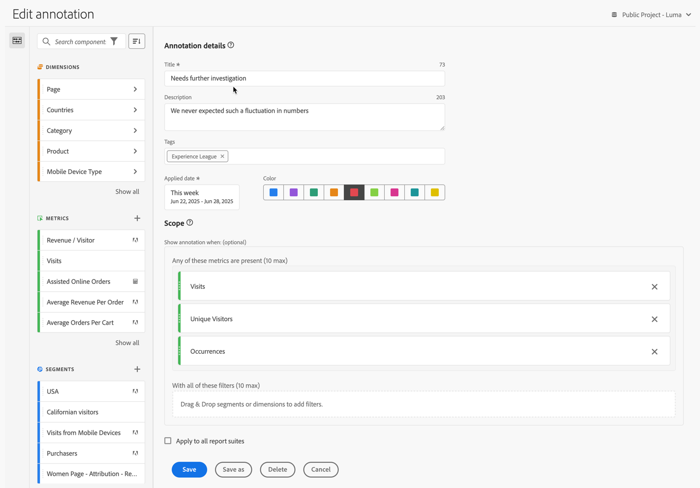

# Criar anotações

Por padrão, somente admins podem criar anotações. Os usuários têm direitos para visualizar anotações, de forma semelhante a como os usuários visualizam outros componentes (como segmentos, métricas calculadas etc.).

No entanto, admins podem fornecer a permissão [!UICONTROL Criação de anotações] (Ferramentas do Analytics) para usuários por meio do [Adobe Admin Console](https://experienceleague.adobe.com/docs/analytics/admin/admin-console/permissions/analytics-tools.html?lang=pt-BR).

Você pode criar uma anotação das seguintes maneiras:

* **A**.  Na interface principal, selecione **[!UICONTROL Componentes]** e **[!UICONTROL Anotações]**. Selecione  [!UICONTROL **[!UICONTROL Adicionar]**] no gerenciador de [[!UICONTROL Anotações]](/help/analyze/analysis-workspace/components/annotations/manage-annotations.md).
* **B**. Em um projeto do espaço de trabalho, no menu de contexto da visualização, selecione **[!UICONTROL Criar anotação a partir da seleção]**.
* **C**.  Em um projeto do espaço de trabalho, no menu de contexto do gráfico de linha, selecione **[!UICONTROL Anotar seleção]**.
* **D**. Em um projeto do espaço de trabalho, selecione **[!UICONTROL Componentes]** no menu e **[!UICONTROL Criar anotação]**.
* **E**.  Em um projeto do espaço de trabalho, use o atalho **[!UICONTROL Ctrl+Shift+O]** (Windows) ou **[!UICONTROL Shift+Command+O]** (macOS)

Para definir a anotação, use o [[!UICONTROL Construtor de anotações]](#annotation-builder).

## Criador de anotações {#annotation-builder}

>[!CONTEXTUALHELP]
>id="components_annotations_details"
>title="Detalhes da anotação"
>abstract="As anotações permitem comunicar com eficácia nuances de dados contextuais e insights à sua organização. Elas permitem vincular eventos de calendário a dimensões ou métricas específicas. "

>[!CONTEXTUALHELP]
>id="components_annotations_scope"
>title="Escopo"
>abstract="O escopo permite personalizar em quais dados as anotações serão adicionadas. As métricas calculadas e os segmentos não herdarão automaticamente as anotações aplicadas aos componentes usados nas definições. É possível adicionar novas métricas calculadas à seção de escopo de uma anotação existente. Novos segmentos exigem uma nova anotação."

A caixa de diálogo **[!UICONTROL Criador de anotações]** é usada para criar anotações novas ou editar anotações existentes. A caixa de diálogo é denominada **[!UICONTROL Nova anotação]** ou **[!UICONTROL Editar anotação]** para anotações criadas ou gerenciadas por meio do gerenciador de [[!UICONTROL anotações]](/help/analyze/analysis-workspace/components/annotations/manage-annotations.md).

>[!BEGINTABS]

>[!TAB Criador de anotações]

>[!TAB Criar/Editar anotação]

>[!ENDTABS]

1. Especifique os seguintes detalhes ( é obrigatório):

   | Elemento | Descrição |
   | --- | --- |
   | **[!UICONTROL Conjunto de relatórios]** | É possível selecionar o conjunto de relatórios para a anotação. A anotação definida está disponível como uma anotação nos projetos do Workspace com base no conjunto de relatórios selecionado. Esta seleção é anulada quando você habilitou [!UICONTROL Aplicar a todos os conjuntos de relatórios]. |
   | **[!UICONTROL Anotação somente de projeto]** | Uma caixa de informações para explicar que a anotação que você cria só é visível no projeto do espaço de trabalho em que você está trabalhando. Habilite a opção **[!UICONTROL Disponibilizar esta anotação em todos os projetos]** para tornar a anotação visível para todos os projetos. Essa caixa de informações só é visível ao criar uma anotação de dentro de um projeto do espaço de trabalho. |
   | **[!UICONTROL Título]**  | Nomeie a anotação, por exemplo, como `Needs further investigation`. |
   | **[!UICONTROL Descrição]** | Forneça uma descrição para a anotação, por exemplo, `We never expected such a fluctuation in numbers.`. |
   | **[!UICONTROL Tags]** | Organize a anotação criando ou aplicando uma ou mais tags. Comece a digitar para encontrar as tags existentes que você pode selecionar. Ou pressione **[!UICONTROL Enter]** para adicionar uma nova tag. Selecione  para remover uma tag. |
   | **[!UICONTROL Data aplicada]**  | Selecione a data ou o intervalo de datas que precisa estar presente para que a anotação seja visível. Ao criar uma anotação usando o atalho, a anotação utiliza um intervalo de datas como padrão para o dia atual. Ao criar uma anotação usando uma seleção em uma visualização, a anotação utiliza como padrão o intervalo de datas com base no intervalo de datas do painel ao qual a visualização pertence. |
   | **[!UICONTROL Cor]** | Aplicar uma cor à anotação. A anotação aparece no projeto com a cor selecionada. A cor pode ser usada para categorizar anotações, como feriados, eventos externos, problemas de rastreamento etc. |
   | **[!UICONTROL Escopo]** | Arraste e solte métricas do painel do componente que aciona a anotação. Por exemplo: Pessoas, Sessões e Eventos. Em seguida, arraste e solte quaisquer dimensões ou segmentos do painel de componentes que atuam como segmentos para determinar se a anotação deve ou não ser exibida. Se você não especificar um escopo, a anotação será aplicada a todos os seus dados.  Você tem duas opções:<ul><li>**[!UICONTROL Qualquer uma dessas métricas está presente]**: arraste e solte até 10 métricas para acionar a exibição da anotação. Por exemplo, a métrica Receita parou de coletar dados de um intervalo de datas específico. Arraste a métrica Receita para esta caixa.</li><li>**[!UICONTROL Com todos esses segmentos]**: arraste e solte até 10 dimensões ou segmentos que determinam se a anotação será exibida.</li></ul>

**Observação:** qualquer anotação aplicada a um componente que depois é usada como parte de uma métrica calculada ou definição de segmento NÃO herda automaticamente a anotação. A métrica calculada desejada também deve ser adicionada à seção do escopo para exibir a anotação. No entanto, uma nova anotação deve ser criada para qualquer segmento que você deseja anotar com as mesmas informações. Por exemplo, suponhamos que você aplique uma anotação a [!UICONTROL Pedidos] em um dia específico. Em seguida, use [!UICONTROL Pedidos] em uma métrica calculada para o mesmo intervalo de datas. A nova métrica calculada não exibe automaticamente a anotação de pedidos. Adicione também a métrica calculada à seção de escopo para que a anotação seja exibida. |
   | **[!UICONTROL Aplicar a todas as visualizações de dados]** | Por padrão, a anotação se aplica ao conjunto de relatórios de origem. Ao marcar essa caixa de seleção, é possível fazer com que a anotação se aplique a todos os conjuntos de relatórios na empresa. |

   {style="table-layout:auto"}

1. Selecionar
   * Clique em **[!UICONTROL Salvar]** para salvar a anotação.
   * Clique em **[!UICONTROL Salvar como]** para salvar uma cópia da anotação.
   * Clique em **[!UICONTROL Excluir]** para excluir uma anotação.
   * Clique em **[!UICONTROL Cancelar]** para cancelar as alterações feitas em uma anotação ou a criação de uma nova anotação.
