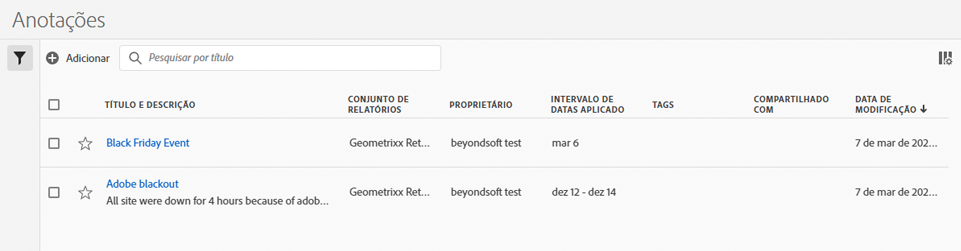

# Gerenciar anotações

A variável [!UICONTROL Gerenciador de anotações] mostra todas as anotações que você possui ou que foram compartilhadas com você. As anotações específicas do projeto não aparecem aqui. É possível usar essa interface para compartilhar, filtrar, marcar, copiar, excluir e marcar suas anotações como favoritas. Os administradores podem gerenciar e aprovar anotações.

**[!UICONTROL Componentes]** > **[!UICONTROL Anotações]**

## Interface do usuário do Gerenciador de anotações

| Elemento da interface | Descrição |
| --- | --- | 
| [!UICONTROL Título e descrição] | Fornecidos no Construtor de anotações. Para editar o título e a descrição, clique no link de título. Isso leva você até o Construtor de anotações. |
| [!UICONTROL Conjunto de relatórios] | Os conjuntos de relatórios aos quais esta anotação se aplica. |
| [!UICONTROL Proprietário] | Indica quem é o proprietário da anotação. Como um usuário não administrador, você pode ver somente as suas anotações ou as que foram compartilhadas com você. |
| [!UICONTROL Intervalo de datas aplicado] | A data ou o intervalo de datas ao qual essa anotação se aplica. |
| [!UICONTROL Compartilhado com] | Lista com quantos indivíduos ou grupos a anotação foi compartilhada. Clique para obter mais detalhes. |
| [!UICONTROL Data de modificação] | Mostra a data e a hora em que a anotação foi modificada pela última vez. |

{style="table-layout:auto"}

## Editar anotações

Editar uma anotação significa que você pode ajustar intervalos de datas, cores, escopo ou se ela se aplica a todos os conjuntos de relatórios ou projetos. É possível editar anotações de duas formas:

* Em um gráfico de linhas, passe o mouse sobre a anotação e clique no ícone de lápis dentro do popover.
* No [!UICONTROL Gerenciador de anotações], clique no título da anotação.

Ambas as opções o direcionam de volta ao [!UICONTROL Construtor de anotações]. Lá, é possível fazer os ajustes necessários e salvar a nova versão.

## Compartilhar anotações

Ao compartilhar anotações ou trabalhar com anotações compartilhadas com você, lembre-se:

* Se você criar um projeto com anotações somente de projeto e, em seguida, compartilhar o projeto com outro usuário, as anotações não poderão ser editadas ou excluídas por ninguém com quem você compartilha o projeto.
* Se você salvar uma anotação e compartilhá-la diretamente com um usuário, ele poderá editar/excluir a anotação somente se tiver direitos de administrador.
* Se um projeto for compartilhado com você com uma anotação somente de projeto, ela será exibida somente nesse projeto. Se a anotação for compartilhada diretamente com você, ela será exibida em todos os projetos nos quais pode ser exibida.

## Anotações e fusos horários

Todas as anotações são criadas com um carimbo de data e hora, mas sem informações de horas ou fuso horário. No momento do relatório, o fuso horário do conjunto de relatórios do painel é sempre aplicado. Por exemplo, uma anotação criada para o dia de Natal acontece em 25 de dezembro, independentemente do fuso horário do conjunto de relatórios em que você estiver.

## Outras tarefas de anotação

O Gerenciador de anotações permite aos administradores editar, adicionar, marcar, excluir, renomear, aprovar, copiar, exportar e filtrar anotações. Não é visível para usuários não administrativos.

Opções adicionais estão disponíveis quando você seleciona pelo menos uma anotação:

| Tarefa | Descrição |
| --- | --- |
| [!UICONTROL Adicionar] | Direciona para o construtor de anotações, onde é possível criar anotações. |
| [!UICONTROL Tag] | Todos os usuários podem criar tags para anotações e aplicar uma ou mais tags a uma anotação. Entretanto, só é possível visualizar as tags das anotações que você possui. |
| [!UICONTROL Excluir] | Excluir uma anotação a remove de qualquer projeto em sua organização. |
| [!UICONTROL Renomear] | Renomear uma anotação a renomeia em todos os projetos aos quais foi aplicada. |
| [!UICONTROL Copiar] | Cria uma cópia distinta com sua própria ID de anotação, mas com o mesmo nome e definição. |
| [!UICONTROL Exportar para CSV] | Exporte a definição da anotação para um arquivo CSV. |
| [!UICONTROL Filtro] (painel esquerdo) | Filtre por tags, conjunto de relatórios, proprietários e outros filtros (Meus, Aprovados, Favoritos, Compartilhados comigo e Mostrar todos). |

{style="table-layout:auto"}
