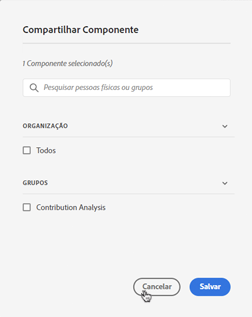

# Gerenciar anotações

>[!NOTE]
>
>No momento, esse recurso está em testes limitados.

O [!UICONTROL Componentes] > [!UICONTROL Anotações] O gerenciador oferece várias maneiras de gerenciar anotações, como compartilhar, filtrar, marcar, aprovar, copiar, excluir e marcar como favoritos.

O [!UICONTROL Anotações] O gerenciador mostra todas as anotações que você possui que foram segmentadas para todos os seus projetos e que foram compartilhadas com você.

>[!NOTE]
>
>[!UICONTROL Anotações] que você criou apenas para um projeto específico não aparece no gerenciador.

## Interface do usuário do Gerenciador de anotações

| Elemento da interface do usuário | Descrição |
| --- | --- | 
| [!UICONTROL Título e descrição] | Fornecido no Construtor de anotações. Para editar o título e a descrição, clique no link de título; isso leva você de volta ao Construtor de anotações. |
| [!UICONTROL Conjunto de relatórios] | Os conjuntos de relatórios aos quais essa anotação se aplica. |
| [!UICONTROL Proprietário] | Indica o proprietário da anotação. Como um usuário não administrativo, você pode ver somente as anotações que possui ou que foram compartilhadas com você. |
| [!UICONTROL Intervalo de datas aplicado] | A data ou o intervalo de datas ao qual essa anotação se aplica. |
| [!UICONTROL Compartilhado com] | Lista quantos indivíduos ou grupos compartilhou a anotação. Clique para obter mais detalhes. |
| [!UICONTROL Data de modificação] | Mostra a data e a hora em que a anotação foi modificada pela última vez. |

## Editar anotações

Editar uma anotação significa que você pode ajustar intervalos de datas, cores, escopo ou se ela se aplica ou não a todos os conjuntos de relatórios ou projetos. É possível editar anotações de duas maneiras:

* Em um gráfico de linhas, passe o mouse sobre a anotação e clique no ícone de lápis dentro da proa.

* No [!UICONTROL Gerenciador de anotações], clique no título da anotação.

Ambas as opções o direcionam de volta ao Criador de anotações. Você pode fazer os ajustes necessários e salvar a nova versão.

## Compartilhar anotações

1. Selecione as anotações que deseja compartilhar e clique em [!UICONTROL Compartilhar].

1. No [!UICONTROL Compartilhar componente] , pesquise os indivíduos ou grupos com os quais deseja compartilhar as anotações.

1. Em [!UICONTROL Organização], ....

1. Clique em [!UICONTROL Salvar].

## Marcar anotações

Para seguir

