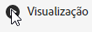

# Compartilhar anotações nos cartões de pontuação móveis

Você pode exibir anotações criadas no espaço de trabalho nos cartões de pontuação móveis. Isso permite compartilhar nuances de dados contextuais e insights sobre sua organização e campanhas diretamente para os projetos de cartões de pontuação móveis, visualizáveis no aplicativo móvel de painéis do Analytics.

## Exibir anotações nos cartões de pontuação móveis

Para exibir anotações em cartões de pontuação móveis, primeiro crie a anotação nos projetos do espaço de trabalho ou no menu Componentes.

Para obter informações sobre como criar anotações, consulte [Criar anotações](create-annotations.md). As anotações são desativadas em cartões de pontuação móveis por padrão e devem ser ativadas para cada cartão de pontuação que você deseja exibir em cartões de pontuação móveis.

1. Ativar anotações. Para ativar as anotações, consulte [Ativar ou desativar anotações](overview.md#annotations-on-off).

1. Crie uma anotação e verifique se ela está sendo compartilhada com todos os projetos. Para criar uma anotação no espaço de trabalho, consulte [Criar anotações](create-annotations.md).

1. Selecione **Mostrar anotações** para exibir a anotação nos cartões de pontuação móveis.

   

1. Confirme se a opção Mostrar anotações está selecionada; acesse **Projeto** > **Informações e configurações do projeto**.

   

## Visualizar anotações em cartões de pontuação móveis

Quando as anotações são ativadas, os ícones de anotação ficam visíveis no Construtor de cartão de pontuação. As anotações são exibidas somente em gráficos e tabelas na visualização detalhada. As anotações não são visíveis no bloco principal do cartão de pontuação.

Quando os ícones de anotação estão visíveis, não é possível visualizar completamente ou interagir com as anotações na tela do construtor. Use o modo de visualização para visualizar e interagir com as anotações conforme elas aparecem no aplicativo. 

As cores da anotação são selecionadas quando a anotação é criada no espaço de trabalho. As anotações em cinza indicam a presença de mais de uma anotação.  

## Visualizar anotações do gráfico

| Data | Aparência |
| --- | --- |
| **Dia único** |    |
| **Intervalo de datas** |  |
| **Sobreposição de anotações** |   Para visualizar os detalhes da anotação no aplicativo de painéis do Analytics, toque em um ícone de anotação.   Ao visualizar uma anotação em um gráfico, é possível deslizar o dedo para a esquerda e para a direita para navegar por todas as anotações presentes no gráfico. Ao visualizar uma anotação na tabela, deslize o dedo para a esquerda e para a direita para navegar por todas as anotações associadas a esse item de linha na tabela.      Em gráficos que não têm um *eixo x* baseado em tempo, como os gráficos de rosca ou de barra horizontal, as anotações que se aplicam ao gráfico podem ser visualizadas ao tocar no ícone localizado no canto inferior direito.    |
