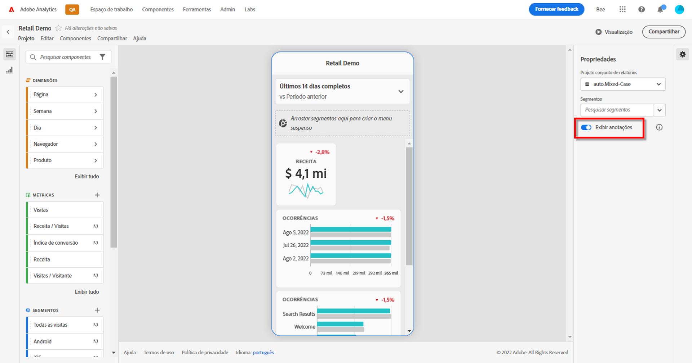
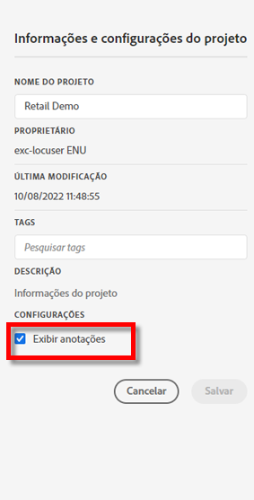

# Anotações do cartão de pontuação para dispositivos móveis

Você pode exibir anotações criadas no Analysis Workspace em cartões de pontuação para dispositivos móveis. As anotações dos cartões de pontuação móveis permitem compartilhar nuances de dados contextuais e insights sobre sua organização e campanhas.

## Exibir anotações em cartões de pontuação móveis

Para destacar anotações em cartões de pontuação para dispositivos móveis, primeiro crie a anotação em projetos do espaço de trabalho ou no menu Componentes.

Para obter informações sobre como criar anotações, consulte [Criar anotações](create-annotations.md). As anotações são desativadas em cartões de pontuação para dispositivos móveis por padrão e devem ser ativadas para cada cartão de pontuação que você deseja exibir em cartões de pontuação para dispositivos móveis.

1. Ativar anotações. Para ativar as anotações, consulte [Ativar ou desativar anotações](overview.md#turn-annotations-on-or-off).

1. Crie uma anotação e verifique se ela está compartilhada com todos os projetos. Consulte [Criar anotações](create-annotations.md) para obter mais informações.

1. Selecione **[!UICONTROL Mostrar anotações]** para exibi-las nos cartões de pontuação para dispositivos móveis.

   

   Também é possível confirmar se a opção **[!UICONTROL Mostrar anotações]** está selecionada em **[!UICONTROL Projeto]** > **[!UICONTROL Informações e configurações do projeto]**

## Visualizar anotações em cartões de pontuação móveis

Quando as anotações estão habilitadas, os ícones de anotação ficam visíveis no Criador de cartões de pontuação. As anotações são exibidas somente em gráficos e tabelas na exibição detalhada. As anotações não são visíveis na exibição principal do bloco do cartão de pontuação.

Quando esses ícones estão visíveis, não é possível visualizar completamente ou interagir com as anotações na tela do criador. Use o ícone de **&#x200B;** para visualizar e interagir com as anotações conforme elas aparecem no aplicativo.

As cores da anotação são selecionadas após criar a anotação no espaço de trabalho. As anotações em cinza indicam a presença de mais de uma anotação.

## Visualizar anotações

Para visualizar a anotação, utilize o ícone de . Selecione uma anotação para abrir seus detalhes.

Se mais anotações estiverem disponíveis, você verá vários pontos (●) na parte inferior da anotação. Deslize para a esquerda ou para a direita para alternar entre as anotações.

<!--
# Share Annotations in Mobile Scorecards

You can display annotations that are created in Workspace in Mobile Scorecards. This allows you to share contextual data nuances and insights about your organization and campaigns directly within Mobile Scorecard projects, viewable in the Analytics dashboards mobile app.

## Surface Annotations in Mobile Scorecards

To surface annotations in mobile scorecards, create the annotation first from Workspace projects or from the components menu.

For information on creating annotations, see [Create Annotations](create-annotations.md). Annotations are turned off in mobile scorecards by default and must be enabled for each scorecard that you want to surface in mobile scorecards.

1. Turn on annotations. To turn annotations on, see [Turn annotations on or off](overview.md#annotations-on-off).

1. Create an annotation and make sure it is shared to all your projects. To create an annotation in Workspace,  see [Create Annotations](create-annotations.md).

1. Select **Show annotations** to display the annotation in Mobile Scorecards.

   

1. Confirm that show annotations is selected, go to **Project** > **Project info and settings**.

   

## View annotations in Mobile Scorecards

When annotations are enabled, annotation icons are visible in the Scorecard Builder. Annotations appear only on charts and tables in the detailed view. Annotations are not visible from the main tile view of the scorecard.

 

When annotation icons are visible, you can't fully view or interact with annotations in the builder canvas. Use the Preview mode to view and interact with annotations as they appear in the app  **Preview**.

Annotation colors are selected when the annotation is created in workspace. Gray annotations indicated the presence of more than one annotation.

## View chart annotations

| Date | Appearance |
| --- | --- |
| **Single day** |     |
| **Date range** |  |
| **Overlapping annotations** |   To view annotation details in the Analytics dashboards app, tap an annotation icon.   When viewing an annotation in a chart, you can swipe left and right to navigate all annotations present in the chart. When viewing an annotation in the table, swipe left and right to navigate all annotations associated with that row item in the table.      In charts that do not have a time-based *x axis*, such as the donut or horizontal bar charts, annotations that apply to the chart can be viewed by tapping the icon located in the lower right-hand corner.   |
-->