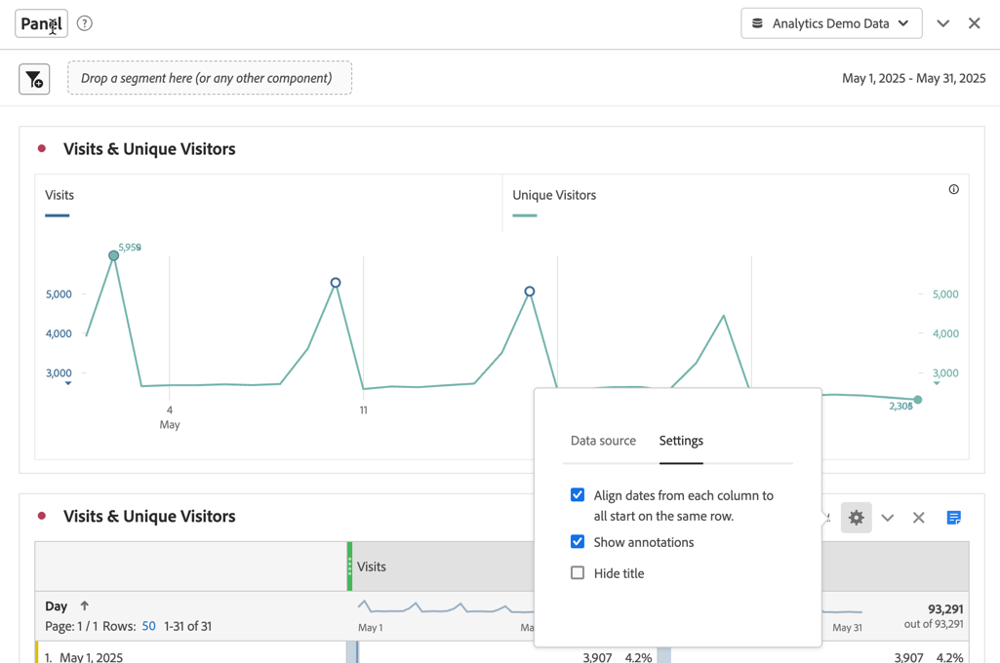
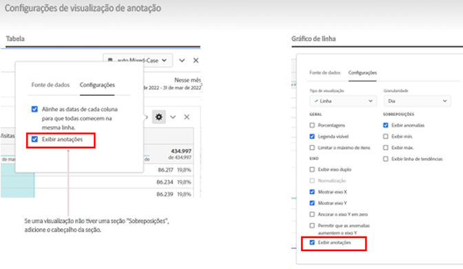
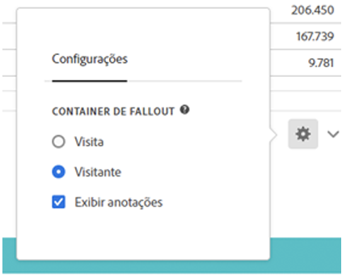

# Visão geral sobre as anotações

As anotações permitem que você comunique nuances e insights de dados contextuais de forma eficaz para outras partes interessadas na sua organização. Com as anotações, é possível vincular eventos de calendário a dimensões e métricas específicas. Você pode anotar uma data ou intervalo de datas com problemas de dados conhecidos, feriados, lançamentos de campanhas etc. Em seguida, é possível exibir graficamente os eventos e verificar se as campanhas ou outros eventos afetaram o tráfego no site, o uso do aplicativo móvel, a receita ou qualquer outra métrica.

Por exemplo, digamos que você esteja compartilhando projetos com sua organização. Caso ocorra uma queda acentuada nos seus visitantes únicos, e possível criar uma anotação de **Redução de visitantes** e incluí-la no escopo do conjunto de relatórios inteiro. Ao visualizar qualquer conjunto de relatórios que inclua essa data, os usuários verão a anotação em seus projetos, junto com seus dados.

As anotações podem se aplicar a:

* Uma única data ou a um intervalo de datas.

* Todo o seu conjunto de dados ou métricas, dimensões ou segmentos específicos.

* O projeto no qual as anotações foram criadas (padrão) ou a todos os projetos.

* A exibição de dados em que as anotações foram criadas (padrão) ou a todas as exibições de dados.

Consulte [Criar anotações](create-annotations.md) para obter as várias opções disponíveis para criar anotações. Em seguida, é possível compilar, modificar e salvar anotações no [Construtor de anotações](create-annotations.md#annotation-builder).

Utilize o [Gerenciador de anotações](manage-annotations.md) para gerenciá-las.

## Ativar ou desativar anotações

As anotações podem ser ativadas ou desativadas em vários níveis:

| Nível | Guia de instruções |
|---|---|
| **Visualização** | Habilite ou desabilite a opção  > **[!UICONTROL Configurações]** > **[!UICONTROL Mostrar anotações]**.  |
| **Projeto** | No menu de projeto do espaço de trabalho, selecione **[!UICONTROL Projeto]** > **[!UICONTROL Informações e configurações do projeto]** e habilite ou desabilite a opção **[!UICONTROL Mostrar anotações]**.  |
| **Usuário** | Na guia **[!UICONTROL Componentes]**, selecione **[!UICONTROL Preferências]** ou, no menu de projeto do espaço de trabalho, selecione **[!UICONTROL Projeto]** > **[!UICONTROL Preferências do usuário]**.  Em **[!UICONTROL Preferências]**, selecione **[!UICONTROL Projetos e análise]**. Na barra de guias à esquerda, selecione **[!UICONTROL Dados]**. Na parte inferior, habilite ou desabilite **[!UICONTROL Mostrar anotações]** abaixo do cabeçalho **[!UICONTROL Tabela de forma livre]**.  |

<!--
# Annotations overview

Annotations in Workspace enable you to effectively communicate contextual data nuances and insights to your organization. They let you tie calendar events to specific dimensions/metrics. You can annotate a date or date range with known data issues, public holidays, campaign launches, etc. You can then graphically display events and see whether campaigns or other events have affected your site traffic, revenue, or any other metric.

For example, let's say you are sharing projects with your organization. If you had a major spike in traffic due to a marketing campaign, you could create a "Campaign launch date" annotation and scope it for your whole report suite. When your users view any data sets that included that date, they see the annotation within their projects, alongside their data.

Keep this in mind:

* Annotations can be tied to a single date or to a date range.

* They can apply to your entire data set or to specified metrics, dimensions, or segments.

* They can apply to the project in which they were created (default) or to all projects.

* They can apply to the report suite in which they were created (default) or to all report suites.

## Permissions {#permissions}

By default, only Admins can create annotations. Users have rights to view annotations like they do with other other Analytics components (such as segments, calculated metrics, etc.).

However, Admins can give the [!UICONTROL Annotation Creation] permission (Analytics Tools) to users via the [Adobe Admin Console](https://experienceleague.adobe.com/docs/analytics/admin/admin-console/permissions/analytics-tools.html).

## Turn annotations on or off {#annotations-on-off}

Annotations can be turned on or off at several levels:

* At the Visualization level: [!UICONTROL Visualization] settings > [!UICONTROL Show annotations]

* At the Project level: [!UICONTROL Project info & settings] > [!UICONTROL Show annotations]

* At the User level: [!UICONTROL Components] > [!UICONTROL User preferences] > [!UICONTROL Data] > [!UICONTROL Show annotations]

-->