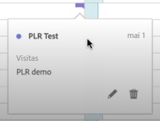
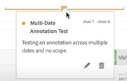
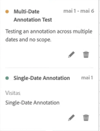

# Exibir anotações

As anotações se manifestam de forma um pouco diferente, dependendo de onde são exibidas e se abrangem um único dia ou um intervalo de datas.

## Exibir anotações no Workspace

| Tipo de visualização | Descrição |
| --- | --- |
| **Linha ** **Dia único** | Ao selecionar  em uma visualização de linha, você verá um pop-up com os detalhes da anotação.  Para editar a anotação no [Criador de anotações](create-annotations.md#annotation-builder), selecione . Para excluir a anotação, clique em . |
| **Linha ** **Intervalo de datas** | Ao selecionar , você verá um pop-up com os detalhes da anotação e uma linha na parte inferior indicando o intervalo de datas. Para editar a anotação no [Criador de anotações](create-annotations.md#annotation-builder), clique em . Para excluir a anotação, clique em . |
| **Tabela de forma livre** | Em uma tabela de forma livre, você pode acessar todas as anotações por meio do botão de anotações na parte superior direita da visualização. Selecione  para ver uma lista de rolagem de todas as anotações.  Em cada anotação, é possível selecionar  para editar a anotação no [Criador de anotações](create-annotations.md#annotation-builder) e  para excluir a anotação. |

{style="table-layout:auto"}

## Visualizar anotações em um PDF

Ao baixar ou enviar um projeto como um PDF, as anotações são resumidas na seção Resumo de anotações.

<!--
# View annotations

Annotations manifest slightly differently, depending on whether they span a single day or a date range.

## View annotations in Line charts or Tables

| Date | Appearance |
| --- | --- |
| **Single day** |   
When you hover over the annotation, you can see its details, you can edit it by selecting the pen icon, or you can delete it:
  |
| **Date range** |  The icon changes and when you hover over it, the date range appears.

When you select it in the line chart, the annotation metadata appear, and you can edit or delete it:
In a table, an icon appears on every date in the date range.
|
| **Overlapping annotations** | On days that have more than one annotation tied to them, the icon appears in a grey color.

When you hover over the grey icon, all overlapping annotations appear:
 |

{style="table-layout:auto"}

## View annotations in a .pdf file

Since you cannot hover over icons in a .pdf file, this file (after export) provides notes of explanations at the bottom of a panel. Here is an example:

## View annotations with non-trended data

Sometimes annotation are shown with non-trended data, but tied to a specific dimension. In that case, they appear only in a summary annotation in the bottom right corner. Here is an example:

The summary chart appears in all visualization types in the corner, not just in non-trended freeform tables and summary numbers. It also appears in visualizations like [!UICONTROL Donut], [!UICONTROL Flow],[!UICONTROL Fallout],[!UICONTROL Cohort], and so on.

-->