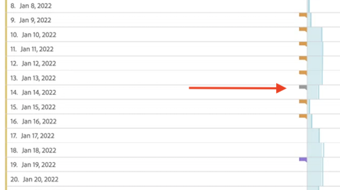

# Exibir anotações

>[!NOTE]
>
>No momento, esse recurso está em testes limitados.

As anotações se manifestam de forma um pouco diferente, dependendo se abrangem um único dia ou um intervalo de datas.

## Exibir anotações em gráficos de linha ou tabelas

| Data | Aparência |
| --- | --- |
| **Dia único** | 
Ao passar o mouse sobre a anotação, é possível visualizar os detalhes, editá-la selecionando o ícone de caneta ou excluí-la:
  |
| **Intervalo de datas** | O ícone muda, e quando você passa o mouse sobre ele, o intervalo de datas é exibido.

Ao selecioná-lo no gráfico de linhas, os metadados da anotação são exibidos e você pode editá-los ou excluí-los:
Em uma tabela, um ícone é exibido em cada data no intervalo de datas.
 |
| **Sobreposição de anotações** | Nos dias que tiverem mais de uma anotação vinculada a eles, o ícone aparecerá em uma cor cinza.

Quando você passa o mouse sobre o ícone cinza, todas as anotações sobrepostas são exibidas:
 |

## Exibir anotações em um gráfico de resumo

## Exibir anotações em um arquivo PDF

Como não é possível passar o mouse sobre os ícones em um arquivo PDF, esse arquivo (após a exportação) fornece notas explicativas na parte inferior de um painel. Exemplo:

## Exibir anotações não baseadas em datas

Às vezes, a anotação não está vinculada a uma data, mas vinculada a uma dimensão específica. Nesse caso, eles aparecem somente em uma anotação de resumo no canto inferior direito. Exemplo:

