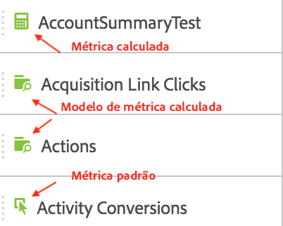
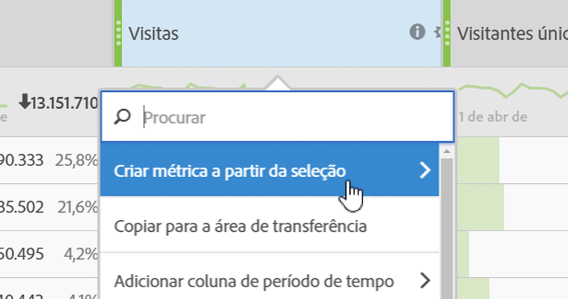

# Métricas

Há duas formas de utilizar as métricas no Analysis Workspace.

Você pode arrastar uma métrica padrão, métrica calculada ou modelo de métrica calculada do [!UICONTROL Components] menu para a tabela:

>[!NOTE] Embora seja aparentemente simples, o uso das métricas é potente. É possível adicionar métricas a um relatório arrastando a métrica apropriada para a seção de métricas de uma tabela. Também é possível detalhar dimensões por métricas, fornecendo controle detalhado sobre a exibição da tabela. Além disso, você pode inserir uma métrica como uma dimensão e uma dimensão como uma métrica para criar um relatório de horas extras. Teste os vários componentes e veja o que você pode fazer. As possibilidades são infinitas.

Ou você pode clicar em **[!UICONTROL Components]** > **[!UICONTROL New Metric]**. Você será redirecionado para o [Criador de métricas calculadas](https://marketing.adobe.com/resources/help/pt_BR/analytics/calcmetrics/), que permite criar métricas personalizadas a partir das existentes.

To make it easier to quickly create calculated metrics, **[!UICONTROL Create metric from selection]** has been added to the column right-click menu in Freeform Tables. Essa opção é exibida quando uma ou mais células de coluna de cabeçalho são selecionadas.

[Uso de métricas de participação no YouTube](https://www.youtube.com/watch?v=ngmJHcg65o8&amp;list=PL2tCx83mn7GuNnQdYGOtlyCu0V5mEZ8sS&amp;index=32) (4:16)
