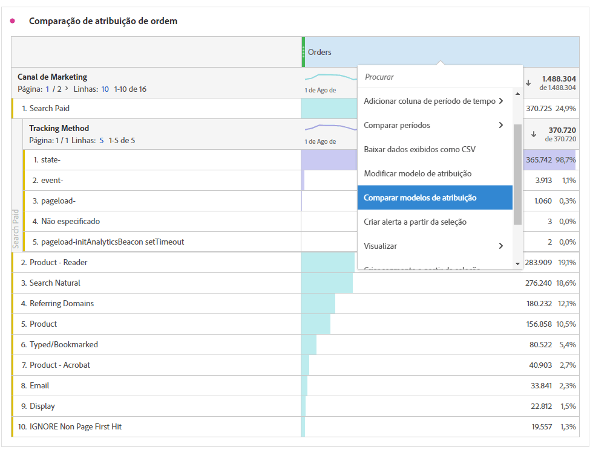

# Métricas

Há duas formas de utilizar as métricas no Analysis Workspace.

É possível arrastar uma métrica padrão, uma métrica calculada ou um modelo de métrica calculada do menu [!UICONTROL Componentes] para a tabela:

>[!NOTE]
>
>Embora seja aparentemente simples, o uso das métricas é eficiente. É possível adicionar métricas a um relatório arrastando a métrica apropriada para a seção de métricas de uma tabela. Também é possível detalhar dimensões por métricas, fornecendo controle detalhado sobre a exibição da tabela. Além disso, você pode inserir uma métrica como uma dimensão e uma dimensão como uma métrica para criar um relatório de horas extras. Teste os vários componentes e veja o que você pode fazer. As possibilidades são infinitas.

Ou clique em **[!UICONTROL Componentes]** > **[!UICONTROL Nova métrica]**. Você será redirecionado para o [Criador de métricas calculadas](/help/components/c-calcmetrics/cm-overview.md), que permite criar métricas personalizadas a partir das existentes.

Para facilitar a criação rápida de métricas calculadas, a opção **[!UICONTROL Criar métrica a partir da seleção]** foi adicionada ao menu da coluna exibida quando clicamos com o botão direito do mouse nas Tabelas de forma livre. Essa opção é exibida quando uma ou mais células de coluna de cabeçalho são selecionadas.

[Métricas calculadas: Métricas](https://docs.adobe.com/content/help/en/analytics-learn/tutorials/components/calculated-metrics/calculated-metrics-implementationless-metrics.html)  sem implementação (3:42)

## Comparar métricas com diferentes modelos de atribuição

Se você deseja comparar um modelo a outro de maneira fácil e rápida, clique com o botão direito em uma métrica e selecione **[!UICONTROL Comparar modelos de atribuição]**:

Esse atalho permite comparar de forma rápida e fácil um modelo de atribuição com outro, sem arrastar uma métrica e configurá-la duas vezes.
