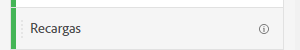
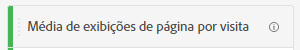
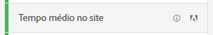

# Métricas

As métricas permitem quantificar os pontos de dados no Analysis Workspace. Elas são usadas mais frequentemente como colunas em uma visualização e estão vinculadas a dimensões.

O Adobe oferece vários tipos de métricas para uso no Analysis Workspace:

* **Métricas padrão**: A maioria das métricas usadas nos projetos são métricas padrão. Os exemplos incluem [Exibições de página](/help/components/metrics/page-views.md), [Receita](/help/components/metrics/revenue.md)ou [Eventos personalizados](/help/components/metrics/custom-events.md). Consulte [Visão geral das métricas](/help/components/metrics/overview.md) no guia do usuário Componentes para obter mais informações.

   

* **Métricas calculadas**: Métricas definidas pelo usuário com base em métricas padrão, números estáticos ou funções algorítmicas. Métricas calculadas definidas pelo usuário mostram um ícone da calculadora na lista de componentes disponíveis. Consulte [Visão geral das métricas calculadas](/help/components/c-calcmetrics/cm-overview.md) no guia do usuário Componentes para obter mais informações.

   

* **Modelos de métricas calculadas**: Métricas definidas por Adobe que se comportam de forma semelhante às métricas calculadas. Você pode usá-los como estão em projetos do Workspace ou salvar uma cópia para personalizar sua lógica. Os modelos de métricas calculadas mostram um ícone de Adobe na lista de componentes disponíveis.

   

As métricas são flexíveis em seu uso no Analysis Workspace. Arraste uma métrica para uma tabela de forma livre vazia para ver a tendência dessa métrica ao longo do período de datas do projeto. Também é possível arrastar uma métrica quando uma dimensão está presente para ver essa métrica em comparação a cada item de dimensão. Arrastar uma métrica para cima de um cabeçalho de métrica existente a substitui e arrastar uma métrica ao lado de um cabeçalho permite ver ambas as métricas lado a lado.

>[!VIDEO](https://video.tv.adobe.com/v/40817/?quality=12)

## Métricas calculadas

As métricas calculadas permitem que você veja facilmente como as métricas se relacionam usando operadores simples ou funções estatísticas. Há várias maneiras de criar métricas calculadas:

* Clique no ícone de adição ao lado do cabeçalho Métricas sob a lista de componentes à esquerda.
* Navegar para **[!UICONTROL Componentes]** > **[!UICONTROL Métricas calculadas]** > **[!UICONTROL Adicionar]**.
* Clique com o botão direito do mouse em um cabeçalho de coluna > **[!UICONTROL Criar métrica a partir da seleção]** quando uma ou mais células de coluna de cabeçalho são selecionadas. Essa opção cria automaticamente uma métrica calculada para você, sem precisar usar o Construtor de regras de métrica calculada.

[Métricas calculadas: métricas sem implementação](https://experienceleague.adobe.com/docs/analytics-learn/tutorials/components/calculated-metrics/calculated-metrics-implementationless-metrics.html?lang=pt-BR) (3:42)

## Comparar métricas com diferentes modelos de atribuição

Se você quiser comparar um modelo com outro de maneira fácil e rápida, clique com o botão direito em uma métrica e selecione **[!UICONTROL Comparar modelos de atribuição]**:

Esse atalho permite comparar de forma rápida e fácil um modelo de atribuição com outro, sem arrastar uma métrica e configurá-la duas vezes.

## Usar a função [!UICONTROL média cumulativa] para aplicar a suavização de métricas

Veja um vídeo sobre este tópico:

>[!VIDEO](https://video.tv.adobe.com/v/27068/?quality=12)
