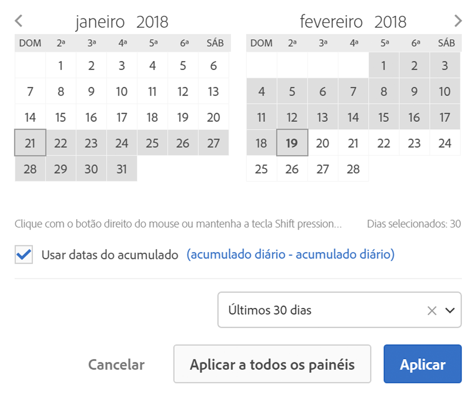

# Visão geral de calendário e intervalos de data

No calendário, você pode especificar datas e intervalos de datas ou selecionar uma predefinição.

As seleções do calendário se aplicam a nível de painel, mas você pode aplicá-las a todos os painéis. Por padrão, o calendário da Workspace mostra o mês atual e o anterior.

O primeiro clique inicia uma seleção de intervalo de datas. Em seguida, destaca o intervalo em qualquer direção até o segundo clique, que seleciona o final do intervalo de datas. If the `Shift` key is held down (or right-click is used) while clicking the first date, it will append to the range.

Você também pode arrastar datas (e dimensões de tempo) em um projeto do espaço de trabalho. É possível selecionar dias, semanas, meses e anos específicos ou uma data do acumulado.

[Usar intervalos de datas e calendário na Analysis Workspace no youtube](https://www.youtube.com/watch?v=L4FSrxr3SDA&list=PL2tCx83mn7GuNnQdYGOtlyCu0V5mEZ8sS&index=28) (4:07)

| Configuração | Descrição |
|--- |--- |
| Dias selecionados | Dias/semanas/meses selecionados/anos. |
| Usar datas do acumulado | Datas do acumulado permitem gerar um relatório dinâmico que analisa antes e depois de um período de tempo com base na execução do relatório. Por exemplo, se quiser relatar todos os pedidos feitos no “Mês anterior” (com base no campo Data de criação) e executar o relatório em dezembro, verá os pedidos feitos em novembro. Se executar o mesmo relatório em janeiro, verá os pedidos feitos em dezembro.  Visualização de data: indica o período que o calendário em andamento engloba.  Início: você pode escolher entre dia, semana atual, mês atual, trimestre atual, ano atual.  Fim: você pode escolher entre dia, semana atual, mês atual, trimestre atual, ano atual.  For an example, go [here](/help/analyze/analysis-workspace/components/calendar-date-ranges/custom-date-ranges.md). |
| Intervalo de datas | Permite selecionar um intervalo de datas predefinido. Últimos 30 dias é padrão. |
| Aplicar a todos os painéis | Permite alterar o intervalo de datas selecionado para o painel atual e também para todos os outros painéis do projeto. |
| Aplicar | Aplica o intervalo de datas somente a este painel. |
