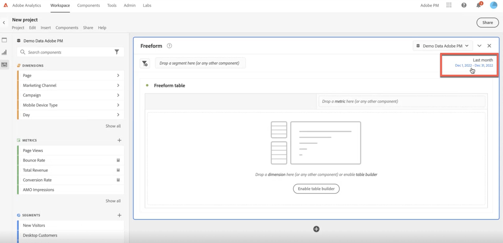

# Visão geral dos intervalos de data

Em um projeto do Workspace, você geralmente usa o [calendário de um painel](/help/analyze/analysis-workspace/c-panels/panels.md#calendar) para especificar o intervalo de datas das visualizações desse painel.

Os componentes de intervalo de datas permitem definir e substituir as configurações do calendário do painel.

## Utilize intervalos de datas

Você pode usar um componente de intervalo de datas para redefinir o calendário do painel.

Ou você pode usar um intervalo de datas em uma tabela de forma livre como uma métrica ou dimensão.

- **Métrica**. Por exemplo, para comparar uma dimensão entre dois meses diferentes em relação a uma métrica específica.
- **Dimensão**. Para comparar uma métrica entre diferentes itens de dimensão em relação à dimensão de intervalo de datas.

>[!NOTE]
>
>Quando você usa intervalos de datas em uma tabela de forma livre, os intervalos de datas substituem o calendário especificado para o painel ao qual a tabela de forma livre pertence.
>

Você usa um intervalo de datas da mesma forma que [usaria qualquer componente](/help/analyze/analysis-workspace/components/analysis-workspace-components.md#analysis-workspace-components). Você arrasta o intervalo de datas do painel do componente  **[!UICONTROL Intervalos de datas]** e solta o componente em:

- **[!UICONTROL Calendário]**: você pode  **[!UICONTROL Substituir]** a configuração do calendário atual pelo intervalo de datas.
- **Cabeçalho da coluna de métrica**: você pode  **[!UICONTROL Substituir]** a métrica, **[!UICONTROL Adicionar &#x200B;]**&#x200B;o intervalo de datas como uma métrica ou **[!UICONTROL &#x200B; Filtrar &#x200B;]**&#x200B;a métrica, usando o componente de intervalo de datas.
- **Cabeçalho da coluna de dimensão**: você pode  **[!UICONTROL Substituir]** as dimensões atuais. A nova dimensão agora é **[!UICONTROL Intervalos de datas]**. Quando a dimensão é “Intervalos de datas”, você pode **[!UICONTROL Adicionar &#x200B;]**&#x200B;outros intervalos de datas como itens de dimensão.
- **Item de dimensão**: você pode fazer o  **[!UICONTROL Detalhamento]** do item de dimensão específico segundo o intervalo de datas.

Você também pode adicionar uma coluna de intervalo de datas diretamente a uma visualização de tabela de forma livre:

1. Em uma coluna de métrica, selecione no menu de contexto:

   - **[!UICONTROL Adicionar coluna de período]**. Você pode selecionar entre as opções sugeridas com base no calendário atual ou criar um [intervalo de datas personalizado](#custom-date-ranges).
   - **[!UICONTROL Comparar períodos]**. Você pode selecionar entre uma opção sugerida com base no calendário atual ou criar um [intervalo de datas personalizado](#custom-date-ranges).

1. Com base na sua seleção, colunas adicionais de intervalo de datas serão adicionadas à tabela de forma livre.

## Intervalos de datas padrão

O Analysis Workspace fornece vários intervalos de datas padrão.

| Dia | Semana | Mês | Trimestre | Ano |
|---|---|---|---|---|
| Hoje | Nesta semana | Este mês | Este trimestre | Este ano |
| Ontem | Esta semana (exceto hoje) | Este mês (exceto hoje) | Este trimestre (exceto hoje) | Este ano (exceto hoje) |
| 2 dias atrás | 2 semanas atrás | 2 meses atrás |   |  |
| 3 dias atrás | 3 semanas atrás | 3 meses atrás |  | |
| Últimos 7 dias | Semana passada | Último mês | Trimestre passado | Ano passado |
| Últimos 14 dias | Últimas 2 semanas completas | Últimos 2 meses completos | Últimos 4 trimestres inteiros | |
| Últimos 30 dias | Últimas 3 semanas completas | Últimos 3 meses completos | | |
| Últimos 60 dias | Últimas 4 semanas completas | Últimos 6 meses completos | | |
| Últimos 90 dias | Últimas 12 semanas completas | Últimos 12 meses completos | | |
| Últimos 7 dias completos | Últimas 52 semanas completas | Últimos 13 meses completos | | |
| Últimos 14 dias completos | | | | |
| Últimos 30 dias completos | | | | |
| Últimos 90 dias completos | | | | |

<table style="table-layout:fixed">

## Intervalos de datas personalizados

É possível criar os seus próprios intervalos de datas personalizados. Consulte [Criar intervalo de datas](create.md) para ver as várias opções disponíveis para criar intervalos de datas. Em seguida, é possível compilar, modificar e salvar intervalos de datas no [Construtor de intervalos de datas](create.md#date-range-builder).

Use o [Gerenciador de intervalos de datas](manage.md) para gerenciar os intervalos de datas.

<!--
# Calendar and date ranges overview {#date-range}

>[!CONTEXTUALHELP]
>id="components_dateranges_endtime"
>title="End time"
>abstract="End times always include 59 seconds."

In the calendar, you can specify dates and date ranges, or select a preset.

>[!BEGINSHADEBOX]

See  [Calendar and date ranges overview](https://video.tv.adobe.com/v/30814?quality=12&learn=on&captions=por_br){target="_blank"} for a demo video.

>[!ENDSHADEBOX]

Calendar selections apply at the panel level, but you have the option to apply them to all panels. When you click a date range in Workspace, the interface displays the current calendar month and the previous calendar month. You can adjust these two calendars by clicking the right and left arrows in each respective upper corner.

{width="60%"} 

## Select and apply date ranges {#select-apply}

The first click on a calendar starts a date range selection. The second click completes a date range selection, which becomes highlighted. If the `Shift` key is held down (or right-click is used), it appends to the currently selected range.

You can also drag dates (and time dimensions) into a Workspace project. You can select specific days, weeks, months, years, or a rolling date.

[Using Date Ranges and Calendar in Analysis Workspace](https://experienceleague.adobe.com/docs/analytics-learn/tutorials/analysis-workspace/calendar-and-date-ranges/using-dates-in-analysis-workspace.html?lang=pt-BR) (4:07)

| Setting | Description |
|--- |--- |
|Selected Days|Selected days/weeks/months/years.|
|Make date range components relative to panel calendar| If disabled, any date range components used within a table, visualization, or panel drop zone override the panel calendar. 
If enabled, any date range components used within a table, visualization, or panel drop zone are in relation to the panel date range. For example, if the panel date range is set to November 1 through November 30, and a Last Week date range component is used in a freeform table, the information in the freeform table refers to the last week in October. |
|Use rolling dates| Rolling dates allow you to generate a dynamic report that looks forward or backward for a set period of time based on when you ran the report. For example, if you want to report on all Orders placed "Last Month" (based on the Created Date field) and ran that report in December, you'd see orders placed in November. If you ran that same report in January, you'd see orders placed in December.<ul><li>**[!UICONTROL Date Preview]**: Indicates what time period the rolling calendar encompasses.</li><li>**[!UICONTROL Start]**: You can choose among current day, current week, current month, current quarter, current year.</li><li>**[!UICONTROL End]**: You can choose among current day, current week, current month, current quarter, current year.</li></ul>To view an example, see [Custom date ranges](/help/analyze/analysis-workspace/components/calendar-date-ranges/custom-date-ranges.md).  Selected by default.|
|Date Range|Lets you pick a preset date range. Last 30 days is the default. **[!UICONTROL This week/month/quarter/year (excluding today)]** lets you choose from date ranges that do not include partial-day data from today.|
|Apply to All Panels|Lets you not only change the selected date range for the current panel, but also for all other panels within the project.|
|Apply|Applies the date range to this panel only.|

## About relative panel date ranges {#relative-panel-dates}

If you're working in Workspace, you can make the date range components relative to the panel calendar. 
Three common use cases where you'll see relative panel dates take effect are Combo charts, Key metrics summary, and Freeform table date ranges.

To use relative panel date ranges

1. Select the **Workspace** tab.
1. Select **Blank project**.
1. Add dimensions, metrics, and segments from the left rail. 
1. Click the panel date range field to toggle the relative panel date range setting.
1. Select **Make date range components relative to panel calendar**.
    * Select the option to make the date range components relative to the panel calendar.
        If relative dates are selected, then rolling dates will be based on the start date of the panel calendar and not today's date.
    * If this option isn't selected, then rolling dates will be based on today's date.

    {width="60%"} 

1. Click **Apply**.
    The relative dates are shown in the upper-right.

    

## Guidelines for relative panel date ranges {#guidelines}

Keep in mind the following guidelines when using relative panel date ranges.

### Formulas and relative date ranges {#formula-relative-dates}

If you have relative dates selected, all date formulas will use the panel's start date as the starting point.

### Custom calendars and relative date ranges {#custom-calendar-formulas}

When you use a week-based custom calendar and you add months or years, the formula calculates the offset of the day in the given period. The actual date may be different because of the offset. The formula chooses the day landing in the same place in the custom calendar. For example, the third Friday of the third week in a custom calendar.

### About segments that use rolling dates and relative panel date ranges {#segments-relative-dates}

If you build a segment or use a segment with a rolling date, for example, the Last 7 Days or the Last 2 Weeks, and you click on the segment preview, it will start the rolling date from *Today* instead of the panel start date. As a result the preview for the segment will not match when you actually use the segment in the table. The preview is impacted, not the segment itself. 

## Guidelines for panel date ranges and previews {#guidelines-panel-dates}

* Starting with the February release, component and data previews will be based on the panel date range and not the last 90 days. 
* All components listed in the left rail will be available based on the panel date range. 
* All date previews in the segment and calculated metric builders will be based on the panel date range (unless accessed from the component managers, which do not have an associated panel, they will still be based on the last 90 days). 
* Any data previews will display data or components based on the panel date range.

-->