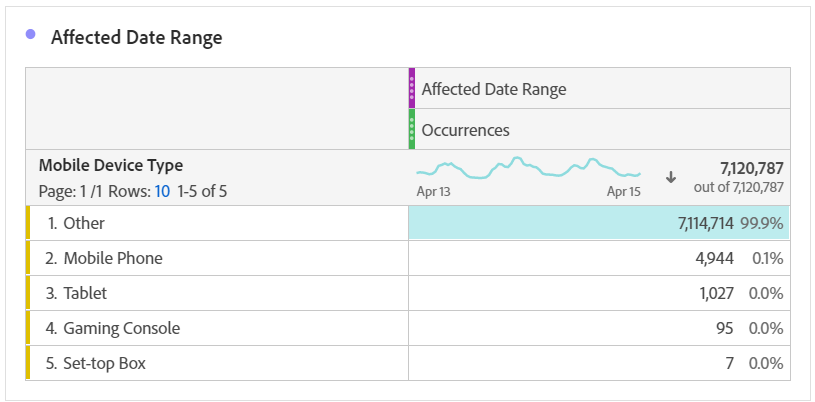

# Comparar datas afetadas por um evento a intervalos anteriores

Se você tiver dados [impactados por um evento](/help/technotes/event-impacted.md), poderá observar tendências históricas para medir seu impacto. Essa comparação é importante para entender o quanto um evento afeta seus dados, para que você possa decidir se deseja excluir os dados, adicionar uma observação aos relatórios ou ignorá-los.

## Criar um intervalo de datas que inclua o evento

Crie um intervalo de datas que inclua o evento para começar a explorar o impacto desse evento.

1. Navegue até **[!UICONTROL Components]** > **[!UICONTROL Date ranges]**.
2. Clique em **[!UICONTROL Add]**.
3. Selecione o intervalo de datas em que o evento ocorreu. Clique em **[!UICONTROL Save]**.

   

## Datas do evento da Visualização e intervalos anteriores semelhantes lado a lado

É possível comparar qualquer métrica entre o intervalo de datas do evento e intervalos de datas anteriores semelhantes usando uma visualização de tabela de forma livre.

1. Abra um projeto do Workspace e adicione a dimensão &quot;Dia&quot; à tabela de forma livre. Aplique o intervalo de datas criado recentemente empilhado em uma métrica, como &quot;Ocorrências&quot;.

   

2. Clique com o botão direito do mouse no intervalo de datas e clique em **[!UICONTROL Add time period column]** > **[!UICONTROL Custom date range to this date range]**.
   * Para uma comparação semana após semana, selecione o intervalo do evento menos 7 dias. Verifique se os dias da semana entre o evento e esse intervalo de datas estão alinhados.
   * Para uma comparação mês a mês, selecione o intervalo do evento no mês passado. Você também pode selecionar o intervalo do evento menos 28 dias se quiser alinhar os dias da semana.
   * Para uma comparação ano após ano, selecione o intervalo do evento no ano passado.
3. Quando você seleciona o intervalo de datas desejado, eles são adicionados à tabela de forma livre. Você pode clicar com o botão direito do mouse e adicionar quantos intervalos de datas desejar comparar.

   

## Calcular diferenças percentuais entre o evento e intervalos anteriores semelhantes

Compare os valores de dimensão entre um intervalo de datas do evento e intervalos de datas anteriores semelhantes usando uma visualização de tabela de forma livre. Essas etapas ilustram um exemplo de semana por semana que você pode seguir.

1. Abra um projeto do Workspace e adicione uma dimensão **** que não seja de tempo à tabela de forma livre. Por exemplo, você pode usar a dimensão &#39;Tipo de dispositivo móvel&#39;. Aplique o intervalo de datas criado recentemente empilhado em uma métrica, como &quot;Ocorrências&quot;:

   

2. Clique com o botão direito do mouse no intervalo de datas e clique em **[!UICONTROL Compare time periods]** > **[!UICONTROL Custom date range to this date range]**. Selecione o intervalo do evento menos 7 dias. Verifique se os dias da semana entre o evento e esse intervalo de datas estão alinhados.

   

3. Renomeie a métrica resultante &quot;Alteração na porcentagem&quot; para algo mais específico, como &quot;Intervalo afetado por WoW&quot;. Clique no ícone de informações e clique no lápis de edição para editar o nome da métrica.

   

4. Repita as etapas 3 e 4 para comparações mês a mês e ano a ano. É possível realizar essa ação na mesma tabela ou em tabelas separadas.

## Analisar os intervalos de datas de comparação lado a lado como linhas

Se você quiser analisar mais detalhadamente as alterações de porcentagem acima, converta-as em linhas.

1. Adicione uma visualização de tabela de forma livre e ative o criador de tabela. Essa ação permite colocar as métricas de alteração de porcentagem na ordem desejada.
2. Mantenha pressionada `Ctrl` (Windows) ou `Cmd` (Mac) e arraste as métricas de alteração de 3% para as linhas da tabela, uma de cada vez.

   

3. Adicione o segmento &quot;Todas as visitas&quot; à coluna da tabela e a quaisquer outros segmentos desejados.

   

4. Clique em **[!UICONTROL Build]**. Na tabela resultante, é possível visualização os intervalos afetados em relação à semana, mês e ano anterior em qualquer segmento desejado.

   
