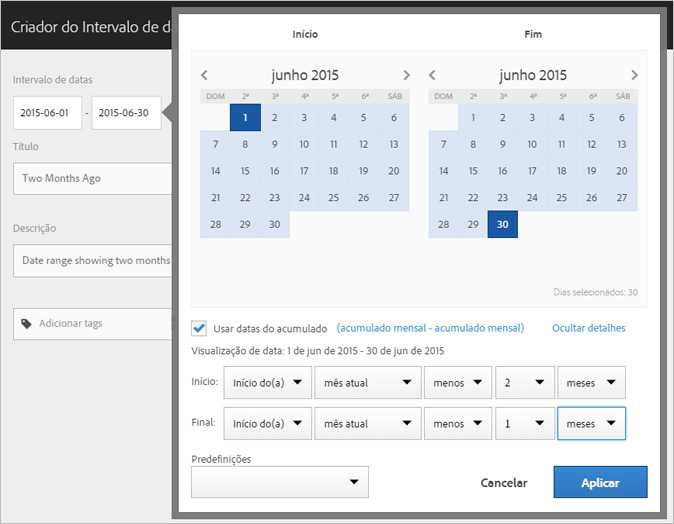
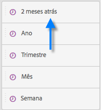
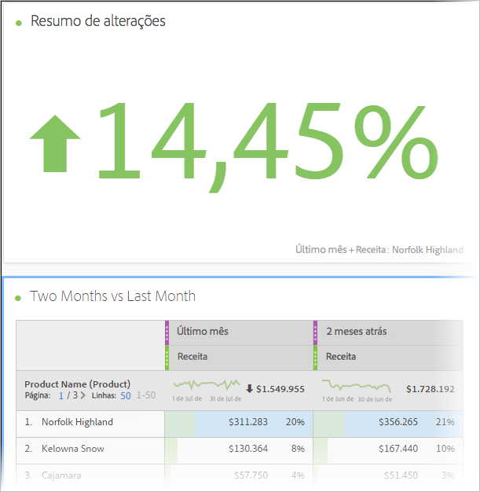

# Criar intervalos de datas personalizados

Crie intervalos de datas personalizados no Analysis Workspace e salve-os como Componentes de tempo.

**[!UICONTROL Componentes]** > **[!UICONTROL Novo intervalo de datas]**

Os intervalos de datas são aplicados no nível do painel. Para adicionar um intervalo de datas ao seu projeto, clique em **Painéis** > *`<select panel>`* e especifique um novo intervalo de datas.

## Intervalo de datas para “dois meses atrás” {#section_C4109C57CB444BB2A79CC8082BD67294}

O intervalo de datas personalizado a seguir mostra um intervalo de datas para “dois meses atrás” com uma visualização de Alteração do resumo, que mostra a alteração direcional.

O intervalo de datas personalizado é exibido na parte superior do painel do componente [!UICONTROL Intervalo de datas] no seu projeto:

Você pode arrastar esse intervalo de datas personalizado para uma coluna ao lado do intervalo de datas personalizado, acumulado mensalmente, usando o Último mês predefinido para uma comparação. Adicione uma visualização de Resumo de alterações e selecione os totais de cada coluna para mostrar a alteração direcional:

## Usar um intervalo de datas do acumulado de 7 dias {#section_7EF63B2E9FF54D2E9144C4F76956A8DD}

Um intervalo de datas é aplicado ao nível de painel. Para adicionar um intervalo de datas para o seu projeto, clique em **Ações** > **Adicionar painel** e especifique um novo intervalo de datas.

No Construtor de intervalo de datas, você pode criar um intervalo de datas personalizado que é exibido no painel Componentes com outros intervalos de datas.

Por exemplo, você pode criar um intervalo de datas que especifica uma janela de acumulado de 7 dias, que terminou há uma semana:

Use   *`rolling daily`*.

* As configurações de Início seriam *`current day minus 14 days`*.

* As configurações de Fim seriam *`current day minus 7 days`*.

Esse intervalo de datas pode ser um componente que você arrasta para qualquer tabela de forma livre.
