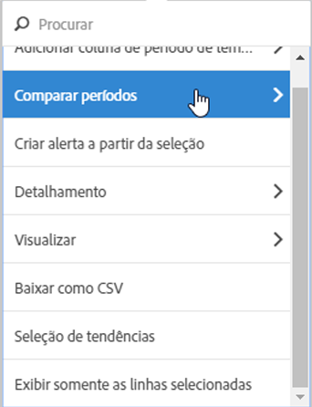
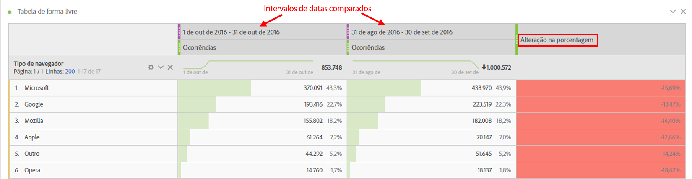
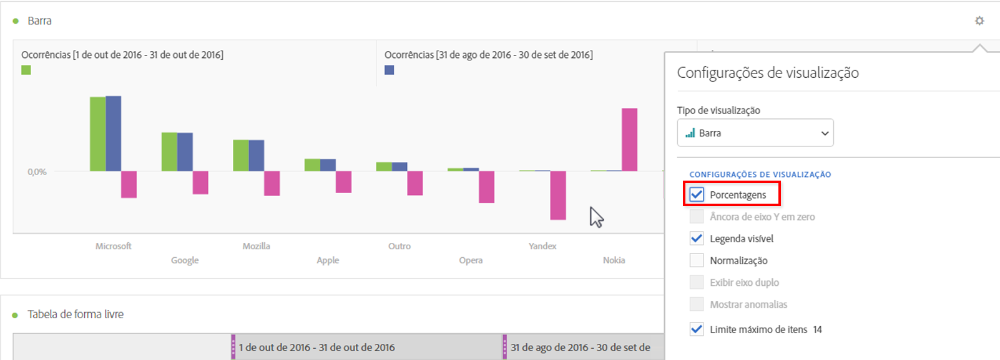
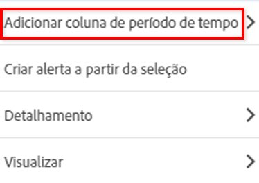
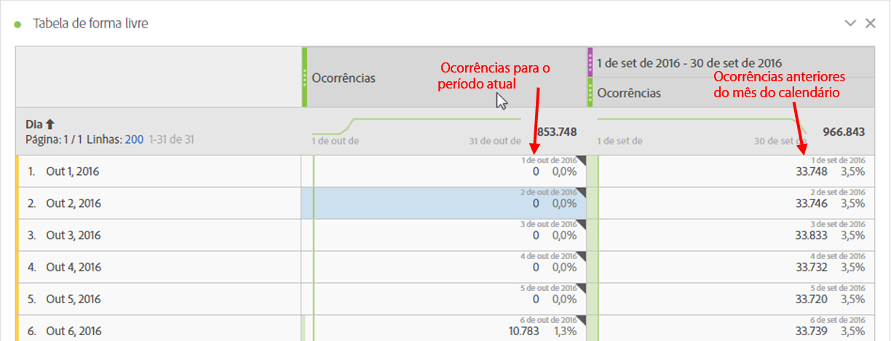
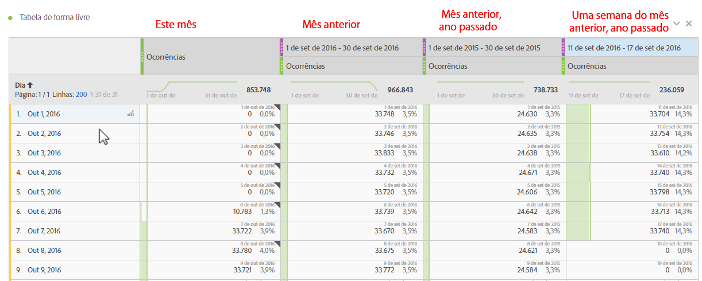
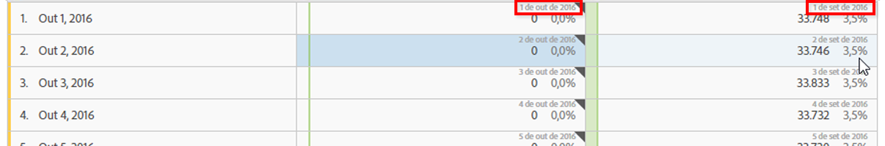

# Comparação de datas

A comparação de datas no Analysis Workspace permite pegar qualquer coluna contendo um intervalo de data e criar uma comparação de data comum, como: ano sobre ano, trimestres sobre trimestres, mês sobre mês, etc.

## Comparar períodos de tempo {#section_C4E36BFE0F5C4378A74E705747C9DEE4}

A análise demanda contexto, e esse contexto é normalmente fornecido por um período de tempo anterior. Por exemplo, a pergunta &quot;Estamos melhor ou pior que nesse mesmo período de tempo no ano passado?&quot; é fundamental para entender seus negócios. A comparação de datas inclui automaticamente uma coluna &quot;diferença&quot;, que mostra a porcentagem de mudança comparada a um período de tempo específico.

1. Crie uma tabela de forma livre, com qualquer dimensão e métrica que desejar comparar em um período.
1. Clique com o botão direito na linha da tabela e selecione **[!UICONTROL Comparar períodos]**.

   

   >[!IMPORTANT]
   >
   >A opção de clicar com o botão direito está desativada para linhas de métrica, linhas de intervalo de datas e linhas de dimensão.

1. Dependendo de como configurou o intervalo de data da tabela, você tem as opções a seguir para comparação:

   | Opção | Descrição |
   |---|---|
   | **[!UICONTROL Semana/mês/trimestre/ano anterior a esse intervalo de datas]** | Compara com a semana/mês/etc. imediatamente antes desse intervalo de data. |
   | **[!UICONTROL Esta semana/este mês/este trimestre/este ano no ano passado]** | Compara com o mesmo intervalo de datas no ano passado. |
   | **[!UICONTROL Selecionar intervalo]** | Permite selecionar um intervalo de datas personalizado. |

   >[!NOTE]
   >
   >Sendo selecionado um número de dias personalizado, por exemplo, de 7 a 20 de outubro (intervalo de 14 dias), você terá apenas 2 opções: **[!UICONTROL Os 14 dias anteriores a esse intervalo de datas]**, e **[!UICONTROL Selecionar intervalo]**.

1. O resultado da comparação aparece assim:

   

   As linhas na coluna de Alteração na porcentagem aparecem em vermelho para valores negativos e em verde para positivos.

1. (Opcional) Como em qualquer projeto do Workspace, é possível criar visualizações baseadas nestas comparações de tempo. Por exemplo, aqui está um gráfico de barras:

   

   Observe que para mostrar a mudança de porcentagem no gráfico de barras, você deve ter a configuração [!UICONTROL Porcentagens] selecionada nas [!UICONTROL Configurações de visualização].

## Adicionar uma coluna de período de tempo para comparação {#section_93CC2B4F48504125BEC104046A32EB93}

A partir de agora, é possível adicionar um período de tempo a cada coluna de uma tabela, permitindo que você adicione períodos diferentes daqueles definidos no seu calendário. Essa é mais uma forma de comparar datas.

1. Clique com o botão direito na tabela e selecione **[!UICONTROL Adicionar coluna de período]** 

1. Dependendo de como configurou o intervalo de data da tabela, você tem as opções a seguir para comparação:

   | Opção | Descrição |
   |---|---|
   | **[!UICONTROL Semana/mês/trimestre/ano anterior a esse intervalo de datas]** | Adiciona uma coluna com semana/mês/etc. imediatamente antes desse intervalo de data. |
   | **[!UICONTROL Esta semana/este mês/este trimestre/este ano no ano passado]** | Adiciona o mesmo intervalo de data no ano passado. |
   | **[!UICONTROL Selecionar intervalo]** | Permite selecionar um intervalo de datas personalizado. |

   >[!NOTE]
   >
   >Sendo selecionado um número de dias personalizado, por exemplo, de 7 a 20 de outubro (intervalo de 14 dias), você terá apenas 2 opções: **[!UICONTROL Os 14 dias anteriores a esse intervalo de datas]**, e **[!UICONTROL Selecionar intervalo]**.

1. O período de tempo será inserido no topo da coluna selecionada:

   

1. É possível adicionar quantas colunas desejar, assim como misturar e correlacionar diferentes intervalos de data:

   

1. Além disso, é possível classificar em cada coluna, o que alterará a ordem de dias dependendo da coluna que for classificada.

## Alinhar colunas de datas para começarem na mesma linha {#section_5085E200082048CB899C3F355062A733}

Uma nova configuração das tabelas permite **[!UICONTROL Alinhar datas de cada coluna para iniciarem na mesma linha (aplica-se a toda a tabela)]**. “Aplica-se a toda a tabela” significa que se você fizer, por exemplo, um detalhamento na tabela, e alterar essa configuração para o detalhamento, modificará a configuração de toda a tabela.

>[!IMPORTANT]
>
>Essa configuração está **desativada** (não está selecionada) para todos os projetos existentes e **ativada** (selecionada) para todos os novos projetos.

Exemplo: ao escolher alinhar as datas em uma comparação de mês a mês de outubro a setembro de 2016, a coluna da esquerda iniciará em 1° de outubro e a coluna da direita em 1° de setembro:

<!-- 

See Jonny Moon's email from November 3. 

 -->

