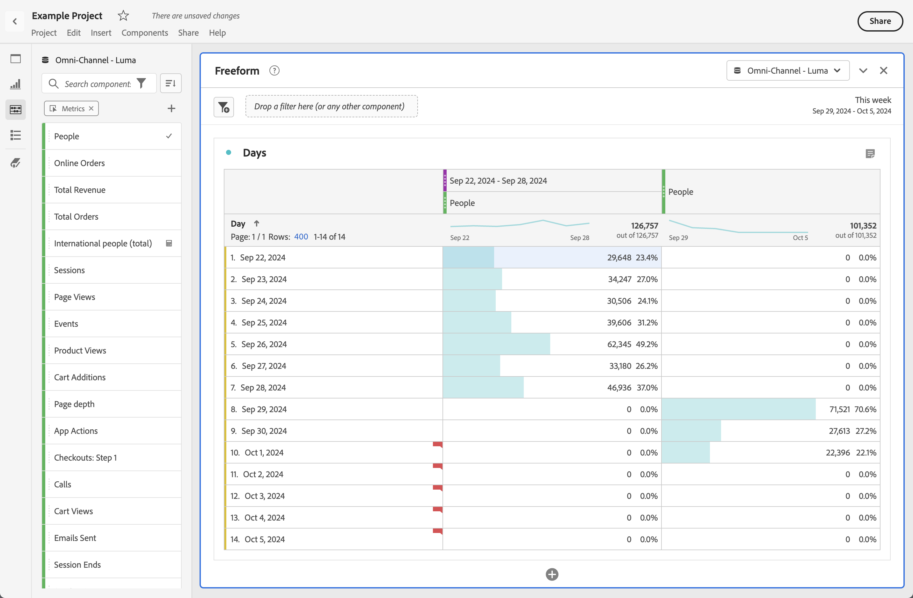

# Comparação de datas

A comparação de datas no Analysis Workspace permite pegar qualquer coluna contendo um intervalo de datas e criar uma comparação de data comum, como: ano a ano, trimestre a trimestre, mês a mês, etc.

## Comparar períodos

A análise demanda contexto, o qual normalmente é fornecido por um período anterior. Por exemplo, a pergunta *Quão melhor ou pior você está fazendo agora em comparação a esta hora do ano passado?O* é fundamental para entender a sua empresa. A comparação de datas inclui uma coluna de *diferença* automaticamente, que mostra a porcentagem de alteração comparada a um período de tempo especificado.

1. Crie uma [Tabela de forma livre](/help/analyze/analysis-workspace/visualizations/freeform-table/freeform-table.md), com qualquer dimensão e métrica que desejar comparar em um período.
1. Abra o menu de contexto de uma linha de tabela e selecione **[!UICONTROL Comparar períodos]**.

   

   >[!NOTE]
   >
   >Essa opção do menu de contexto está desativada para linhas de métrica, linhas de intervalo de datas e linhas de dimensão de tempo.

1. Dependendo de como configurou o intervalo de data da tabela, você tem as opções a seguir para comparação:

   | Opção | Descrição |
   |---|---|
   | **[!UICONTROL Anterior(es) *x* semanas/meses/trimestres/anos a este intervalo de datas]** | Comparar ao intervalo de datas selecionado imediatamente antes desse intervalo de datas. |
   | **[!UICONTROL Estas x semanas/meses/trimestres/anos do ano passado para este intervalo de datas]** | Compare com o mesmo intervalo de datas no ano passado. |
   | **[!UICONTROL Intervalo de datas personalizado até este intervalo de datas]** | Permite definir um intervalo de datas personalizado. |

   >[!NOTE]
   >
   >Ao selecionar um número de dias personalizado, por exemplo, de 7 a 20 de outubro (intervalo de 14 dias), você terá apenas duas opções: **[!UICONTROL Os 14 dias anteriores a esse intervalo de datas]** e **[!UICONTROL Intervalo de datas personalizado até este intervalo de datas]**.

1. O resultado da comparação aparece assim:

   

   As linhas na coluna Alteração percentual aparecem em vermelho para valores negativos e em verde para valores positivos.

## Adicionar uma coluna de período de tempo para comparação

Agora é possível adicionar um período a cada coluna na tabela, permitindo adicionar um período diferente daquele definido no calendário.

1. Clique com o botão direito do mouse em uma coluna na tabela e selecione **[!UICONTROL Adicionar coluna de período]**.

   

1. Dependendo de como configurou o intervalo de data da tabela, você tem as opções a seguir para comparação:

   | Opção | Descrição |
   |---|---|
   | **[!UICONTROL Anterior(es) *x* semanas/meses/trimestres/anos a este intervalo de datas]** | Adicione uma coluna com a semana/mês/etc. imediatamente antes desse intervalo de data. |
   | **[!UICONTROL Estas *x* semanas/meses/trimestres/anos do ano passado para este intervalo de datas]** | Adicionar o mesmo intervalo de datas no ano passado. |
   | **[!UICONTROL Intervalo de datas personalizado até este intervalo de datas]** | Permite criar um intervalo de datas personalizado. |

   >[!NOTE]
   >
   >Ao selecionar um número de dias personalizado, por exemplo, de 7 a 20 de outubro (intervalo de 14 dias), você terá apenas duas opções: **[!UICONTROL Os 14 dias anteriores a esse intervalo de datas]** e **[!UICONTROL Intervalo de datas personalizado até este intervalo de datas]**.

1. O período de tempo é inserido na parte superior da coluna selecionada:

   

1. É possível adicionar quantas colunas desejar, assim como misturar e correlacionar diferentes intervalos de data:

1. Além disso, você pode classificar em cada coluna, o que altera a ordem de dias dependendo da coluna que você está classificando.

## Alinhar as datas das colunas para que comecem na mesma linha

É possível alinhar as datas de cada coluna para que todas iniciem na mesma linha. 

Por exemplo, você faz uma comparação dia a dia da última semana (terminando em 5 de outubro de 2024) e da semana anterior. Por padrão, a coluna da esquerda iniciará em 22 de setembro e a coluna da direita em 29 de setembro.

Você pode habilitar **[!UICONTROL Alinhar datas de cada coluna para que todas iniciem na mesma linha]** em [Configurações](/help/analyze/analysis-workspace/visualizations/freeform-table/freeform-table.md#settings-1) para que a visualização da tabela de forma livre alinhe as datas das colunas para que iniciem na mesma linha.

Considere o seguinte ao usar essa opção:

* Essa configuração é habilitada por padrão para todos os novos projetos.

* Essa configuração se aplica a toda a tabela. Por exemplo, se você alterar essa configuração para um detalhamento na tabela, a configuração será aplicada à tabela inteira.

<!--
# Date comparison

Date comparison in Analysis Workspace lets you take any column containing a date range and create a common date comparison, such as: year-over-year, quarter-over-quarter, month-over-month, etc.

>[!BEGINSHADEBOX]

See  [Date comparison](https://video.tv.adobe.com/v/33855?quality=12&learn=on&captions=por_br){target="_blank"} for a demo video.

>[!ENDSHADEBOX]

## Compare time periods {#section_C4E36BFE0F5C4378A74E705747C9DEE4}

>[!NOTE]
>[!UICONTROL Compare Time Periods] leverages advanced Calculated Metrics. As a result, it is available only to customers with Analytics Select, Prime, and Ultimate SKUs. 

Analysis requires context, and often that context is provided by a previous time period. For example, the question "How much better or worse are we doing than at this time last year?" is fundamental to understanding your business. Date Comparison automatically include a "difference" column, which shows the percentage change compared to a specified time period.

1. Create a Freeform table, with any dimensions and metrics you want to compare over a time period.
1. Right-click a table row and select **[!UICONTROL Compare time periods]**.

   

   >[!NOTE]
   >
   >This right-click option is disabled for metric rows, date range rows, and time dimension rows.

1. Depending on how you have set the table's date range, you have these options for comparison: 

   |  Option  | Description  |
   |---|---|
   | **[!UICONTROL Prior week/month/quarter/year to this date range]** | Compares to the week/month/etc. immediately before this date range.  |
   | **[!UICONTROL This week/month/quarter/year last year to this date range]** | Compares to the same date range a year ago.  |
   | **[!UICONTROL Custom date range to this date range]** | Lets you select a custom date range.  |

   >[!NOTE]
   >
   >When you select a custom number of days, for example October 7 - October 20 (a 14-day range), you will get only 2 options: **[!UICONTROL Prior 14 days before this date range]**, and **[!UICONTROL Custom date range to this date range]**.

1. The resulting comparison looks like this:

   

   Rows in the Percent Change column appear red for negative values and green for positive values.

1. (Optional) As in any other Workspace projects, you can create visualizations based on these time comparisons. For example, here is a Bar graph:

   

   Note that in order to show the percentage change in the bar chart, you have to have the [!UICONTROL Percentages] setting checked in the [!UICONTROL Visualization Settings].

## Add a time period column for comparison {#section_93CC2B4F48504125BEC104046A32EB93}

You can now add a time period to each column in a table, enabling you to add a time period that is different from the one your calendar is set to. This is another way you can compare dates.

1. Right-click a column in the table and select **[!UICONTROL Add time period column]**. 

   

1. Depending on how you have set the table's date range, you have these options for comparison: 

   |  Option  | Description  |
   |---|---|
   | **[!UICONTROL Prior week/month/quarter/year to this date range]** | Adds a column with the week/month/etc. immediately before this date range.  |
   | **[!UICONTROL This week/month/quarter/year last year to this date range]** | Adds the same date range a year ago.  |
   | **[!UICONTROL Custom date range to this date range]** | Lets you select a custom date range.  |

   >[!NOTE]
   >
   >When you select a custom number of days, for example October 7 - October 20 (a 14-day range), you will get only 2 options: **[!UICONTROL Prior 14 days before this date range]**, and **[!UICONTROL Custom date range to this date range]**.

1. The time period will be inserted on top of the column you selected:

   

1. You can add as many time columns as you want, as well as mix and match different date ranges:

   

1. In addition, you can sort on each column, which will change the order of days depending on the column you are sorting on.

## Align column dates to start on the same row {#section_5085E200082048CB899C3F355062A733}

You can align the dates from each column to all start on the same row. 

For example, when you choose to align the dates, if you do a month-over-month comparison between October and September 2016, the left column will start with October 1 and the right column will start with September 1:

>[!NOTE]
>
>Consider the following when using this option:
>
>* This setting is enabled by default for all new projects.
>
>* This setting applies to the entire table. For example, if you change this setting for a breakdown within the table, it will change the setting for the entire table.
>

To enable this setting, if it is not already enabled:

1. In the table where you want to align column dates, select the **Settings** icon in the table header.

1. On the [!UICONTROL **Settings**] tab, select **[!UICONTROL Align Dates from each column to all start on the same row (applies to entire table)]**.

-->