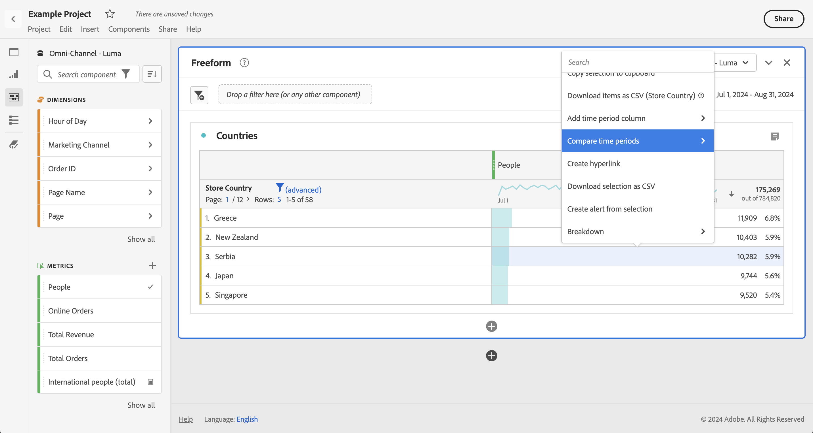

# Comparação de datas

A comparação de datas no Analysis Workspace permite pegar qualquer coluna contendo um intervalo de data e criar uma comparação de data comum, como: ano sobre ano, trimestres sobre trimestres, mês sobre mês, etc.

>[!BEGINSHADEBOX]

Consulte  [Comparação de datas](https://video.tv.adobe.com/v/30753?quality=12&learn=on){target="_blank"} para ver um vídeo de demonstração.

>[!ENDSHADEBOX]

## Comparar períodos de tempo {#section_C4E36BFE0F5C4378A74E705747C9DEE4}

>[!NOTE]
>[!UICONTROL Comparar Períodos] usa Métricas Calculadas avançadas. Como resultado, ele está disponível somente para clientes com SKUs do Analytics Select, Prime e Ultimate.

A análise demanda contexto, e esse contexto é normalmente fornecido por um período de tempo anterior. Por exemplo, a pergunta &quot;Quão melhor ou pior estamos fazendo do que neste momento no ano passado?&quot; é fundamental para entender seus negócios. A comparação de datas inclui automaticamente uma coluna &quot;diferença&quot;, que mostra a porcentagem de mudança comparada a um período de tempo específico.

1. Crie uma tabela de forma livre, com qualquer dimensão e métrica que desejar comparar em um período.
1. Clique com o botão direito na linha da tabela e selecione **[!UICONTROL Comparar períodos]**.

   

   >[!NOTE]
   >
   >A opção de clicar com o botão direito está desativada para linhas de métrica, linhas de intervalo de datas e linhas de dimensão.

1. Dependendo de como configurou o intervalo de data da tabela, você tem as opções a seguir para comparação:

   | Opção | Descrição |
   |---|---|
   | **[!UICONTROL Semana/mês/trimestre/ano anterior a esse intervalo de datas]** | Compara com a semana/mês/etc. imediatamente antes desse intervalo de data. |
   | **[!UICONTROL Esta semana/este mês/este trimestre/este ano no ano passado para este intervalo de datas]** | Compara com o mesmo intervalo de datas no ano passado. |
   | **[!UICONTROL Intervalo de datas personalizado para este intervalo de datas]** | Permite selecionar um intervalo de datas personalizado. |

   >[!NOTE]
   >
   >Ao selecionar um número personalizado de dias, por exemplo, 7 de outubro - 20 de outubro (um intervalo de 14 dias), você terá apenas 2 opções: **[!UICONTROL Os 14 dias anteriores a esse intervalo de datas]** e **[!UICONTROL O intervalo de datas personalizado para esse intervalo de datas]**.

1. O resultado da comparação aparece assim:

   

   As linhas na coluna de Alteração na porcentagem aparecem em vermelho para valores negativos e em verde para positivos.

1. (Opcional) Como em qualquer projeto do Espaço de trabalho, é possível criar visualizações baseadas nestas comparações de tempo. Por exemplo, aqui está um gráfico de barras:

   

   Observe que para mostrar a mudança de porcentagem no gráfico de barras, você deve ter a configuração [!UICONTROL Porcentagens] selecionada nas [!UICONTROL Configurações de visualização].

## Adicionar uma coluna de período de tempo para comparação {#section_93CC2B4F48504125BEC104046A32EB93}

A partir de agora, é possível adicionar um período de tempo a cada coluna de uma tabela, permitindo que você adicione períodos diferentes daqueles definidos no seu calendário. Essa é mais uma forma de comparar datas.

1. Clique com o botão direito do mouse em uma coluna da tabela e selecione **[!UICONTROL Adicionar coluna de período]**.

   

1. Dependendo de como configurou o intervalo de data da tabela, você tem as opções a seguir para comparação:

   | Opção | Descrição |
   |---|---|
   | **[!UICONTROL Semana/mês/trimestre/ano anterior a esse intervalo de datas]** | Adiciona uma coluna com semana/mês/etc. imediatamente antes desse intervalo de data. |
   | **[!UICONTROL Esta semana/este mês/este trimestre/este ano no ano passado para este intervalo de datas]** | Adiciona o mesmo intervalo de data no ano passado. |
   | **[!UICONTROL Intervalo de datas personalizado para este intervalo de datas]** | Permite selecionar um intervalo de datas personalizado. |

   >[!NOTE]
   >
   >Ao selecionar um número personalizado de dias, por exemplo, 7 de outubro - 20 de outubro (um intervalo de 14 dias), você terá apenas 2 opções: **[!UICONTROL Os 14 dias anteriores a esse intervalo de datas]** e **[!UICONTROL O intervalo de datas personalizado para esse intervalo de datas]**.

1. O período de tempo será inserido no topo da coluna selecionada:

   

1. É possível adicionar quantas colunas desejar, assim como misturar e correlacionar diferentes intervalos de data:

   

1. Além disso, é possível classificar em cada coluna, o que alterará a ordem de dias dependendo da coluna que for classificada.

## Alinhar colunas de datas para começarem na mesma linha {#section_5085E200082048CB899C3F355062A733}

Você pode alinhar as datas de cada coluna para que todas iniciem na mesma linha.

Por exemplo, ao escolher alinhar as datas em uma comparação de mês por mês de outubro a setembro de 2016, a coluna da esquerda iniciará em 1° de outubro e a coluna da direita em 1° de setembro:

>[!NOTE]
>
>Considere o seguinte ao usar essa opção:
>
>* Essa configuração é ativada por padrão para todos os novos projetos.
>
>* Essa configuração se aplica a toda a tabela. Por exemplo, se você alterar essa configuração para um detalhamento na tabela, ela alterará a configuração da tabela inteira.
>

Para ativar essa configuração, se ela ainda não estiver ativada:

1. Na tabela onde deseja alinhar as datas da coluna, selecione o ícone **Configurações** no cabeçalho da tabela.

1. Na guia [!UICONTROL **Configurações**], selecione **[!UICONTROL Alinhar Datas de cada coluna para iniciarem na mesma linha (aplica-se a toda a tabela)]**.

