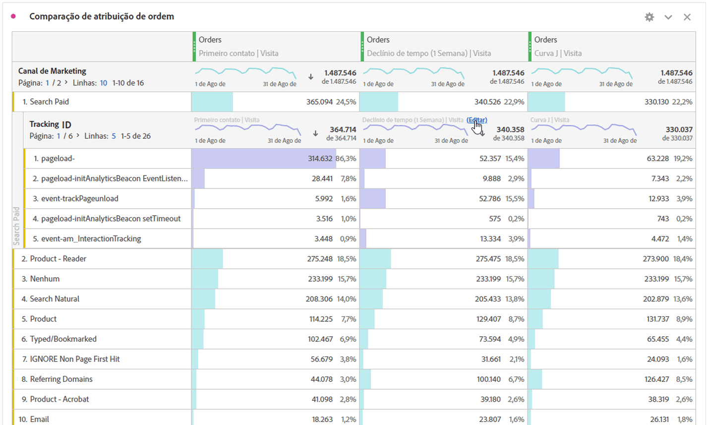

# Analisar dimensões

Analise dimensões e itens de dimensão no Analysis Workspace.

Analise os seus dados de formas ilimitadas, de acordo com as suas necessidades específicas; crie consultas usando métricas, dimensões, segmentos, linhas do tempo e outros valores de detalhamento de análise relevantes.

1. [Crie um projeto](/help/analyze/analysis-workspace/build-workspace-project/t-freeform-project.md) com uma tabela de dados.
1. Na tabela de dados, clique com o botão direito em um item da linha e selecione **[!UICONTROL Detalhamento]** > *`<item>`*.

   

   É possível detalhar métricas por itens de dimensão ou segmentos de audiência nos períodos selecionados. É possível especificar ainda mais para um nível mais granular.

   >[!NOTE]
   >
   >O número de detalhamentos exibidos na tabela é limitado a 200. Esse limite vai aumentar para a exportação de detalhamentos.

[Dimensões do Analysis Workspace no YouTube](https://www.youtube.com/watch?v=P9W0hhIHhCs&amp;index=12&amp;list=PL2tCx83mn7GuNnQdYGOtlyCu0V5mEZ8sS) (4:54)

[Detalhamentos de dimensão no YouTube](https://www.youtube.com/watch?v=3mQ2HN7-lIc&amp;list=PL2tCx83mn7GuNnQdYGOtlyCu0V5mEZ8sS&amp;index=13) (2:02)

## Aplicar modelos de atribuição a detalhamentos

Qualquer detalhamento em uma tabela também pode ter qualquer modelo de atribuição aplicado a ela. Esse modelo de atribuição pode ser o mesmo ou diferente da coluna pai. Por exemplo, você pode analisar Pedidos lineares em sua dimensão de Canais de marketing mas deseja aplicar Pedidos de forma de U aos códigos de rastreamento específicos em um Canal. Para editar o modelo de atribuição aplicado a um detalhamento, passe o mouse sobre o modelo de detalhamento e clique em **[!UICONTROL Editar]**:

