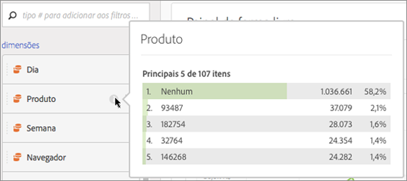
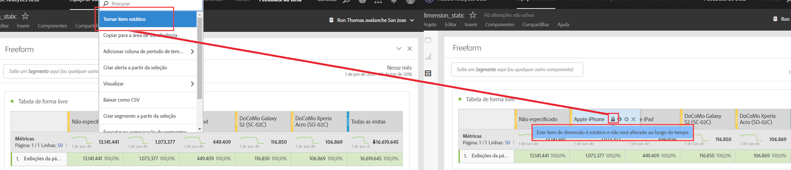

# Visualizar dimensões

## Visualização da dimensão {#section_13D5A69AE6194715A721BC87D283F6F2}

Passe o mouse sobre o ícone de informações (i) localizado próximo a uma dimensão. Serão exibidos os 5 principais valores para dimensões que não são de tempo (e 15 para dimensões de tempo). Costumávamos mantes esses valores estáticos (ou seja, os 5 valores escolhidos nunca eram alterados).

A partir de agora, por padrão, mostramos valores dinâmicos em vez de estáticos, com a opção de transformá-los em valores estáticos. Outras observações:

* Conforme seus dados atualizam, as colunas de dimensão dinâmica serão atualizadas para mostrar os itens de dimensão atuais de 5/15.
* Uma coluna de dimensão dinâmica que é copiada ou movida se tornará estática.
* Ao passar o cursor sobre uma coluna de dimensão estática, você verá um ícone de cadeado, indicando que a dimensão é estática.

## Mostrar itens da dimensão {#section_A074B3A984634AC7B1362889088E0A42}

Ao passar o mouse sobre uma dimensão e clicar na seta para a direita cinza próxima a ela, é exibida uma lista de itens de dimensão. Uma lista de itens de dimensão normalmente mostra os itens principais referentes aos últimos 30 dias.

Ao rolar para o final da lista, você verá **[!UICONTROL Mostrar itens superiores dos últimos 6 meses]**. Clique nessa opção para ver os itens superiores da dimensão nos últimos 180 dias.
