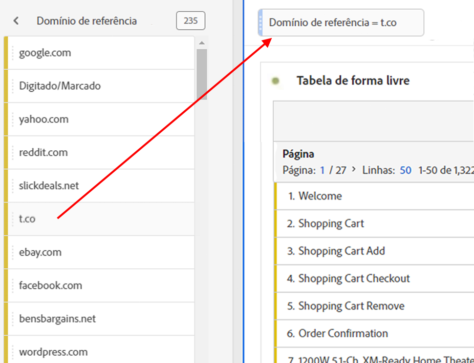

# Segmentos de projeto ad-hoc

Este é um vídeo sobre como criar segmentos de projetos ad-hoc:

>[!VIDEO](https://video.tv.adobe.com/v/23978/?quality=12)

Você pode criar segmentos de projeto ad-hoc se quiser explorar rapidamente como um segmento pode afetar seu projeto, sem acessar o Construtor de segmentos. Considere esses segmentos como segmentos temporários em nível de projeto. Normalmente, eles não farão parte da &quot;biblioteca&quot; do segmento, como segmentos de componentes no painel esquerdo. No entanto, você pode salvá-las, conforme mostrado abaixo.

Para uma comparação do que os segmentos de projeto ad-hoc podem fazer com relação aos segmentos de nível de componente completos, acesse [aqui](/help/analyze/analysis-workspace/components/segments/t-freeform-project-segment.md).

1. Solte qualquer tipo de componente (dimensão, item de dimensão, evento, métrica, segmento, modelo de segmento, intervalo de datas) na área de soltar segmentos no topo de um painel. Os tipos de componentes são convertidos automaticamente em segmentos.
Este é um exemplo de como criar um segmento para o domínio de referência do Twitter:

   

   O painel obtém esse segmento automaticamente e você pode ver os resultados instantaneamente.

1. Você pode adicionar um número ilimitado de componentes a um painel.
1. Se decidir que deseja salvar esse segmento, consulte a seção abaixo.

Lembre-se:

* **Não** é possível soltar os seguintes tipos de componentes na zona de segmentos: métricas calculadas e dimensões/métricas; a partir dos quais não pode-se criar segmentos.
* Para dimensões e eventos completos, o Analysis Workspace cria segmentos de ocorrência &quot;existe&quot;. Exemplos: `Hit where eVar1 exists` ou `Hit where event1 exists`.
* Se as opções “não especificado” ou “nenhum” forem soltas na zona de soltar dos segmentos, serão automaticamente convertidas em um segmento “não existe” para que sejam tratadas corretamente na segmentação.

>[!NOTE]
>
>Segmentos criados desse modo são internos no projeto.

## Salvar segmentos de projeto ad-hoc {#ad-hoc-save}

Você pode optar por salvar esses segmentos seguindo estas etapas:

1. Passe o mouse sobre o segmento no local onde os segmentos são colocados e clique no ícone “i”.
1. No painel de informações que é exibido, clique em **[!UICONTROL Salvar]**.

   

## O que são segmentos somente de projeto?

Os segmentos somente do projeto são segmentos rápidos ou segmentos de projeto ad-hoc do Workspace. Ao editá-los/abri-los no construtor de segmentos, a caixa somente do projeto será exibida. Se eles APLICAREM um segmento rápido no construtor, mas não marcarem a caixa disponibilizar , ele ainda será um segmento somente de projeto, mas não poderá mais ser aberto no construtor de QS. Se eles marcarem a caixa e SALVAR, agora é um segmento da lista de componentes.